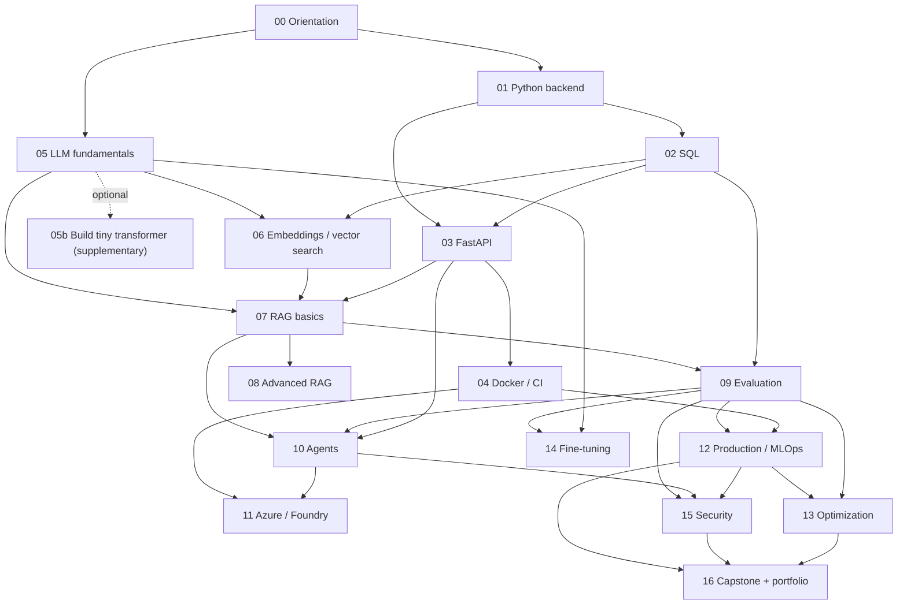

# Course Map

A one-page index of every chapter, the capstone artifact it should leave behind,
and the files it touches. Use this to navigate sideways across the course
without re-reading every chapter README.

## Prerequisite dependency graph

Read in order if you are taking the course linearly. If you are skipping
ahead, this diagram shows which earlier chapter each one assumes:

Dashed arrows are optional. Solid arrows are hard prerequisites in the sense
that earlier-chapter artifacts are *referenced* by the later chapter's project
lab.

## How to read this map

- **Capstone artifact** names the concrete deliverable that proves the chapter
  is finished. If you can't point to one of these in your `my_work/` folder, the
  chapter is not done — regardless of how much you read.
- **Reference target** is the doc that should be cited from any claim that
  depends on an external tool, framework, or standard.
- Chapter file names are fixed: `lesson.md`, `deep_dive.md`, `examples.md`,
  `homework.md`, `quiz.md`, `question_bank.md`, `projects.md`, `project_lab.md`,
  `dictionary.md`, `resources.md`, `references_numbered.md`. See each chapter's
  `README.md` for the recommended reading order.

## Chapters

| # | Chapter | Capstone artifact | Reference target |
| --- | --- | --- | --- |
| 00 | [Orientation and Expert Roadmap](chapters/00_orientation/) | Capstone proposal + chapter-by-chapter evidence roadmap + decision log template | OpenAI Platform Docs; OWASP Top 10 for LLM Applications |
| 01 | [Python Backend Foundations](chapters/01_python_backend_foundations/) | Typed service skeleton with provider adapters, structured logging, and tests that run without network | Pydantic; pytest; FastAPI |
| 02 | [SQL and Data Management](chapters/02_sql_data_management/) | Schema (documents, chunks, requests, answers, feedback, evals, audit_log) + 6 named queries + retention policy | PostgreSQL docs; pgvector |
| 03 | [FastAPI, REST, and Integration](chapters/03_fastapi_rest_integration/) | OpenAPI-backed contract for `/documents`, `/ask`, `/feedback`, `/eval/{id}`, `/agent/run`, streaming and async patterns | FastAPI; OpenAPI Specification |
| 04 | [Docker, Linux, Git, CI/CD](chapters/04_docker_linux_git_cicd/) | One-command local stack + CI pipeline + release manifest (code, prompt, model, index, eval) | Docker; Docker Compose; GitHub Actions |
| 05 | [LLM Fundamentals and Prompting](chapters/05_llm_fundamentals_prompting/) | Prompt registry with versions, test cases, scores, known failures, injection coverage | OpenAI Platform Docs; OWASP LLM Top 10 |
| 06 | [Embeddings and Vector Search](chapters/06_embeddings_vector_search/) | Retrieval benchmark across BM25, dense, hybrid; metadata-filter test suite; migration plan | Qdrant; Milvus; Weaviate; FAISS; pgvector |
| 07 | [RAG Pipeline Basics](chapters/07_rag_pipeline_basics/) | End-to-end pipeline with citations, no-answer behavior, chunk quality review | LangChain RAG; LlamaIndex; Haystack |
| 08 | [Advanced RAG, Retrieval, Reranking](chapters/08_advanced_rag_retrieval_reranking/) | Reranking experiment (NDCG@5 + citation correctness + p95 latency), confidence-aware policy, query router | RAG Techniques GitHub; FlashRAG; RAGLAB |
| 09 | [LLM and RAG Evaluation](chapters/09_llm_evaluation_ragas_deepeval/) | 100-case golden dataset (risk-leveled), eval runner, human review workflow | RAGAS; DeepEval; LangSmith |
| 10 | [Agentic AI, LangGraph, Tool Use](chapters/10_agentic_ai_langgraph_tool_use/) | Stateful agent graph with classify → retrieve → tool → approval → final-answer, tool policy, injection refusals | LangGraph; OpenAI Agents SDK; AutoGen |
| 11 | [Azure/OpenAI Foundry and Enterprise AI](chapters/11_azure_openai_foundry_semantic_kernel/) | Vendor-neutral architecture + platform mapping + framework comparison + migration plan | Azure AI Foundry; Semantic Kernel |
| 12 | [Production Serving, Monitoring, MLOps](chapters/12_production_serving_monitoring_mlops/) | Observability for every stage + 5 runbooks + release manifest enforced in CI + rollback drill | MLflow; OpenTelemetry; Prometheus; Grafana |
| 13 | [Optimization, Caching, Quantization, Serving](chapters/13_optimization_caching_quantization_serving/) | Latency budget + cache design (tenant-safe) + serving matrix + quantization eval | OpenAI prompt caching; vLLM; TGI; Triton; ONNX Runtime |
| 14 | [Fine-Tuning and Model Adaptation](chapters/14_finetuning_model_adaptation/) | Adaptation decision memo + before/after eval + synthetic data review (if used) | Hugging Face PEFT; TRL; QLoRA paper |
| 15 | [Security, Guardrails, Compliance](chapters/15_security_guardrails_compliance/) | Threat model + 50-case guardrail test suite + audit log schema + PII handling policy | OWASP LLM Top 10; NIST AI RMF |
| 16 | [Capstone, Interview, Portfolio](chapters/16_capstone_interview_portfolio/) | Runnable capstone, architecture pack, portfolio README, interview kit, repeatable demo | OpenAI Cookbook; this course's own outputs |

## Cross-cutting docs

- [`README.md`](README.md) — course identity, learning outcomes, recommended pace.
- [`QUALITY_CHECKS.md`](QUALITY_CHECKS.md) — what the validator enforces and how to run it.
- [`syllabus/master_plan.md`](syllabus/master_plan.md) — the long form plan.
- [`syllabus/12_week_schedule.md`](syllabus/12_week_schedule.md) — the intensive-track schedule.
- [`syllabus/evaluation_rubric.md`](syllabus/evaluation_rubric.md) — how to grade short-answer and scenario work.
- [`resources/source_map.md`](resources/source_map.md) — the canonical source catalog.
- [`capstone/`](capstone/) — capstone requirements and deliverables checklist.
- [`interview_prep/`](interview_prep/) — interview kit templates.

## Authored vs derived content

Each chapter's `project_lab.md` either uses a hand-authored overlay (concrete
domain scenario, inputs, outputs, test cases, metrics, failure cases,
acceptance criteria) or falls back to a derived layout built from the
chapter's concepts and problems. As of the last regeneration, **17 of 17**
chapters have authored overlays. If the overlay's `scenario` reads like
"Build this as a reviewable artifact in your capstone …" you're looking at
the derived fallback — improving it is a contribution opportunity.
