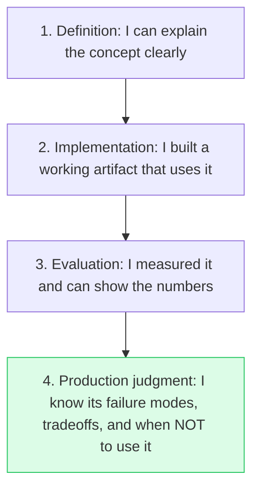
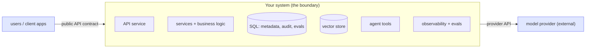

<!-- HAND-AUTHORED: do not regenerate -->
# Deep Dive: Orientation and Expert Roadmap

## Thesis

Expert AI engineering is the discipline of turning model capability into reliable, observable, secure, and useful systems. A model is a *component*; a product is a *system*. The gap between the two — data pipelines, contracts, evaluation, operations, security — is where almost all the engineering effort, and almost all the failure, actually lives. This deep dive expands the lesson with the mental models, a maturity ladder, and the curated sources a university-level reader should be able to follow to primary material.

A useful framing comes from the well-documented observation that, in real machine-learning systems, the model code is a small fraction of the total system; the surrounding infrastructure (data, serving, monitoring, configuration, evaluation) dominates [5]. The same is true — more so — for LLM systems, where the model is a third-party API and *everything that makes it trustworthy* is yours to build.

## The Expert Maturity Ladder

The `expert rubric` distinguishes four levels of mastery for every concept in this course. The point of the ladder is that "I read about it" is the bottom rung, not the top:

Grade yourself at level 4, not level 1. A chapter is "done" when you can name a concept's failure modes and the tradeoff that would make you avoid it — not when you can recite its definition.

## The System Boundary

The `system boundary` is the single most clarifying diagram you can draw for any AI product. It separates what users and clients depend on (public contracts) from what you can freely change (replaceable internals), and it makes every trust boundary, permission, and failure point visible:

Everything inside the box is your responsibility, including the parts that fail silently (retrieval quality, evaluation, access control). The model provider is *outside* the boundary — a dependency you adapt to, version against, and can be forced to replace.

## Core Concepts

### `AI engineering`

The practice of building reliable products around AI models, data, APIs, evaluation, and operations. Without system engineering, model capability remains a demo instead of a dependable service. The discipline borrows from software engineering (contracts, testing, CI/CD), from MLOps (data versioning, monitoring, drift), and from site reliability engineering (SLOs, incident response, error budgets) [3][4].

Verification: Draw the full system boundary (above) and identify every non-model component required for production.

### `system boundary`

The explicit line separating users, APIs, model providers, data stores, tools, and operations. Clear boundaries make failures, permissions, contracts, and ownership visible.

Verification: Document which components are public contracts and which are replaceable internals.

### `capstone`

The integrated project that proves your ability to connect concepts into a working AI system. A capstone turns learning into evidence that can be reviewed by others.

Verification: Ship a runnable project with architecture, tests, metrics, failure analysis, and references.

### `evidence portfolio`

A collection of code, diagrams, evaluations, logs, and decision records proving competence. Hiring and open-source review both reward verifiable artifacts over claims.

Verification: Map every major skill to a concrete file or demo artifact.

### `failure log`

A structured record of failed cases, root causes, fixes, and follow-up tests. Failures are the fastest path to robust AI systems because aggregate metrics hide edge cases.

Verification: Maintain a table of failures and link each fix to a new test or eval case.

### `decision record`

A concise document explaining an engineering choice, alternatives, tradeoffs, and evidence. The format (a lightweight Architecture Decision Record) is a standard practice in mature engineering teams precisely because reversible and irreversible tradeoffs both need a written rationale future maintainers can audit [6].

Verification: Write a decision record for model, vector DB, chunking, reranking, and security choices.

### `source map`

A curated map of official docs, repositories, papers, and standards used for verification. It prevents unsourced claims and makes the course maintainable as tools change.

Verification: Link claims to official docs, active repositories, or primary papers.

### `expert rubric`

A scoring system that distinguishes definition, implementation, evaluation, and production judgment (the maturity ladder above). It prevents shallow completion and makes progress measurable.

Verification: Grade yourself using evidence at concept, implementation, eval, and production levels.

## Implementation Blueprint

Build this chapter as part of the capstone, not as isolated reading. The orientation chapter's artifact is *planning*, but it is still an artifact a reviewer can read.

Recommended workflow:

1. Write the capstone proposal: domain, users, corpus (and its legal usability), success metric, top risks, non-goals.
2. Map each of the 16 following chapters to the concrete artifact it will leave in `my_work/`.
3. Set up the three reusable templates (decision record, failure log, evidence checklist).
4. Have a peer read the proposal cold and confirm they can state your users, success metric, and top risk.
5. Commit everything to `my_work/` — the orientation is "done" when the plan is reviewable.

## Current Engineering Problems To Study

- Many learners collect tools without building an integrated system.
- Demos hide evaluation, security, latency, and rollback problems.
- A serious portfolio needs evidence, not only screenshots.
- The hidden cost of an AI system is the non-model infrastructure, which is easy to underestimate at the start [5].

## Production Failure Modes

Each failure below names the concept, the way it shows up in production, and the check that would have caught it earlier. Treat this section as the source for regression tests and runbook entries.

- `AI engineering` — failure: The team optimizes a prompt while ignoring retrieval, logging, access control, and evaluation. Mitigation check: Draw the full system boundary and identify every non-model component required for production.
- `system boundary` — failure: A client depends on an internal vector DB schema and breaks when retrieval changes. Mitigation check: Document which components are public contracts and which are replaceable internals.
- `capstone` — failure: The project shows only a happy-path demo with no evals, limitations, or source references. Mitigation check: Ship a runnable project with architecture, tests, metrics, failure analysis, and references.
- `evidence portfolio` — failure: The README says 'production-ready' but provides no traces, tests, or quality report. Mitigation check: Map every major skill to a concrete file or demo artifact.
- `failure log` — failure: Repeated hallucinations are fixed ad hoc and never added to regression tests. Mitigation check: Maintain a table of failures and link each fix to a new test or eval case.
- `decision record` — failure: A vector DB is chosen because it is popular, not because it met measured requirements. Mitigation check: Write a decision record for model, vector DB, chunking, reranking, and security choices.
- `source map` — failure: The curriculum cites blog summaries while official APIs have changed. Mitigation check: Link claims to official docs, active repositories, or primary papers.
- `expert rubric` — failure: A learner marks a chapter complete after reading definitions only. Mitigation check: Grade yourself using evidence at concept, implementation, eval, and production levels.

## Project Directions

- Build a public-style learning roadmap with evidence checkpoints.
- Write a capstone proposal with data, users, risks, and success metrics.
- Create a decision log template and use it for the first five architecture choices.

## How This Chapter Connects To The Capstone

In the capstone, this chapter leaves the planning artifacts: the proposal, the roadmap, and the templates. Every later chapter's artifact slots into the roadmap you draw here. Do not mark the chapter complete until a peer can read the proposal and restate it.

## References

[1] OpenAI platform documentation: https://platform.openai.com/docs
[2] LangGraph overview: https://docs.langchain.com/oss/python/langgraph/overview
[3] Google SRE Book (free online): https://sre.google/books/
[4] Google, Rules of Machine Learning (best practices): https://developers.google.com/machine-learning/guides/rules-of-ml
[5] Sculley et al., "Hidden Technical Debt in Machine Learning Systems," NeurIPS 2015: https://papers.nips.cc/paper/2015/hash/86df7dcfd896fcaf2674f757a2463eba-Abstract.html
[6] Architecture Decision Records (ADR) overview: https://adr.github.io/
[7] OWASP Top 10 for LLM Applications: https://owasp.org/www-project-top-10-for-large-language-model-applications/
[8] NIST AI Risk Management Framework: https://www.nist.gov/itl/ai-risk-management-framework

## Further Reading

- The Twelve-Factor App (config, dependencies, disposability for services): https://12factor.net/
- LlamaIndex RAG overview (end-to-end mental model): https://developers.llamaindex.ai/python/framework/understanding/rag/
- Hugging Face documentation hub (models, datasets, ecosystem): https://huggingface.co/docs
