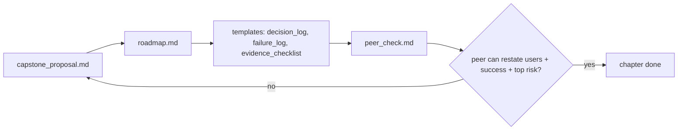

# My Work — Chapter 00: Orientation

This is your workspace for this chapter. The orientation chapter's output is
**planning**, but it is still reviewable evidence. Fill the files below; the
chapter is done when a peer can read your proposal and restate it.

## What this chapter produces



## Deliverables checklist

- [ ] `capstone_proposal.md` — domain, users (specific), corpus (+ legal usability), success metric, top 3-5 risks, non-goals. Under ~600 words.
- [ ] `roadmap.md` — each of the 16 chapters mapped to the artifact it will leave here (no "understand X" entries).
- [ ] `decision_log.md` — template + first entry ("why this domain?").
- [ ] `failure_log.md` — empty template, ready for later chapters.
- [ ] `evidence_checklist.md` — the per-concept self-check template.
- [ ] `peer_check.md` — a peer's answers to: who are the users? what is success? what is the top risk?

## Suggested layout

```
my_work/
  capstone_proposal.md
  roadmap.md
  decision_log.md
  failure_log.md
  evidence_checklist.md
  peer_check.md
```

See `../examples.md` for ready-to-copy templates and a good-vs-weak proposal
contrast. See `../homework.md` for the graded task list.

## Done when

A peer who has never seen your project can, after one read of
`capstone_proposal.md`, state your users, your success metric, and your top
risk — without asking you.
