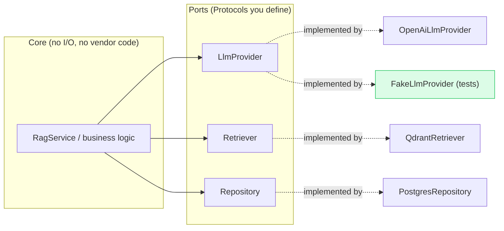
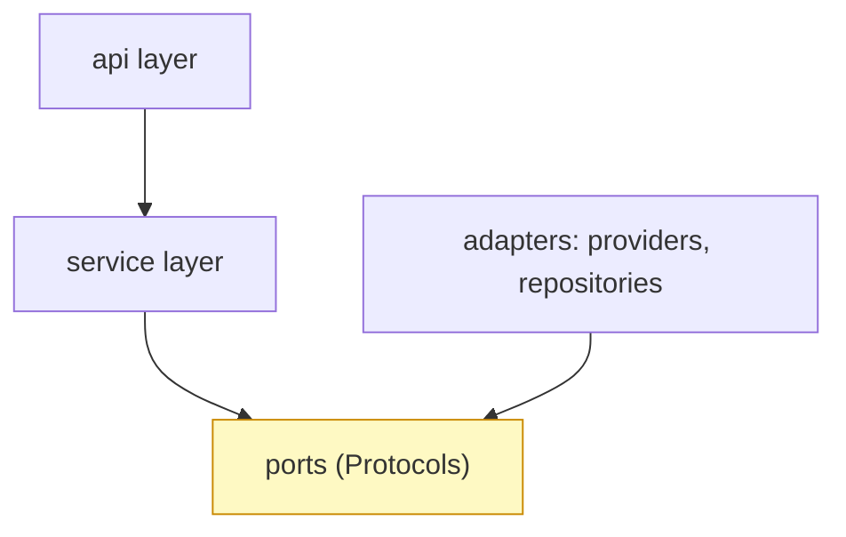

<!-- HAND-AUTHORED: do not regenerate -->
# Deep Dive: Python Backend Foundations

## Thesis

Production AI work requires maintainable Python services, not notebook-only scripts. The architecture this chapter teaches is not invented for AI — it is the decades-old **ports-and-adapters** (hexagonal) style [9] combined with the **dependency inversion principle** [10]: business logic depends on abstractions (Protocols), and concrete details (a specific LLM, a specific database) plug in at the edges. AI simply raises the stakes, because the "details" that change underneath you — model providers, vector stores, embedding models — change *often*.

## Ports and Adapters: The Core Picture

Your service logic sits in the centre and depends only on *ports* (the `Protocol` interfaces). Real providers and databases are *adapters* that implement those ports; in tests, fakes implement the same ports. Nothing in the centre knows whether it's talking to OpenAI or a fake:

This is why "swap OpenAI for Anthropic" should touch *two* files (a new adapter and one line in the composition root) and why every test runs without a network. If a provider change ripples through your service code, a port is missing.

## The Dependency Rule

Dependencies point **inward, toward the abstraction**. The API depends on the service; the service depends on ports; adapters also depend on ports (they implement them). The centre depends on nothing concrete — that is the dependency inversion principle [10] in one diagram. A circular import or an `import openai` inside the service is a violation you can see at a glance.

## Core Concepts

### `package layout`

The directory and module organization of a Python application, following community conventions (the `src/` layout, separation of concerns) [7][8]. A clean layout separates routes, services, repositories, providers, models, and tests.

Verification: Show where API, service, provider, and persistence code live in your capstone.

### `type hints`

Python annotations (PEP 484 [11]) that document expected input and output types. They make contracts visible and let a static type checker (mypy, pyright) catch boundary mistakes before runtime.

Verification: Annotate service/provider interfaces and run a type checker in CI.

### `Pydantic`

A Python data-validation library built on type hints, used for typed models, API schemas, and settings [3]. It validates request/response shapes at runtime — the right tool at system boundaries (HTTP, provider responses, tool arguments).

Verification: Use Pydantic models for API requests, responses, config, and tool schemas.

### `service layer`

The application layer that owns business logic independent of HTTP routes — a named pattern from enterprise application architecture [12]. It keeps core AI behavior testable without running the web framework.

Verification: Call the RAG service from both API tests and direct service tests.

### `repository`

A component that hides persistence behind a stable, collection-like interface — Fowler's Repository pattern [13]. It lets SQL storage change without rewriting business logic.

Verification: Implement document, feedback, and audit repositories with explicit methods.

### `provider adapter`

An adapter (in the ports-and-adapters sense [9]) that isolates external providers such as LLMs, embedding APIs, or vector stores. It reduces vendor lock-in and makes testing with fakes possible.

Verification: Define provider Protocols and replace real providers with fakes in tests.

### `async I/O`

Concurrent waiting for network or file operations without blocking the event loop, via Python's `asyncio` [14]. LLM, vector DB, SQL, and tool calls are network-bound, so async dramatically raises throughput — but blocking calls and unbounded concurrency are sharp edges.

Verification: Use async boundaries where I/O dominates; bound concurrency; measure under load.

### `structured logging`

Machine-readable logs with consistent event names and fields (e.g. via `structlog` [15] or stdlib logging with a JSON formatter). It enables tracing, debugging, analytics, incident response, and audit workflows.

Verification: Log request ID, tenant, model, prompt, index, latency, and error type — never raw secrets.

## Implementation Blueprint

Build this chapter as part of the capstone, not as isolated reading.

1. Lay out the package (`src/<pkg>/{api,core,models,services,repositories,providers}`) [7].
2. Define a `Protocol` per external dependency; implement one real and one fake adapter each [9].
3. Put business logic in the service layer [12]; keep route handlers mechanical.
4. Read configuration from the environment via pydantic-settings [3][16]; never hard-code secrets.
5. Add a typed error hierarchy mapped to HTTP status codes.
6. Configure structured logging with a `request_id` contextvar [15].
7. Write a test suite that runs with no network (fakes), targeting under five seconds.

## Current Engineering Problems To Study

- Model provider logic leaking into routes, making systems hard to test.
- Untyped request/response objects causing late, hard-to-debug failures.
- Notebook prototypes lacking error contracts, dependency boundaries, and logs.
- Blocking calls inside `async def` freezing the event loop for all in-flight requests.

## Production Failure Modes

Each failure names the concept, how it shows up in production, and the check that catches it earlier.

- `package layout` — failure: All logic lives in one script, making provider changes and tests difficult. Mitigation check: Show where API, service, provider, and persistence code live in your capstone.
- `type hints` — failure: A retriever returns inconsistent objects and downstream generation fails late. Mitigation check: Annotate service/provider interfaces and run a type checker in CI.
- `Pydantic` — failure: Invalid tool arguments reach a provider because input was only informally checked. Mitigation check: Use Pydantic models for API requests, responses, config, and tool schemas.
- `service layer` — failure: The RAG pipeline is embedded inside a route handler and cannot be unit tested. Mitigation check: Call the RAG service from both API tests and direct service tests.
- `repository` — failure: SQL queries are scattered across agent, API, and evaluation code. Mitigation check: Implement document, feedback, and audit repositories with explicit methods.
- `provider adapter` — failure: OpenAI-specific response parsing is hardcoded inside the RAG service. Mitigation check: Define provider Protocols and replace real providers with fakes in tests.
- `async I/O` — failure: A slow (or synchronous) provider call blocks unrelated requests in the API service. Mitigation check: Use async boundaries where I/O dominates; push CPU work to threads; bound concurrency.
- `structured logging` — failure: Logs contain plain-text messages with no request ID or version metadata, or leak secrets. Mitigation check: Log request ID, tenant, model, prompt, index, latency, and error type; redact secrets.

## Project Directions

- Build a typed AI service skeleton with fake LLM, fake retriever, and tests.
- Create a provider adapter interface for LLM, embedding, and vector store calls.
- Implement structured logging with request IDs and model/prompt/index metadata.

## How This Chapter Connects To The Capstone

This chapter produces the skeleton every later chapter plugs into: ports for the LLM and vector store (chapters 5–8), repositories for SQL (chapter 2), the service the API exposes (chapter 3), and the logging observability builds on (chapter 12). Do not mark it complete until a teammate can extend the skeleton without asking you.

## References

[1] Python typing module: https://docs.python.org/3/library/typing.html
[2] Python logging module: https://docs.python.org/3/library/logging.html
[3] Pydantic documentation: https://docs.pydantic.dev/
[4] pytest documentation: https://docs.pytest.org/
[5] FastAPI documentation: https://fastapi.tiangolo.com/
[6] Python asyncio documentation: https://docs.python.org/3/library/asyncio.html
[7] Real Python, Python Application Layouts: https://realpython.com/python-application-layouts/
[8] PEP 8 — Style Guide for Python Code: https://peps.python.org/pep-0008/
[9] Alistair Cockburn, Hexagonal Architecture (Ports and Adapters): https://alistair.cockburn.us/hexagonal-architecture/
[10] Dependency Inversion Principle (overview): https://en.wikipedia.org/wiki/Dependency_inversion_principle
[11] PEP 484 — Type Hints: https://peps.python.org/pep-0484/
[12] Martin Fowler, Service Layer (PoEAA): https://martinfowler.com/eaaCatalog/serviceLayer.html
[13] Martin Fowler, Repository (PoEAA): https://martinfowler.com/eaaCatalog/repository.html
[14] Python asyncio — Coroutines and Tasks: https://docs.python.org/3/library/asyncio-task.html
[15] structlog documentation: https://www.structlog.org/
[16] The Twelve-Factor App — Config: https://12factor.net/config

## Further Reading

- PEP 257 — Docstring Conventions: https://peps.python.org/pep-0257/
- PEP 20 — The Zen of Python: https://peps.python.org/pep-0020/
- mypy documentation (static type checking): https://mypy.readthedocs.io/
- Real Python, Dependency Injection in Python: https://realpython.com/dependency-injection-python/
