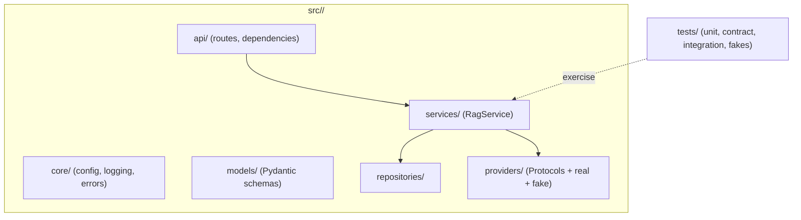

# My Work — Chapter 01: Python Backend Foundations

Your workspace for the typed service skeleton the rest of the course plugs
into. The goal is an inspectable, tested structure that runs with **no network**.

## Target structure to build



## Deliverables checklist

- [ ] Package skeleton importable as `python -c "import <pkg>"`.
- [ ] `core/config.py` via pydantic-settings + committed `.env.example` (no secrets).
- [ ] Pydantic `AskRequest` / `AskResponse` / `Citation` with validation.
- [ ] `RagService` with constructor-injected `Retriever` / `Generator` / `AuditRepository` Protocols.
- [ ] Fake implementations of each Protocol under `tests/fakes/`.
- [ ] `core/errors.py` exception hierarchy with `error_code` / `retryable`.
- [ ] Structured JSON logging with `request_id`, `tenant_id`, `model_id`, `prompt_version`, `latency_ms` + a tested `redact_for_log` helper.
- [ ] `tests/unit/` covering happy path, no-answer (audited), provider-error mapping — under 5s, zero network.
- [ ] (stretch) composition root + `mypy` clean + `baseline.md` perf numbers.

## Suggested layout

```
my_work/
  src/<pkg>/{api,core,models,services,repositories,providers}/
  tests/{unit,contract,integration,fakes}/
  .env.example
  pyproject.toml
  baseline.md          # optional: p50/p95 under load
  decision_record.md   # e.g. which logging library and why
```

See `../examples.md` for copy-ready snippets (schemas, Protocols, service,
error mapping, redaction, tests) and `../lesson.md` for the architecture
diagrams (ports-and-adapters, request sequence, sync-vs-async, test pyramid).

## Done when

A teammate can clone, run the tests (green, no network), and swap a provider
via config — without asking you. The service can be exercised entirely with
fakes.
