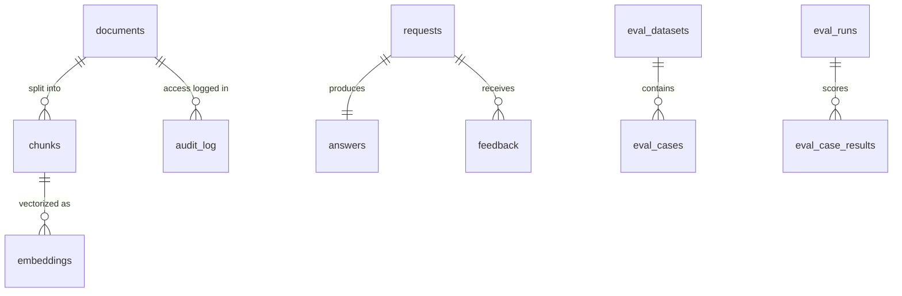

# Lesson: SQL and Data Management for AI Systems

## 1. Why SQL Is the Control Plane

When teams first build a RAG system they reach for a vector database and treat the relational database as an afterthought — somewhere to stash user accounts. That gets reversed in production. Vector search answers exactly one question: *which chunks are semantically similar to this query?* Everything else — who is allowed to see what, which version produced this answer, what did the user say afterward, which embedding model is currently live, what should be deleted next Tuesday — lives in SQL.

A production AI system has at minimum these responsibilities and SQL is the natural place for all of them:

- **Identity and access**: users, tenants, roles, document-level permissions.
- **Catalog**: which documents exist, which versions, which were deleted, who uploaded them.
- **Request traceability**: every `/ask` call captured with model version, prompt version, retrieved chunk ids, latency, cost.
- **Quality evidence**: golden datasets, eval runs, per-case scores, regression history.
- **Feedback and labels**: user ratings, expert annotations, failure categories.
- **Audit**: who accessed what, when, why, and through which release.
- **Cost and capacity**: token counts per request, per tenant, per day.

The vector store is the *engine*; SQL is the *control plane*. If you only invest in the engine, the system can answer questions but cannot explain itself.

This chapter teaches you how to design that control plane so the rest of the course (especially chapters 09 on evaluation, 12 on observability, and 15 on security) has something real to build on.

## Visual Overview

The core tables and how they relate. `documents` is the root of traceability; everything links back to it:



## 2. The Seven Canonical Tables

Different domains will add their own tables, but in every production RAG/agent system you will eventually have a near-identical set of seven:

1. `documents` — source material the system ingested.
2. `chunks` — retrievable units derived from documents.
3. `embeddings` — vectors (or pointers to vectors in a dedicated store).
4. `requests` — every user-facing AI call.
5. `answers` — generated responses with citations and metadata.
6. `feedback` — user/expert judgements on answers.
7. `audit_log` — sensitive actions on documents, chunks, answers.

A separate `evals` table (or schema) tracks golden cases and run results; we'll cover it in section 6 after the core seven.

Why this exact set: every concept in chapter 07 RAG and chapter 09 evaluation needs one of these tables to exist. Build them in the order above and you'll never paint yourself into a corner.

## 3. Designing `documents` and `chunks`

The `documents` table is the root of traceability. Every chunk, every embedding, every citation eventually leads back to a row here.

```sql
CREATE TABLE documents (
    id              UUID         PRIMARY KEY DEFAULT gen_random_uuid(),
    tenant_id       UUID         NOT NULL,
    source_uri      TEXT         NOT NULL,           -- s3://..., file://..., or http(s)://...
    title           TEXT         NOT NULL,
    document_type   TEXT         NOT NULL,           -- 'policy' | 'contract' | 'ticket' | ...
    mime_type       TEXT         NOT NULL,
    sha256          BYTEA        NOT NULL,           -- content hash; dedup + idempotency
    byte_size       BIGINT       NOT NULL,
    version         INTEGER      NOT NULL DEFAULT 1,
    superseded_by   UUID         REFERENCES documents(id),
    access_level    TEXT         NOT NULL,           -- 'public' | 'internal' | 'restricted'
    metadata        JSONB        NOT NULL DEFAULT '{}'::jsonb,
    created_at      TIMESTAMPTZ  NOT NULL DEFAULT NOW(),
    created_by      UUID         NOT NULL,
    deleted_at      TIMESTAMPTZ,                     -- soft delete; never hard delete here
    deleted_by      UUID,
    delete_reason   TEXT,

    CONSTRAINT chk_delete_consistent CHECK (
        (deleted_at IS NULL AND deleted_by IS NULL) OR
        (deleted_at IS NOT NULL AND deleted_by IS NOT NULL)
    )
);

CREATE UNIQUE INDEX uq_documents_tenant_sha
    ON documents (tenant_id, sha256)
    WHERE deleted_at IS NULL;

CREATE INDEX ix_documents_tenant_type_created
    ON documents (tenant_id, document_type, created_at DESC)
    WHERE deleted_at IS NULL;
```

Several deliberate choices worth memorising:

- **UUID primary keys.** Easier to migrate across environments, no leaky sequential ids, and merging tenant data into another instance becomes possible.
- **`sha256` for dedup.** Uploading the same document twice should not create two `documents` rows. The unique index on `(tenant_id, sha256)` enforces idempotency at the schema level — your ingestion service can rely on `ON CONFLICT` instead of doing application-level "did I already insert this?" lookups.
- **`version` + `superseded_by`** instead of UPDATE-in-place. When a document changes, insert a new row and link the old one. Citations that pointed to the old version still resolve. This is how regulated domains stay sane.
- **Soft delete.** `deleted_at IS NOT NULL` excludes the row from normal queries but preserves it for audit. The `CHECK` constraint prevents the half-state where `deleted_at` is set but `deleted_by` isn't — small constraints like this catch real bugs.
- **Partial unique index on `WHERE deleted_at IS NULL`.** Lets you re-upload a document after deletion without violating uniqueness, and keeps the index small.

The `chunks` table mirrors this:

```sql
CREATE TABLE chunks (
    id              UUID         PRIMARY KEY DEFAULT gen_random_uuid(),
    document_id     UUID         NOT NULL REFERENCES documents(id) ON DELETE RESTRICT,
    tenant_id       UUID         NOT NULL,           -- denormalised on purpose, see below
    chunk_index     INTEGER      NOT NULL,           -- ordinal within document
    text            TEXT         NOT NULL,
    token_count     INTEGER      NOT NULL,
    section         TEXT,
    page_number     INTEGER,
    char_start      INTEGER      NOT NULL,
    char_end        INTEGER      NOT NULL,
    metadata        JSONB        NOT NULL DEFAULT '{}'::jsonb,
    chunking_version TEXT        NOT NULL,           -- which chunker produced this
    created_at      TIMESTAMPTZ  NOT NULL DEFAULT NOW(),

    UNIQUE (document_id, chunking_version, chunk_index)
);

CREATE INDEX ix_chunks_tenant_doc ON chunks (tenant_id, document_id);
```

Two notes:

- **`tenant_id` is denormalised onto `chunks`.** Yes, you can `JOIN documents` to get it. No, you do not want to. Every retrieval-related query filters by tenant; doing it via a join is slower and easier to get wrong (forget the join and you've leaked across tenants). Denormalisation here is correctness *and* performance.
- **`chunking_version`** records which chunker produced a chunk. When you change chunking strategies (you will), you need to re-chunk without overwriting the old chunks — citations still need to resolve. Storing the version lets old retrievals stay reproducible.
- **`ON DELETE RESTRICT`** instead of CASCADE: explicit deletion order forces the operator to think. Cascading delete of a document silently removes hundreds of chunks and breaks past citations.

## 4. Embeddings: SQL Catalog + Vector Store

You have two reasonable choices for storing vectors:

1. **`pgvector`** in the same PostgreSQL instance — operationally simplest, fine up to single-digit millions of vectors with HNSW.
2. **A dedicated vector store** (Qdrant, Milvus, Weaviate, etc.) — required at scale, better filtering performance, separate failure domain.

Regardless of which you pick, you want a SQL table that *catalogs* the embeddings — what was embedded, by which model, into which index — even if the vectors themselves live elsewhere:

```sql
CREATE TABLE embeddings (
    id                  UUID         PRIMARY KEY DEFAULT gen_random_uuid(),
    chunk_id            UUID         NOT NULL REFERENCES chunks(id) ON DELETE CASCADE,
    embedding_model     TEXT         NOT NULL,       -- 'text-embedding-3-small' etc.
    embedding_dim       INTEGER      NOT NULL,
    vector_store        TEXT         NOT NULL,       -- 'pgvector' | 'qdrant:prod' | ...
    vector_store_id     TEXT,                        -- id used by the external store
    index_version       TEXT         NOT NULL,       -- 'v17'
    -- Only populated when vector_store = 'pgvector':
    vector              vector(1536),
    created_at          TIMESTAMPTZ  NOT NULL DEFAULT NOW(),

    UNIQUE (chunk_id, embedding_model, index_version)
);

-- pgvector index (if you use it):
CREATE INDEX ix_embeddings_vec_hnsw
    ON embeddings USING hnsw (vector vector_cosine_ops)
    WHERE vector IS NOT NULL;
```

The non-obvious value: when an incident report says "answer X cited chunk Y; which embedding model was live at the time?", this table answers it. Without it, you're guessing.

`ON DELETE CASCADE` is appropriate from `chunks` to `embeddings` because an embedding without its chunk is meaningless. But that cascade does *not* automatically delete the vector in the external store — you need a deletion job that reads the `vector_store_id` and calls the store's delete API. We come back to this in section 11.

## 5. `requests` and `answers`: Per-Call Traceability

Every `/ask` call should produce one row in `requests` and (if it returned an answer) one row in `answers`. Without this, debugging "why did Acme tenant get a wrong answer at 14:32?" devolves into log archaeology.

```sql
CREATE TABLE requests (
    id              UUID         PRIMARY KEY,         -- this is the request_id you log everywhere
    tenant_id       UUID         NOT NULL,
    user_id         UUID         NOT NULL,
    received_at     TIMESTAMPTZ  NOT NULL DEFAULT NOW(),
    endpoint        TEXT         NOT NULL,            -- '/ask' | '/agent/run' | ...
    question        TEXT         NOT NULL,
    question_hash   BYTEA        NOT NULL,            -- for cache lookups without storing PII twice
    locale          TEXT,
    idempotency_key TEXT,
    metadata        JSONB        NOT NULL DEFAULT '{}'::jsonb,

    UNIQUE (tenant_id, idempotency_key)               -- enforces idempotent re-submissions
);

CREATE INDEX ix_requests_tenant_time ON requests (tenant_id, received_at DESC);

CREATE TABLE answers (
    request_id          UUID         PRIMARY KEY REFERENCES requests(id) ON DELETE CASCADE,
    answer_text         TEXT         NOT NULL,
    no_answer           BOOLEAN      NOT NULL DEFAULT FALSE,
    requires_review     BOOLEAN      NOT NULL DEFAULT FALSE,
    model_id            TEXT         NOT NULL,        -- exact deployed model name
    prompt_version      TEXT         NOT NULL,        -- 'rag_v4'
    embedding_model     TEXT         NOT NULL,
    index_version       TEXT         NOT NULL,
    retrieved_chunk_ids UUID[]       NOT NULL,
    cited_chunk_ids     UUID[]       NOT NULL,
    input_tokens        INTEGER      NOT NULL,
    output_tokens       INTEGER      NOT NULL,
    latency_ms          INTEGER      NOT NULL,
    completed_at        TIMESTAMPTZ  NOT NULL DEFAULT NOW(),
    metadata            JSONB        NOT NULL DEFAULT '{}'::jsonb
);

CREATE INDEX ix_answers_model_time ON answers (model_id, completed_at DESC);
CREATE INDEX ix_answers_prompt_time ON answers (prompt_version, completed_at DESC);
```

The columns that matter most for incident analysis:

- **`model_id`, `prompt_version`, `embedding_model`, `index_version` on every answer.** When you ship a new prompt and quality drops, you need to find the bad cohort *by version*, not by guessing timestamps.
- **`retrieved_chunk_ids` and `cited_chunk_ids` as arrays.** Yes, PostgreSQL arrays are unfashionable. Yes, you could normalise into a junction table. For this specific query pattern (per-answer chunk list, almost always queried by `request_id`), arrays are simpler and faster. If you ever need to query "which answers cited chunk X?", add a GIN index: `CREATE INDEX ... USING GIN (cited_chunk_ids)`.
- **`idempotency_key` unique per tenant.** When a flaky network causes a retry, you do not want two `requests` rows and two LLM calls. The unique constraint enforces "at most one of this".
- **`no_answer` and `requires_review` as first-class booleans.** Aggregate queries about refusal rate or review rate become trivial. If these were buried inside `metadata` JSON, every dashboard would parse JSON.

## 6. `feedback` and `evals`: Quality as Data

Feedback turns user reactions into a queryable signal. Eval cases turn quality into a release gate. Both deserve their own structured tables.

```sql
CREATE TABLE feedback (
    id              UUID         PRIMARY KEY DEFAULT gen_random_uuid(),
    request_id      UUID         NOT NULL REFERENCES requests(id) ON DELETE CASCADE,
    tenant_id       UUID         NOT NULL,
    reviewer_type   TEXT         NOT NULL,        -- 'end_user' | 'expert' | 'auto_grader'
    reviewer_id     UUID         NOT NULL,
    rating          SMALLINT,                     -- 1-5 or null for thumbs without rating
    thumbs          TEXT,                         -- 'up' | 'down' | NULL
    failure_category TEXT,                        -- normalised label, see section 9
    notes           TEXT,
    created_at      TIMESTAMPTZ  NOT NULL DEFAULT NOW()
);

CREATE INDEX ix_feedback_failure_time
    ON feedback (failure_category, created_at DESC)
    WHERE failure_category IS NOT NULL;
```

For evals, treat the golden dataset as a versioned artifact:

```sql
CREATE TABLE eval_datasets (
    id              UUID         PRIMARY KEY DEFAULT gen_random_uuid(),
    name            TEXT         NOT NULL,
    version         TEXT         NOT NULL,        -- 'v1', '2026-05-26-rc1'
    created_at      TIMESTAMPTZ  NOT NULL DEFAULT NOW(),
    description     TEXT         NOT NULL,
    UNIQUE (name, version)
);

CREATE TABLE eval_cases (
    id                  UUID    PRIMARY KEY DEFAULT gen_random_uuid(),
    dataset_id          UUID    NOT NULL REFERENCES eval_datasets(id) ON DELETE CASCADE,
    case_id             TEXT    NOT NULL,        -- stable within dataset, e.g. 'CASE-007'
    question            TEXT    NOT NULL,
    expected_answer     TEXT,
    reference_chunk_ids UUID[]  NOT NULL DEFAULT '{}',
    risk_level          TEXT    NOT NULL,        -- 'low' | 'medium' | 'high'
    failure_category    TEXT,                    -- expected failure mode if any
    metadata            JSONB   NOT NULL DEFAULT '{}',
    UNIQUE (dataset_id, case_id)
);

CREATE TABLE eval_runs (
    id              UUID         PRIMARY KEY DEFAULT gen_random_uuid(),
    dataset_id      UUID         NOT NULL REFERENCES eval_datasets(id),
    model_id        TEXT         NOT NULL,
    prompt_version  TEXT         NOT NULL,
    embedding_model TEXT         NOT NULL,
    index_version   TEXT         NOT NULL,
    started_at      TIMESTAMPTZ  NOT NULL DEFAULT NOW(),
    completed_at    TIMESTAMPTZ,
    release_gate    TEXT,                        -- 'pass' | 'fail' | 'manual_review'
    summary         JSONB        NOT NULL DEFAULT '{}'
);

CREATE TABLE eval_case_results (
    run_id          UUID         NOT NULL REFERENCES eval_runs(id) ON DELETE CASCADE,
    case_id         UUID         NOT NULL REFERENCES eval_cases(id),
    metrics         JSONB        NOT NULL,        -- {"faithfulness": 0.91, ...}
    passed          BOOLEAN      NOT NULL,
    trace_id        TEXT,                         -- pointer to detailed trace
    PRIMARY KEY (run_id, case_id)
);
```

Two design choices worth defending:

- **`metrics` as JSONB on `eval_case_results`.** Different evals produce different metrics (RAGAS faithfulness, citation correctness, latency). JSONB keeps the schema flexible without an explosion of nullable columns. Use a `GIN` index on `metrics` if you'll query by metric name.
- **`release_gate` on `eval_runs`.** Encodes the release decision at the run level. CI can query `SELECT release_gate FROM eval_runs WHERE id = $1` to decide whether to deploy. Without this, the gate logic lives only in CI scripts and rots.

## 7. The `audit_log` Table

The audit log is the table you build because regulators (or future-you, after an incident) will ask "who accessed what, when, why, and through which version?" An audit log is fundamentally different from an application log:

| | Application log | Audit log |
| --- | --- | --- |
| Audience | engineers | compliance, security, legal |
| Storage | logs cluster, hot a few weeks | SQL or WORM store, hot for years |
| Mutability | rotated/deleted freely | append-only, retention-controlled |
| Schema | loose, may evolve | tight, schema-enforced |
| What's logged | everything | only sensitive actions |

Schema:

```sql
CREATE TABLE audit_log (
    id              BIGSERIAL    PRIMARY KEY,
    occurred_at     TIMESTAMPTZ  NOT NULL DEFAULT NOW(),
    actor_type      TEXT         NOT NULL,        -- 'user' | 'service' | 'admin'
    actor_id        UUID         NOT NULL,
    tenant_id       UUID         NOT NULL,
    action          TEXT         NOT NULL,        -- 'document.read' | 'answer.generate' | 'document.delete' | ...
    resource_type   TEXT         NOT NULL,
    resource_id     UUID,
    purpose         TEXT,                          -- 'rag_answer' | 'admin_review' | 'export'
    request_id      UUID,                          -- correlates with requests.id
    release_version TEXT,                          -- git sha + release manifest id
    ip_address      INET,
    user_agent      TEXT,
    payload         JSONB        NOT NULL DEFAULT '{}'
);

CREATE INDEX ix_audit_tenant_time
    ON audit_log (tenant_id, occurred_at DESC);

CREATE INDEX ix_audit_actor_time
    ON audit_log (actor_id, occurred_at DESC);

CREATE INDEX ix_audit_action_time
    ON audit_log (action, occurred_at DESC);
```

Operational rules that should be baked in from day one:

- **Append-only at the application level.** No code path issues `UPDATE audit_log` or `DELETE FROM audit_log`. Database role for the app has only `INSERT` and `SELECT` on this table.
- **Synchronous write for actions that demand it.** A "delete document" audit entry must commit in the same transaction as the delete. A "read document" entry can be async if volume demands it — but you accept some loss.
- **Retention is policy-driven.** Some entries (consent changes, deletions) keep for years; access logs may keep for months. Encode the policy in a `pg_cron` job, not in tribal knowledge.

What should produce an audit entry, by default:

- any read of a document marked `access_level = 'restricted'`
- any document soft-delete or hard-delete
- any tool call with side effects (chapter 10's agent tools)
- any guardrail block (chapter 15)
- any cross-tenant operation by an admin

## 8. Indexes That Actually Matter for AI Workloads

Indexes are not free: they slow inserts, take memory, and create maintenance burden. Add them deliberately, justify each one, and re-evaluate when query patterns change. A `schema_notes.md` next to your DDL should explain *which query each index serves*.

Indexes that genuinely earn their keep in AI systems:

- **`(tenant_id, created_at DESC)` on `requests`, `answers`, `feedback`.** Almost every dashboard query starts with "for tenant X, in the last N hours/days...".
- **`(tenant_id, document_type, created_at DESC) WHERE deleted_at IS NULL` on `documents`.** Listing tenant documents by type is a frequent UI operation. The partial predicate skips soft-deleted rows.
- **`(model_id, completed_at DESC)` and `(prompt_version, completed_at DESC)` on `answers`.** Lets you query "how is the new prompt performing?" without a full scan.
- **`USING GIN (cited_chunk_ids)` on `answers`.** Required if you ever need to find answers that cited a specific chunk (impact analysis when a document changes).
- **`USING GIN (metadata jsonb_path_ops)` on `documents` and `chunks`.** Enables fast JSONB containment queries (`metadata @> '{"jurisdiction": "TR"}'`). Use `jsonb_path_ops` (smaller index, fewer operators) unless you need the full ops set.
- **HNSW on `embeddings.vector`** when using pgvector. Configure `m` (graph degree) and `ef_construction` per your scale; defaults are reasonable for under 1M vectors.

Indexes you should *not* add by default:

- A `BTREE` on every `tenant_id` column. The composite indexes above already cover most queries.
- A `BTREE` on `metadata` JSONB. Use GIN for JSONB; BTREE on JSONB is almost always wrong.
- An index per JSONB field "just in case." Define the queries first.

To diagnose the indexes you have, the two SQL views you should know are `pg_stat_user_indexes` (how often is each index used?) and `pg_stat_statements` (which queries are slow and how often do they run?). Unused indexes are technical debt — drop them.

## 9. Multi-Tenant Isolation as a Query Discipline

Multi-tenant data leaks are among the most common AI-system security incidents. The cure is a discipline applied at every layer:

1. **At the API layer**, `tenant_id` is extracted from the verified token, not from request bodies. Never trust `tenant_id` from a request payload.
2. **In application code**, every repository method takes `tenant_id` as a *required* parameter (chapter 01).
3. **In SQL**, every WHERE clause filters by `tenant_id`. This is usually enforced by repository helpers, but for very high-stakes systems, use PostgreSQL's row-level security (RLS):

```sql
ALTER TABLE documents ENABLE ROW LEVEL SECURITY;

CREATE POLICY documents_tenant_isolation ON documents
    USING (tenant_id = current_setting('app.tenant_id')::uuid);
```

Then your application sets `SET app.tenant_id = '...'` per connection (typically per request, in a connection-pool-friendly way). RLS adds a defense-in-depth layer: even a missing `WHERE tenant_id = ...` cannot leak.

The cost of RLS: it forces every query to include the policy predicate, which can interact unpredictably with the query planner. Benchmark before adopting it at scale; for many systems, disciplined application-layer filtering is enough.

## 10. JSONB Metadata: Powerful and Easy to Misuse

`JSONB` columns are the right home for variable-shape metadata: per-document fields that depend on `document_type`, per-tenant configuration, ad-hoc tags. They are the wrong home for fields you query often or filter by.

Right uses:

- `documents.metadata`: jurisdiction, effective_date, owning team, regulatory class.
- `chunks.metadata`: parser-specific fields like "table_id" or "footnote_anchor".
- `answers.metadata`: streaming flag, A/B variant id, debug toggles.

Wrong uses (these should be promoted to columns):

- `metadata->>'tenant_id'`. Always a column, always indexed, always required.
- `metadata->>'model_id'`. Same.
- Anything that appears in `WHERE` on every query.

Two practical patterns:

```sql
-- Query by JSONB containment, hits the GIN index:
SELECT id FROM documents
WHERE tenant_id = $1
  AND metadata @> '{"jurisdiction": "TR", "regulatory_class": "PII"}'::jsonb;

-- Extract for projection, no index needed:
SELECT id, metadata->>'jurisdiction' AS jurisdiction
FROM documents WHERE tenant_id = $1;
```

JSONB validation: PostgreSQL has no schema check on JSONB by default. Either validate at the application layer (Pydantic model for each metadata shape), or add a `CHECK` constraint with a JSON schema validator function (`pg_jsonschema` extension). The application-layer approach is simpler and usually sufficient.

## 11. Retention, Deletion, and the Vector Store Problem

A "deletion" in an AI system has more moving parts than you'd think:

| Where it lives | What "delete" means |
| --- | --- |
| `documents` row | soft delete (timestamps + reason) |
| Raw file in object storage | delete after retention period |
| `chunks` rows | delete (or keep for citation history; depends on policy) |
| `embeddings` rows (pgvector or external) | delete vector + catalog row |
| Logs/traces referencing chunk_ids | redact or expire per policy |
| Eval cases that reference the document | re-anchor or remove from datasets |

A GDPR-style "delete my data" request touches *all* of these. If your retention policy only handles the `documents` row, you have a leak: an embedding of the deleted text still sits in the vector store and can be retrieved.

A workable design:

1. The soft-delete of a document writes an `audit_log` entry and enqueues a `deletion_job` row.
2. A background worker (chapter 12) processes the queue: deletes the raw file, deletes vector_store records by id, deletes `embeddings` rows, redacts logs older than retention.
3. The worker writes a final `audit_log` entry "deletion complete" so the compliance question "is it really gone?" has an answer.

Write a retention policy doc that lists every table and every external store, naming the TTL and the control. If a table is missing from the doc, the policy is incomplete.

## 12. Migrations and Backwards Compatibility

Schema migrations in AI systems are tricky because there are *two* coupled artifacts: the SQL schema and the vector store. A migration that renames `chunks.text` is also a re-indexing event because the embeddings reference the old text.

Migration discipline:

- **Use a migration tool** (Alembic for SQLAlchemy, sqlx-cli, dbmate, Liquibase). Track migrations in git, never edit a migration that's been applied to any environment.
- **Forward + rollback for every migration.** If a rollback isn't safe (e.g. a column that's been written to), say so explicitly in the migration description and require a manual rollback plan.
- **Avoid blocking DDL on large tables.** `ALTER TABLE ... ADD COLUMN ... DEFAULT ...` rewrites the whole table on older Postgres versions. Use the two-step pattern: add nullable, backfill, set NOT NULL.
- **Zero-downtime patterns for renames**: add the new column, dual-write from the application for a release, backfill, switch readers, drop the old column. Three deploys, no incident.
- **Re-indexing as a migration.** When you change embedding model or chunking version, the old index stays live until the new one catches up. The application reads from `index_version` config. Cutover is a config flip, not a downtime window.

## 13. Connection Pooling, Async Sessions, Transactions

For an async Python service, use `asyncpg` directly or via SQLAlchemy's async dialect. The connection pool is critical: too small and your service stalls under load; too large and you exhaust the database's connection limit.

A rough starting bound:

```python
from sqlalchemy.ext.asyncio import create_async_engine

engine = create_async_engine(
    settings.database_url,
    pool_size=10,
    max_overflow=10,
    pool_pre_ping=True,
    pool_recycle=1800,
)
```

`pool_pre_ping=True` catches stale connections (the kind that happen after a long idle period and would otherwise raise on next use). `pool_recycle=1800` evicts connections older than 30 minutes — defensive against firewalls that silently kill long-lived connections.

For very high traffic, put `PgBouncer` in front of PostgreSQL in transaction-pooling mode and shrink the application pool. This is one of the very few places where adding a piece of infrastructure is genuinely simpler than not.

Transactional patterns:

- **One transaction per request, where possible.** The unit-of-work pattern: the API handler opens a session, every repository call within the request shares it, the session commits on success and rolls back on exception. SQLAlchemy's `AsyncSession` plus FastAPI's dependency injection makes this clean.
- **Two-phase writes for ingestion.** Insert the `documents` row, commit. Then insert chunks + embeddings in their own transaction. If embeddings fail, the document is still there to retry against — and you have not wasted the parsing work.
- **Idempotency keys for retries.** The `requests.idempotency_key` unique constraint means retrying a stuck request with the same key returns the existing row, not a duplicate.

## 14. Query Observability

You will only know your queries are slow when someone complains. Don't let it get there. Enable `pg_stat_statements` from day one:

```sql
CREATE EXTENSION IF NOT EXISTS pg_stat_statements;
```

Then the top-slow-queries view becomes:

```sql
SELECT
    LEFT(query, 80) AS q,
    calls,
    total_exec_time / 1000 AS total_seconds,
    mean_exec_time AS mean_ms,
    rows / NULLIF(calls, 0) AS rows_per_call
FROM pg_stat_statements
ORDER BY total_exec_time DESC
LIMIT 20;
```

Run this weekly. The queries with high `mean_ms` are tuning candidates; queries with high `total_seconds` (because they run constantly) are *also* tuning candidates, even if mean_ms is fine.

`EXPLAIN (ANALYZE, BUFFERS)` is your friend. Read it. If you don't understand a plan, ask. It will tell you about missing indexes, bad statistics, and surprise sequential scans.

In CI, snapshot the query plans for the six named queries from chapter 02's project lab. A diff in plan structure is a red flag.

## 15. Common Mistakes and Anti-Patterns

A scan-list for code and schema review:

1. **Cascading deletes everywhere.** ON DELETE CASCADE silently turns "delete one row" into "delete a thousand". Use RESTRICT or NO ACTION and force the application to delete in the right order.
2. **Using `varchar(n)`.** Pick `TEXT`. Length limits belong in application validation, not in storage.
3. **`TIMESTAMP` without timezone.** Always `TIMESTAMPTZ`. The day you migrate across regions, you'll regret a `TIMESTAMP`.
4. **`SELECT *` in production queries.** It breaks when columns are added, and pulls more bytes than you need across the wire.
5. **Long-running open transactions.** A transaction held during a slow LLM call holds locks the whole time. Open the transaction late, commit early, never bracket an external call.
6. **N+1 queries inside a service method.** `for doc in docs: get_chunks(doc.id)` is the classic. Fetch in one query with `IN (...)` or a join, then group.
7. **Storing `password` or `api_key` columns.** Don't. Use a secrets store (chapter 15).
8. **`UUID` generation in the application.** PostgreSQL's `gen_random_uuid()` is fine and avoids the "but I used the wrong version" problem (use v4 unless you have a reason).
9. **One mega-`metadata` JSONB column for everything.** Hard to query, easy to misuse. Promote frequently-queried fields to columns.
10. **No `tenant_id` denormalisation on hot tables.** Forces joins on every query; one missed join is a leak.

## 16. Production Failure Modes

- **A new ingestion run inserts a million duplicate chunks.** Cause: `chunking_version` was not updated, so `(document_id, chunking_version, chunk_index)` collides and the application catches the error per row but keeps inserting. Defensive measure: batch insert with `ON CONFLICT DO NOTHING` and a hard cap on retries.
- **The audit log table grows unbounded and partitioning is added retroactively under load.** Defensive measure: range-partition `audit_log` by month from day one.
- **A retention job deletes embeddings but not the vectors in Qdrant.** Defensive measure: the deletion job is one piece of code that touches every store, with idempotency and a "fail loudly" mode.
- **Slow query on `pg_stat_user_indexes` reveals 30 unused indexes.** Defensive measure: monthly index audit; drop anything with zero hits over the period.
- **A migration that took 30 ms in staging takes 30 minutes in prod.** Cause: prod table is 1000x bigger; defensive measure: always test migrations against a production-sized dataset (anonymised), or use online migration tools (`pg_repack`, `gh-ost`-like).
- **A cross-tenant data leak via an `ORDER BY ... LIMIT 1` that forgot the `WHERE tenant_id` filter.** Defensive measure: row-level security as defense in depth, or a linting rule that fails any SELECT without a `tenant_id` predicate on the multi-tenant tables.

## 17. Security at the Data Layer

Three controls worth establishing from chapter 02, not chapter 15:

1. **Least-privilege database roles.** The application user has `SELECT/INSERT/UPDATE/DELETE` on data tables and `SELECT/INSERT` only on `audit_log`. A separate, narrower role for the deletion worker. Schema migrations run as a third role used only by CI.
2. **Column-level encryption for the small set of fields that need it.** If you must store a customer secret (e.g. a per-tenant API key for an integration), use `pgcrypto` to encrypt at column level with a key from a secrets manager — not the database itself.
3. **Backups and exports respect the same access model.** It's depressingly common to lock down production data and then ship a full dump of it to a dev machine for "debugging". A backup of `audit_log` is still `audit_log`. Treat exports as new copies that need their own controls.

## 18. The Capstone Checklist

By the end of chapter 02, the following should exist in `chapters/02_sql_data_management/my_work/`:

- `schema.sql` containing `documents`, `chunks`, `embeddings`, `requests`, `answers`, `feedback`, `eval_datasets`, `eval_cases`, `eval_runs`, `eval_case_results`, `audit_log` — with the indexes from sections 3–8.
- `schema_notes.md` justifying every non-PK index ("this index serves the query in `queries/quality_regression.sql`").
- `queries/` directory with at least six named queries: latency p95, quality regression, top failure category, unauthorized access, daily cost, eval coverage.
- `retention_policy.md` listing every table and external store, with TTL and control per row.
- An Alembic (or equivalent) migration suite that brings the schema up from empty, plus at least one tested rollback.
- A short README in `my_work/` that says how to spin up Postgres locally (docker-compose snippet), apply migrations, and run the seed.

If a teammate can apply your schema, run the six queries, and explain why every index exists, the chapter is done.

## 19. Key Takeaway

SQL is what makes an AI system explainable. Vector search is the impressive demo; SQL is what lets the system show its work — who saw what, which version answered what, what was deleted, what the user said next. Build this layer carefully and the rest of the course has firm ground to stand on.

## Numbered References

[1] PostgreSQL documentation: https://www.postgresql.org/docs/
[2] PostgreSQL indexes: https://www.postgresql.org/docs/current/indexes.html
[3] PostgreSQL JSON types: https://www.postgresql.org/docs/current/datatype-json.html
[4] pgvector GitHub: https://github.com/pgvector/pgvector
[5] MLflow tracking: https://www.mlflow.org/docs/latest/ml/tracking
