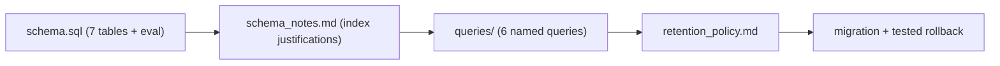

# My Work — Chapter 02: SQL and Data Management

Build the SQL control plane that tracks every document, chunk, request, answer,
feedback, eval, and audit event for your capstone.

## What this chapter produces



## Deliverables checklist

- [ ] `schema.sql` — documents, chunks, embeddings, requests, answers, feedback, audit_log + eval tables.
- [ ] `schema_notes.md` — every non-PK index justified by the query it serves.
- [ ] `queries/` — latency_p95, quality_regression, top_failure_category, unauthorized_access, daily_cost, eval_coverage.
- [ ] `retention_policy.md` — TTL + deletion control per table and per external store (no "TBD").
- [ ] migration suite (Alembic or equivalent) with one tested forward + rollback.
- [ ] (stretch) RLS policy + `pg_stat_statements` snapshot.

## Suggested layout

```
my_work/
  schema.sql
  schema_notes.md
  queries/*.sql
  retention_policy.md
  migrations/
  README.md   # how to spin up Postgres, apply migrations, run the seed
```

See `../examples.md` for ready SQL (idempotent ingest, audit-in-transaction,
p95, cross-tenant leak check, migration pattern) and `../lesson.md` for the
ER diagram and deletion-propagation model.

## Done when

A teammate can apply your schema, run the six named queries on seed data, and
explain why every index exists — without asking you.
