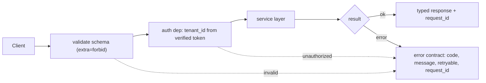

# Lesson: FastAPI, REST, and Integration for AI Systems

## 1. The API Is the Product Boundary

Once you publish an HTTP API, three things become true and you cannot easily reverse any of them:

1. The schema of every request and response becomes a contract you have to honour.
2. Clients (a frontend, a partner integration, another internal service, your own CLI) will build assumptions on top of it.
3. Breaking the contract becomes a coordination event rather than a code change.

A FastAPI route looks small — twelve lines and you have `/ask` working. That smallness is misleading. The decisions you make in those twelve lines — what fields are required, what the error shape is, what the status codes mean, how citations appear in a streaming response, whether `tenant_id` comes from the body or from the token — set the rules for the next year of work. This chapter is about making those decisions deliberately.

You already have the service layer from chapter 01. The API layer is the *translation* between HTTP and that service: validation, authentication, idempotency, streaming, error mapping. It should be thin, mechanical, and well-tested. If your route handler contains a `for` loop or a `try/except` that handles four different exception types, the boundary has slipped.

## Visual Overview

What a request flows through at the API boundary — validation and auth before any expensive work, a uniform error contract on every failure:



## 2. The Five Endpoints Every AI Service Has

Different products vary the wrapping, but underneath you will find these endpoints in nearly every production AI system. Design them once, well, and reuse the shape across the capstone:

| Endpoint | Method | Purpose |
| --- | --- | --- |
| `/documents` | POST | upload/ingest a document (often async; returns `job_id`) |
| `/documents/{id}` | DELETE | soft-delete a document; triggers retention pipeline |
| `/ask` | POST | synchronous Q&A; returns answer + citations |
| `/ask/stream` | GET (SSE) or POST | streaming variant of `/ask` |
| `/feedback` | POST | user/expert feedback tied to a `request_id` |
| `/eval/{run_id}` | GET | fetch eval run results |
| `/agent/run` | POST | start an agent workflow (often returns `run_id` + WebSocket/SSE) |
| `/jobs/{id}` | GET | poll status of long-running background jobs |
| `/healthz` | GET | liveness/readiness, no auth |
| `/metrics` | GET | Prometheus scrape target, internal only |

A few principles that apply across all of them:

- **Verbs in the path are usually a smell** (`/get_answer` instead of `POST /ask`). REST uses HTTP methods for the verb.
- **Plural collection nouns**: `/documents`, not `/document`.
- **IDs are opaque strings** in the URL (`/documents/{id}`), not "smart" composites.
- **Read endpoints never mutate state**; write endpoints declare side effects in their docs.
- **Long-running operations don't block the HTTP request**. `POST /documents` returns 202 + `job_id`; the client polls `GET /jobs/{id}` or subscribes to a stream.

## 3. Pydantic Schemas at the Boundary

FastAPI's superpower is that Pydantic models double as request validation, response validation, and OpenAPI documentation. Use them deliberately at every endpoint.

```python
from pydantic import BaseModel, Field, ConfigDict


class AskRequest(BaseModel):
    model_config = ConfigDict(extra="forbid")     # reject unknown fields

    question: str = Field(min_length=1, max_length=2000)
    top_k: int = Field(default=8, ge=1, le=50)
    locale: str | None = Field(default=None, pattern=r"^[a-z]{2}(-[A-Z]{2})?$")
    metadata: dict[str, str] = Field(default_factory=dict)


class Citation(BaseModel):
    document_id: str
    chunk_id: str
    source: str
    page: int | None = None
    score: float = Field(ge=0.0, le=1.0)


class AskResponse(BaseModel):
    request_id: str
    answer: str
    citations: list[Citation]
    requires_review: bool = False
    model_id: str
    prompt_version: str
```

Three points often missed:

- **`extra="forbid"`** turns "user sent a field you didn't expect" into a 422 error instead of a silent ignore. Loud is better than silent.
- **`tenant_id` is not in this body.** It comes from the verified auth token via a dependency (next section). A `tenant_id` in the request body is a security bug waiting to happen — a client could send a different tenant's id.
- **`request_id` is in the *response*.** Generated server-side, returned to the client, and threaded into every log line. Without it, "my request failed at 14:32" is a debugging guessing game.

For response schemas, prefer `response_model` over manual serialisation:

```python
@router.post("/ask", response_model=AskResponse, status_code=200,
             responses={422: {"model": ErrorBody}, 503: {"model": ErrorBody}})
async def ask(request: AskRequest, ctx: RequestContext = Depends(request_context),
              service: RagService = Depends(get_rag_service)) -> AskResponse:
    return await service.answer(request, ctx)
```

`response_model` enforces that the actual return matches the schema — if `service.answer` accidentally returns a dict missing `citations`, FastAPI raises before the response goes out. That bug never reaches a client.

## 4. Authentication and Tenant Injection

The single most common production bug at the API boundary is *trusting client-supplied identity*. The fix is a small, opinionated auth dependency that runs on every protected endpoint.

```python
from fastapi import Depends, HTTPException, Header
from dataclasses import dataclass


@dataclass(frozen=True)
class RequestContext:
    request_id: str
    tenant_id: str
    user_id: str
    role: str


async def request_context(
    authorization: str = Header(...),
    x_request_id: str | None = Header(default=None),
) -> RequestContext:
    token = _strip_bearer(authorization)
    claims = await verify_token(token)              # raises 401 on failure
    return RequestContext(
        request_id=x_request_id or _new_request_id(),
        tenant_id=claims["tenant_id"],
        user_id=claims["sub"],
        role=claims["role"],
    )
```

Then every route takes `ctx: RequestContext = Depends(request_context)`. The benefits:

- `tenant_id` and `user_id` come from the *verified* token. Forging requires forging the JWT.
- `request_id` is either echoed (allowing clients to correlate) or generated. Either way, it exists on every request.
- The dependency is unit-testable by overriding `app.dependency_overrides[request_context]` in tests.
- A misconfigured route that forgets the dependency cannot accidentally accept unauthenticated traffic — make it part of a `router = APIRouter(dependencies=[Depends(request_context)])` so it's applied to the whole router.

For RBAC, layer a second dependency:

```python
def require_role(*allowed: str):
    async def _check(ctx: RequestContext = Depends(request_context)) -> RequestContext:
        if ctx.role not in allowed:
            raise HTTPException(403, detail={"code": "authorization_error",
                                             "message": "insufficient role"})
        return ctx
    return _check

@admin_router.post("/documents/{id}/restore", dependencies=[Depends(require_role("admin"))])
async def restore_document(id: str): ...
```

This is one of the few places I'd allow a small bit of metaprogramming — the resulting routes are self-documenting and the role check is impossible to miss in code review.

## 5. The Error Contract

Every non-2xx response from your API should follow one shape, every time:

```json
{
  "error": {
    "code": "no_relevant_context",
    "message": "I could not find supporting evidence to answer.",
    "retryable": false,
    "request_id": "req_a31b9c"
  }
}
```

The codes map 1:1 to the exception classes you defined in chapter 01. The benefits:

- **Clients can branch on `code`**, not on parsing English `message` strings.
- **`retryable`** tells client SDKs whether to back off and retry.
- **`request_id`** lets a user paste it into a support ticket and you can find the trace immediately.

The mapping happens in a single exception handler:

```python
from fastapi import Request
from fastapi.responses import JSONResponse


_STATUS = {
    "validation_error": 422,
    "authorization_error": 403,
    "no_relevant_context": 422,
    "provider_error": 503,
    "unsafe_output": 422,
    "rate_limited": 429,
    "not_found": 404,
}


@app.exception_handler(AiServiceError)
async def handle_ai_error(request: Request, exc: AiServiceError):
    status = _STATUS.get(exc.error_code, 500)
    return JSONResponse(
        status_code=status,
        content={"error": {
            "code": exc.error_code,
            "message": exc.user_message,
            "retryable": exc.retryable,
            "request_id": getattr(request.state, "request_id", None),
        }},
    )
```

For uncaught exceptions, register a *generic* 500 handler that logs the full traceback but returns only the safe shape:

```python
@app.exception_handler(Exception)
async def handle_unexpected(request: Request, exc: Exception):
    logger.exception("unexpected_error", request_id=request.state.request_id)
    return JSONResponse(
        status_code=500,
        content={"error": {
            "code": "internal_error",
            "message": "Something went wrong.",
            "retryable": False,
            "request_id": request.state.request_id,
        }},
    )
```

Never echo the raw exception message to the client. Stack traces and internal details belong in your logs, not in API responses — both for security and for a sane support experience.

## 6. Streaming Responses

The synchronous `/ask` endpoint is fine for short questions; for longer answers, users notice the wait. Streaming the answer token by token improves perceived latency dramatically. But streaming introduces complications you must design for, not stumble into.

Server-Sent Events (SSE) is the right default — it's simpler than WebSockets, works over plain HTTP, and is supported by every browser. FastAPI doesn't have first-class SSE support, but `StreamingResponse` with a chunked async generator does the job:

```python
from fastapi.responses import StreamingResponse
import json


@router.post("/ask/stream")
async def ask_stream(
    request: AskRequest,
    ctx: RequestContext = Depends(request_context),
    service: RagService = Depends(get_rag_service),
):
    async def event_stream():
        # Send a session start event with the request_id so clients can correlate
        yield _sse("session", {"request_id": ctx.request_id})

        try:
            async for chunk in service.answer_stream(request, ctx):
                if chunk.type == "token":
                    yield _sse("token", {"text": chunk.text})
                elif chunk.type == "citation":
                    yield _sse("citation", chunk.citation.model_dump())
                elif chunk.type == "guardrail_block":
                    yield _sse("error", {"code": "unsafe_output",
                                         "message": "blocked by policy"})
                    return
            yield _sse("done", {})
        except AiServiceError as e:
            yield _sse("error", {"code": e.error_code,
                                 "message": e.user_message,
                                 "request_id": ctx.request_id})

    return StreamingResponse(event_stream(), media_type="text/event-stream")


def _sse(event: str, data: dict) -> str:
    return f"event: {event}\ndata: {json.dumps(data)}\n\n"
```

Several non-obvious rules:

- **The first event is always a session marker** containing the `request_id`. Without it, a client that loses the connection mid-stream cannot correlate retries.
- **Errors are events, not HTTP status codes.** Once you started streaming with `200`, you can't change your mind. Send an `error` event and close the stream gracefully.
- **Safety/guardrail decisions happen *during* the stream.** A simple naive design runs guardrails on the final text — but the user already saw the unsafe content. Either (a) run guardrails on each chunk (expensive but safe) or (b) delay the visible stream by a few tokens behind the guardrail.
- **Citations arrive *at the end* in most LLM streaming APIs**, after the full answer. Document this explicitly in your client SDK; clients tend to assume citations interleave with tokens.
- **Heartbeats every ~15s**: send a comment line `: keepalive\n\n` to keep middleboxes from closing the connection on slow generations.

## 7. Background Jobs and Long-Running Operations

Document ingestion routinely takes seconds to minutes — too long for an HTTP request. The pattern is the same everywhere: accept the work, return a `job_id`, do the work asynchronously, expose status.

```python
class IngestRequest(BaseModel):
    source_uri: str
    title: str
    document_type: str


class JobAccepted(BaseModel):
    job_id: str
    status_url: str


@router.post("/documents", response_model=JobAccepted, status_code=202)
async def ingest_document(
    request: IngestRequest,
    ctx: RequestContext = Depends(request_context),
    idempotency_key: str | None = Header(default=None, alias="Idempotency-Key"),
    jobs: JobService = Depends(get_job_service),
):
    job_id = await jobs.enqueue(
        kind="document.ingest",
        tenant_id=ctx.tenant_id,
        actor_id=ctx.user_id,
        payload=request.model_dump(),
        idempotency_key=idempotency_key,
    )
    return JobAccepted(job_id=job_id, status_url=f"/jobs/{job_id}")


@router.get("/jobs/{job_id}", response_model=JobStatus)
async def job_status(job_id: str, ctx: RequestContext = Depends(request_context),
                     jobs: JobService = Depends(get_job_service)):
    job = await jobs.get(job_id, tenant_id=ctx.tenant_id)
    if job is None:
        raise NotFoundError("job not found")
    return JobStatus.model_validate(job)
```

States to model on every job:

- `pending` — accepted, not yet picked up by a worker
- `running` — worker has started
- `succeeded` — done, optional `result` payload
- `failed` — done, mandatory `error.code` and `error.message`
- `cancelled` — caller cancelled

For idempotency, the `Idempotency-Key` header maps to a unique constraint in the jobs table. Re-submitting with the same key returns the original `job_id`. The client uses this to safely retry on flaky networks.

The worker side belongs to chapter 12; here we're just establishing the API contract.

## 8. OpenAPI as the Source of Truth

FastAPI generates an OpenAPI 3 spec from your route signatures and Pydantic models. Use it. Commit it. Test against it.

```python
# tests/contract/test_openapi_snapshot.py
def test_openapi_schema_unchanged(client, tmp_path):
    spec = client.get("/openapi.json").json()
    actual = json.dumps(spec, sort_keys=True, indent=2)
    snapshot = (Path(__file__).parent / "openapi_snapshot.json").read_text()
    assert actual == snapshot, "OpenAPI schema drifted; review and update snapshot if intentional"
```

Why this matters:

- A reviewer looking at a PR can see *exactly* what API surface changed by diffing the snapshot.
- An accidental breaking change (renamed field, removed endpoint) fails the test and forces a deliberate update.
- The schema doubles as machine-readable client SDK input — generate `openapi-typescript-codegen` clients for frontend teams.

Document every field with `Field(..., description="...", examples=[...])`. The cost is small; the benefit is a usable Swagger UI for client developers and clear error messages from validation.

## 9. API Versioning

You will eventually break the API contract on purpose. Plan for it.

The simplest versioning that works: URL prefix, mounted as a separate router.

```python
app.include_router(v1_router, prefix="/v1")
app.include_router(v2_router, prefix="/v2")
```

Inside each router, the schemas can evolve independently. Shared internal code (service layer, repositories) doesn't care — only the API translation differs.

Rules:

- A field can be added at any time (backward-compatible).
- A field cannot be removed, renamed, or have its type changed within a version.
- A new required field is breaking — bump the version.
- Deprecation: keep the old version live for a *named* sunset window, log usage, then remove.

Avoid header-based versioning unless you have a strong reason. URL versions are visible in logs, easy to grep for, and trivial for client teams to switch on.

## 10. Rate Limiting and Throttling

AI endpoints are expensive. Without rate limiting, one client can consume your whole token budget for the day.

A tiered design:

1. **Per-token bucket per tenant** for `/ask` and `/agent/run`. A simple Redis-backed sliding window or token bucket implementation (e.g. `slowapi` or a custom dependency) is enough.
2. **Per-IP bucket** for unauthenticated endpoints (`/healthz` excluded). Defends against brute force on auth.
3. **Concurrent-request cap per tenant** for streaming endpoints. Streams hold an event loop slot for the whole answer; without a cap, a few clients can monopolise the worker.

When the limit hits:

```json
HTTP/1.1 429 Too Many Requests
Retry-After: 14
{"error": {"code": "rate_limited", "message": "tenant quota exceeded",
           "retryable": true, "request_id": "..."}}
```

`Retry-After` is honored by sane HTTP clients. Without it, clients hammer immediately.

## 11. Timeouts and Cancellation

A `POST /ask` that takes 90 seconds is a bug — the user has long since closed the tab and your worker is still spending money on a response that nobody will see.

Two timeouts to set explicitly:

- **Server-side request timeout**: configure your ASGI server (Uvicorn, Hypercorn) with `--timeout-keep-alive` and use an outer `asyncio.timeout(...)` wrapper for each request handler.
- **Provider call timeouts**: already in chapter 01, but the API layer enforces the *whole-request* budget on top.

```python
@router.post("/ask")
async def ask(request: AskRequest, ctx=Depends(request_context),
              service=Depends(get_rag_service)):
    try:
        async with asyncio.timeout(30):
            return await service.answer(request, ctx)
    except asyncio.TimeoutError:
        raise ProviderError("request exceeded 30s budget")
```

Cancellation: when the client disconnects, FastAPI propagates a `CancelledError` into your handler. Honor it — release the LLM call, close the DB transaction, stop the agent loop. The way to test this is to start a long stream and `kill -9` the client; your worker should not stay busy.

## 12. CORS and Security Headers

CORS is the single most-misconfigured layer of HTTP. The rule:

- For a public API consumed by browser apps you control: allow only your specific origins, not `*`.
- For an API consumed by server-side clients only: don't add CORS at all (browsers don't make the request; CORS is irrelevant).

```python
from fastapi.middleware.cors import CORSMiddleware

app.add_middleware(
    CORSMiddleware,
    allow_origins=["https://app.example.com"],
    allow_credentials=True,
    allow_methods=["GET", "POST", "DELETE"],
    allow_headers=["Authorization", "Content-Type", "Idempotency-Key"],
)
```

Never `allow_origins=["*"]` with `allow_credentials=True` — modern browsers refuse it anyway, but the misconfiguration shows up in security reviews.

Add security headers via middleware (chapter 15 has the full set):

```python
@app.middleware("http")
async def security_headers(request, call_next):
    response = await call_next(request)
    response.headers["X-Content-Type-Options"] = "nosniff"
    response.headers["Strict-Transport-Security"] = "max-age=63072000; includeSubDomains"
    response.headers["Referrer-Policy"] = "no-referrer"
    return response
```

## 13. Testing the API Contract

API tests come in three flavours; mix them deliberately:

- **Unit tests for dependencies** — `request_context`, `require_role`, validators. Run without booting the app.
- **Contract tests** — the request/response shapes match the schema; status codes are right; error contract is consistent. Use FastAPI's `TestClient` with fakes injected via `app.dependency_overrides`.
- **Integration tests** — `/ask` with a real database and fake providers. Catches wiring bugs that unit tests miss.

A canonical contract test:

```python
@pytest.mark.parametrize("missing", ["question"])
def test_ask_rejects_missing_required_fields(client, missing):
    body = {"question": "hello", "top_k": 5}
    body.pop(missing)
    r = client.post("/ask", json=body, headers={"Authorization": "Bearer fake"})
    assert r.status_code == 422
    body = r.json()
    assert body["error"]["code"] == "validation_error"
    assert missing in body["error"]["message"]
    assert "request_id" in body["error"]
```

That single test covers six things at once: required-field validation, error contract shape, error code stability, message helpfulness, request id propagation, and HTTP status mapping. Most of the API surface needs this exact test repeated.

## 14. Observability at the API Layer

The API is where the request begins, so it's where you stamp the metadata that observability needs downstream:

- `request_id` (already covered) — generated or echoed; threaded into every log.
- **Per-endpoint counters and histograms**: request count, latency p50/p95, error rate (by `code`), in-flight count. Prometheus-style metrics are cheap.
- **Span at the API boundary**: open an OpenTelemetry span when the request enters the handler, attach `request_id`, `tenant_id`, `endpoint`, close it on response. Child spans for retrieval/generation/tools nest naturally.
- **Access log**: structured, one line per request, with `tenant_id`, `endpoint`, `status`, `latency_ms`, `request_id`. This is the source of truth for "what hit my API today".

The depth on observability lives in chapter 12; the discipline of *instrumenting at the API boundary* should start now.

## 15. Common Mistakes and Anti-Patterns

1. **Business logic inside route handlers.** Already the chapter 01 anti-pattern; mention it here because it's even more tempting in FastAPI's "look how short!" style.
2. **`tenant_id` in the request body.** Always from the verified token.
3. **`@router.post("/")` with a path that's just a slash.** Use the full noun: `/documents`.
4. **Returning raw provider responses.** A direct passthrough of OpenAI's response shape couples your API to a vendor and leaks internal token usage.
5. **Forgetting `extra="forbid"` on request bodies.** A typoed field is silently ignored and you waste a debugging hour.
6. **Catching `Exception` in a route handler and returning a 200.** A 200 with `{"error": "..."}` body is a lie that breaks clients.
7. **Using `BackgroundTasks` for long-running work.** FastAPI's `BackgroundTasks` runs *after* the response, in-process. It's fine for "fire and forget" emails; it is not a job queue. Use a real worker (Celery, RQ, Arq, custom).
8. **No `Idempotency-Key` for write endpoints.** Every retry creates a duplicate.
9. **Custom auth schemes.** Use OAuth2/JWT, not invented headers. The library code that handles them correctly already exists.
10. **`/api/v1/documents/list/all`.** Too many path components, too much vocabulary. `GET /v1/documents` is the right shape.

## 16. Production Failure Modes

- **A client doesn't honor `Retry-After` and floods on 429.** Defensive measure: per-tenant block after N consecutive violations; alert.
- **The streaming endpoint never sends `done` because of an unhandled exception in the generator.** Defensive measure: a `try/finally` that always emits a `done` or `error` event.
- **A breaking schema change ships because the snapshot test was updated reflexively in the PR.** Defensive measure: the snapshot diff is reviewed by a second person; PR template forces a "breaking change?" checkbox.
- **`Idempotency-Key` is scoped per request body, not per tenant.** Cross-tenant key collisions return the wrong tenant's job. Defensive measure: unique on `(tenant_id, idempotency_key)`.
- **An OpenAPI client SDK starts depending on a `description` field that's actually a typo.** Defensive measure: descriptions are reviewed; the SDK generation step rejects unstable identifiers.
- **A worker crash leaves jobs stuck in `running` forever.** Defensive measure: a sweeper that promotes `running` jobs older than N minutes to `failed` with `cause=stalled`.

## 17. Security at the API Layer

Chapter 15 covers the full picture. At the API layer, three controls earn their keep on day one:

1. **No PII in URL paths.** `/users/{email}` will end up in access logs, browser histories, and metric tags. Use opaque ids.
2. **Bodies are size-limited.** A 50 MB JSON body can DoS your parser. Configure the ASGI server with a max body size (`--limit-request-body` or equivalent).
3. **Request validation runs *before* expensive work.** A 422 should cost milliseconds, not seconds. Avoid handlers that hit the LLM and *then* validate — validate first.

## 18. The Capstone Checklist

By the end of chapter 03, the following should exist in `chapters/03_fastapi_rest_integration/my_work/`:

- A FastAPI app exposing at least `/ask`, `/documents`, `/feedback`, `/eval/{id}`, `/jobs/{id}` and `/healthz`, all with Pydantic schemas, `extra="forbid"`, and `response_model`.
- Auth dependency that injects `RequestContext` from a verified token (a fake token verifier is fine for now).
- Unified error handler producing the `{error: {code, message, retryable, request_id}}` shape.
- A `/ask/stream` SSE endpoint with `session` / `token` / `citation` / `error` / `done` events.
- An `Idempotency-Key`-aware ingestion endpoint that returns 202 + `job_id`.
- `openapi_snapshot.json` committed and a CI test that fails on drift.
- Contract tests covering: happy path, missing-field 422, wrong-tenant 403, provider-error 503, idempotency replay returns same `job_id`.
- A README in `my_work/` listing each endpoint with one-line purpose and an `httpie` call example.

If a teammate can read your OpenAPI in Swagger UI and write a working client without asking you anything, the chapter is done.

## 19. Key Takeaway

The API is the only part of an AI system that the outside world sees. Get the schema, the error contract, the streaming model, and the idempotency story right early and they pay back for years. Treat each endpoint as a small product whose customers are the people writing the client code.

## Numbered References

[1] FastAPI first steps: https://fastapi.tiangolo.com/tutorial/first-steps/
[2] FastAPI request body: https://fastapi.tiangolo.com/tutorial/body/
[3] FastAPI error handling: https://fastapi.tiangolo.com/tutorial/handling-errors/
[4] FastAPI testing: https://fastapi.tiangolo.com/tutorial/testing/
[5] OpenAPI Specification: https://spec.openapis.org/oas/latest.html
