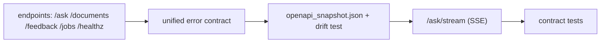

# My Work — Chapter 03: FastAPI, REST, and Integration

Expose the chapter-01 service as a typed HTTP API with a stable contract,
uniform errors, streaming, and idempotent writes.

## What this chapter produces



## Deliverables checklist

- [ ] Endpoints with Pydantic schemas (`extra="forbid"`) and `response_model`.
- [ ] Auth dependency injecting `RequestContext` from a verified token.
- [ ] Unified error handler: `{error: {code, message, retryable, request_id}}`.
- [ ] `/ask/stream` SSE with `session` / `token` / `citation` / `error` / `done` events + heartbeat.
- [ ] Idempotent `POST /documents` (202 + `job_id`, same key → same job).
- [ ] `openapi_snapshot.json` + CI drift test.
- [ ] Contract tests: happy path, 422, 401/403, 503, idempotency replay.

## Suggested layout

```
my_work/
  app/ (api routes, dependencies, error handler)
  tests/contract/  tests/integration/
  openapi_snapshot.json
  streaming_client.md   # curl + httpx example
  README.md             # httpie calls per endpoint
```

See `../examples.md` for app bootstrap, auth dep, SSE endpoint, error handler,
idempotent ingest, contract tests, and the OpenAPI snapshot test. See
`../lesson.md` for the request-flow diagram.

## Done when

A teammate can read your OpenAPI in Swagger UI and write a working client
without asking you anything.
