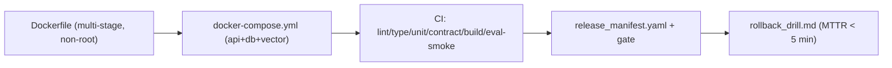

# My Work — Chapter 04: Docker, Linux, Git, CI/CD

Make the capstone reproducible: one-command local stack, a tiered CI pipeline,
and a release manifest that makes rollback complete.

## What this chapter produces



## Deliverables checklist

- [ ] `Dockerfile` — multi-stage, pinned base, non-root, healthcheck, exec-form CMD; image < ~500 MB.
- [ ] `.dockerignore` keeping build context small.
- [ ] `docker-compose.yml` — api + postgres + vector db (+ observability profile), healthchecks.
- [ ] `.env.example` — every required var, no secrets.
- [ ] `.pre-commit-config.yaml` — format, lint, large-file + secret detection.
- [ ] CI workflow — parallel jobs, gated by `needs`, cached.
- [ ] `release_manifest.yaml` + CI gate that fails on incomplete manifest.
- [ ] `rollback_drill.md` — timed restore of the previous manifest.

## Suggested layout

```
my_work/
  Dockerfile  .dockerignore  docker-compose.yml  .env.example
  .pre-commit-config.yaml
  .github/workflows/ci.yml
  release_manifest.yaml
  RELEASING.md   rollback_drill.md   image_size.md
```

See `../examples.md` for the full Dockerfile, compose, CI, manifest, and
manifest-gate script. See `../lesson.md` for the image/container/compose and
CI-DAG diagrams.

## Done when

A teammate clones, runs `docker compose up`, hits `/healthz`, runs the tests,
and follows the rollback procedure — without asking you.
