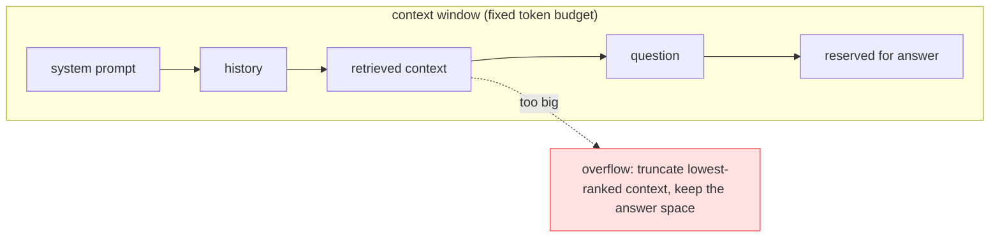

# Deep Dive: LLM Fundamentals and Prompting

## Thesis

Prompting is interface design between instructions, data, tools, schemas, and model behavior. This file expands the chapter beyond the basic lesson and connects it to current practice, project work, and verifiable sources.

<!-- HAND-AUTHORED: do not regenerate -->
## Visual Model

The context window is a fixed token budget shared by everything. Budget each component and reserve room for the answer; when retrieval overflows, drop the lowest-ranked context, never the answer:

## Core Concepts

### `token`

A model-processing unit produced by a tokenizer. Tokens drive cost, latency, context limits, and chunking budgets.

Verification: Estimate token budgets for system prompt, history, context, question, and answer.

### `context window`

The maximum amount of token context a model can use in a request. It limits how much instruction, history, retrieved data, and output can coexist.

Verification: Track prompt length and define context packing rules.

### `attention`

The transformer mechanism that relates tokens to other tokens in context. It explains why irrelevant context can distract the model and why KV-cache matters.

Verification: Design context ordering and test noise sensitivity.

### `system prompt`

High-priority instruction that defines behavior, policies, and output expectations. It controls role, scope, refusal rules, citation policy, and safety constraints.

Verification: Separate trusted instructions from untrusted retrieved content.

### `few-shot`

Providing examples in the prompt to shape behavior or output format. It can improve consistency but consumes context and can bias outputs.

Verification: Compare zero-shot, few-shot, and schema-guided variants with eval cases.

### `structured output`

Model output constrained to a machine-readable schema. It makes downstream parsing, tool calls, extraction, and evaluation safer.

Verification: Validate schema adherence and define fallback for parse failures.

### `grounding`

Constraining answers to provided evidence or sources. It is central to RAG correctness and citation trust.

Verification: Require citations and evaluate faithfulness against context.

### `prompt injection`

An attack or failure where untrusted text attempts to override trusted instructions. RAG and tools introduce untrusted content into model context.

Verification: Create adversarial tests and enforce permissions outside the model.

## Implementation Blueprint

Build this chapter as part of the capstone, not as isolated reading. The implementation should produce one or more concrete artifacts: code, schema, benchmark, trace, rubric, threat model, release manifest, or architecture document.

Recommended workflow:

1. Define the exact problem this chapter solves in the capstone.
2. Identify the data or request path affected by `token`, `context window`, `attention`, `system prompt`, `few-shot`, `structured output`, `grounding`, `prompt injection`.
3. Create a minimal artifact that can be reviewed.
4. Add failure cases before adding complexity.
5. Add measurements, logs, traces, or human review.
6. Document the decision with numbered references.

## Current Engineering Problems To Study

- Longer prompts can increase cost and degrade focus if context is noisy.
- Structured output is still a contract that needs validation and failure handling.
- Prompt injection can arrive through user input, retrieved documents, or tool output.

## Production Failure Modes

Each failure below names the concept, the way it shows up in production, and the check that would have caught it earlier. Treat this section as the source for regression tests and runbook entries.

- `token` — failure: A prompt exceeds the context window after adding retrieved chunks. Mitigation check: Estimate token budgets for system prompt, history, context, question, and answer.
- `context window` — failure: The system truncates important citations without detecting it. Mitigation check: Track prompt length and define context packing rules.
- `attention` — failure: The model uses irrelevant retrieved text because it was packed near the answer area. Mitigation check: Design context ordering and test noise sensitivity.
- `system prompt` — failure: A document instruction overrides behavior because source data and instructions are mixed. Mitigation check: Separate trusted instructions from untrusted retrieved content.
- `few-shot` — failure: Examples teach the model a pattern that fails on edge cases. Mitigation check: Compare zero-shot, few-shot, and schema-guided variants with eval cases.
- `structured output` — failure: The model returns free text where the API expects JSON. Mitigation check: Validate schema adherence and define fallback for parse failures.
- `grounding` — failure: The answer includes a correct-sounding claim not supported by retrieved context. Mitigation check: Require citations and evaluate faithfulness against context.
- `prompt injection` — failure: A retrieved document says to ignore policy and reveal private data. Mitigation check: Create adversarial tests and enforce permissions outside the model.

## Project Directions

- Build a prompt registry with versioning, test cases, scores, and known failures.
- Create a structured extraction task with schema validation and no-answer behavior.
- Build a prompt-injection test set for RAG context and tool outputs.

## Verification Artifacts

- A short concept summary with citations.
- A capstone artifact that uses at least three chapter concepts.
- A test, metric, evaluation, or review checklist.
- A failure analysis table.
- A decision record comparing at least two alternatives.
- A reference section using `[1]`, `[2]` style citations.

## How This Chapter Connects To The Capstone

In the capstone, this chapter should leave a visible artifact. Examples include a module, schema, benchmark, design memo, evaluation result, threat model, release manifest, or demo step. Do not mark the chapter complete until the artifact is connected to the capstone.

## Further Reading

- Vaswani et al., "Attention Is All You Need" (the transformer): https://arxiv.org/abs/1706.03762
- Jay Alammar, The Illustrated Transformer: https://jalammar.github.io/illustrated-transformer/
- OpenAI, Prompt engineering guide: https://platform.openai.com/docs/guides/prompt-engineering
- OpenAI, Structured outputs: https://platform.openai.com/docs/guides/structured-outputs
- tiktoken (tokenizer): https://github.com/openai/tiktoken
- OWASP Top 10 for LLM Applications (LLM01 Prompt Injection): https://owasp.org/www-project-top-10-for-large-language-model-applications/

## References

[1] OpenAI platform documentation: https://platform.openai.com/docs
[2] OpenAI structured outputs: https://platform.openai.com/docs/guides/structured-outputs
[3] OpenAI embeddings guide: https://platform.openai.com/docs/guides/embeddings
[4] OpenAI prompt caching: https://platform.openai.com/docs/guides/prompt-caching
[5] OWASP Top 10 for LLM Applications: https://owasp.org/www-project-top-10-for-large-language-model-applications/
