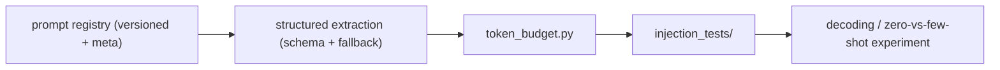

# My Work — Chapter 05: LLM Fundamentals and Prompting

Treat prompts as versioned, tested, measured code. Build the registry, the
structured-extraction task, and the injection test set.

## What this chapter produces



## Deliverables checklist

- [ ] `prompts/` registry — ≥2 prompts, each versioned with `.meta.yaml` (intent, model, temperature, changelog, status) + `registry.json`.
- [ ] Structured extraction — Pydantic schema, enforcement or parse-repair fallback, defined parse-failure behaviour.
- [ ] `token_budget.py` — asserts the prompt fits with answer room; fires on overflow.
- [ ] No-answer behaviour — exact refusal JSON; 5 unsupported questions all refuse.
- [ ] `injection_tests/` — ≥10 cases (direct, indirect-via-context, tool-output) as pytest; honest pass rate.
- [ ] `decoding_experiment.md` — variance at temp 0 / 0.3 / 1.0; defended choice.

## Suggested layout

```
my_work/
  prompts/<name>/v{N}.md + v{N}.meta.yaml
  prompts/registry.json
  token_budget.py
  injection_tests/
  decoding_experiment.md
  README.md
```

See `../examples.md` for the registry meta, structured-output + parse-repair,
injection cases, variance probe, and safe prompt logging. See `../lesson.md`
for the prompt-anatomy and token-budget diagrams.

## Done when

A teammate can read your registry, add a new prompt version, run the injection
test set, and see the decoding-experiment conclusion — without asking you.
