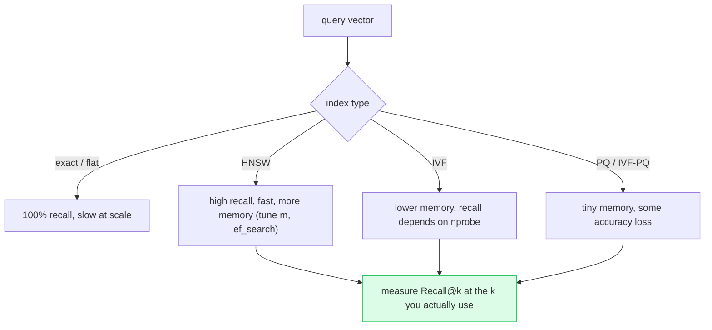

# Deep Dive: Embeddings and Vector Search

## Thesis

Retrieval quality starts with representation, indexing, filtering, and measurement. This file expands the chapter beyond the basic lesson and connects it to current practice, project work, and verifiable sources.

<!-- HAND-AUTHORED: do not regenerate -->
## Visual Model

The ANN tradeoff: exact search is accurate but scales linearly; approximate indexes (HNSW/IVF/PQ) trade a little recall for large speed/memory gains. You tune the knobs against *measured* recall, never by guesswork:

## Core Concepts

### `embedding`

A numeric representation of text or other data used for similarity search. Embeddings enable semantic retrieval over large corpora.

Verification: Benchmark embeddings on your own labeled retrieval cases.

### `cosine similarity`

A similarity measure based on the angle between vectors. It is common in semantic search when vector magnitude should matter less.

Verification: Verify the distance metric recommended for the embedding model.

### `dot product`

A vector similarity score based on element-wise multiplication and summation. Some embedding systems are optimized for dot-product search.

Verification: Document metric choice and score interpretation.

### `HNSW`

Hierarchical Navigable Small World, a graph-based approximate nearest neighbor index. It offers fast vector search with tunable recall/latency tradeoffs.

Verification: Evaluate recall and latency under your metadata filters.

### `IVF`

Inverted File index that partitions vector space into clusters for approximate search. It can improve scale by searching selected partitions.

Verification: Tune partition/probe settings with Recall@k and latency.

### `PQ`

Product Quantization, a compression technique for vectors. It reduces memory but can reduce retrieval accuracy.

Verification: Compare exact or high-precision baseline against PQ results.

### `metadata filter`

A predicate restricting retrieval by fields such as tenant, type, date, or permission. It combines relevance with access control and operational scoping.

Verification: Apply filters inside the retrieval system and test cross-tenant cases.

### `Recall@k`

The fraction of queries where a relevant item appears in the top k results. It measures whether retrieval finds necessary evidence.

Verification: Measure Recall@k at the same k used by context packing.

### `MRR`

Mean Reciprocal Rank, measuring how high the first relevant result appears. It captures ranking quality beyond simple presence.

Verification: Use MRR when first relevant rank matters for context selection.

### `NDCG`

Normalized Discounted Cumulative Gain, a ranking metric with graded relevance. It is useful when relevance is not binary.

Verification: Label graded relevance and compare ranking strategies.

## Implementation Blueprint

Build this chapter as part of the capstone, not as isolated reading. The implementation should produce one or more concrete artifacts: code, schema, benchmark, trace, rubric, threat model, release manifest, or architecture document.

Recommended workflow:

1. Define the exact problem this chapter solves in the capstone.
2. Identify the data or request path affected by `embedding`, `cosine similarity`, `dot product`, `HNSW`, `IVF`, `PQ`, `metadata filter`, `Recall@k`, `MRR`, `NDCG`.
3. Create a minimal artifact that can be reviewed.
4. Add failure cases before adding complexity.
5. Add measurements, logs, traces, or human review.
6. Document the decision with numbered references.

## Current Engineering Problems To Study

- Popular embedding models may underperform on domain-specific terminology.
- Filtering after retrieval can create privacy risk and misleading metrics.
- Index migrations can silently break retrieval unless they are versioned and evaluated.

## Production Failure Modes

Each failure below names the concept, the way it shows up in production, and the check that would have caught it earlier. Treat this section as the source for regression tests and runbook entries.

- `embedding` — failure: Domain terms map poorly and relevant chunks are not retrieved. Mitigation check: Benchmark embeddings on your own labeled retrieval cases.
- `cosine similarity` — failure: The vector DB uses a metric that does not match the embedding model expectation. Mitigation check: Verify the distance metric recommended for the embedding model.
- `dot product` — failure: Scores are misinterpreted because vectors are not normalized. Mitigation check: Document metric choice and score interpretation.
- `HNSW` — failure: High filter selectivity reduces recall or latency stability. Mitigation check: Evaluate recall and latency under your metadata filters.
- `IVF` — failure: Too few probes miss relevant vectors. Mitigation check: Tune partition/probe settings with Recall@k and latency.
- `PQ` — failure: Memory improves while recall drops on high-risk queries. Mitigation check: Compare exact or high-precision baseline against PQ results.
- `metadata filter` — failure: Filtering after retrieval exposes unauthorized candidates in logs or prompts. Mitigation check: Apply filters inside the retrieval system and test cross-tenant cases.
- `Recall@k` — failure: Recall looks good at k=50 but generation only receives top 5. Mitigation check: Measure Recall@k at the same k used by context packing.
- `MRR` — failure: Correct chunks appear but too low to be used. Mitigation check: Use MRR when first relevant rank matters for context selection.
- `NDCG` — failure: A somewhat relevant chunk outranks a highly relevant source. Mitigation check: Label graded relevance and compare ranking strategies.

## Project Directions

- Benchmark vector-only, keyword-only, and hybrid retrieval on a labeled dataset.
- Create a multi-tenant metadata filter lab and prove unauthorized chunks are never retrieved.
- Write an embedding migration plan with dual indexes, evaluation, and rollback.

## Verification Artifacts

- A short concept summary with citations.
- A capstone artifact that uses at least three chapter concepts.
- A test, metric, evaluation, or review checklist.
- A failure analysis table.
- A decision record comparing at least two alternatives.
- A reference section using `[1]`, `[2]` style citations.

## How This Chapter Connects To The Capstone

In the capstone, this chapter should leave a visible artifact. Examples include a module, schema, benchmark, design memo, evaluation result, threat model, release manifest, or demo step. Do not mark the chapter complete until the artifact is connected to the capstone.

## Further Reading

- Malkov & Yashunin, HNSW (the standard ANN graph index): https://arxiv.org/abs/1603.09320
- FAISS wiki — choosing an index: https://github.com/facebookresearch/faiss/wiki/Guidelines-to-choose-an-index
- pgvector: https://github.com/pgvector/pgvector
- Sentence-Transformers (bi-encoders, embeddings): https://www.sbert.net/
- MTEB — Massive Text Embedding Benchmark (compare models): https://huggingface.co/spaces/mteb/leaderboard
- Qdrant documentation (filtered vector search): https://qdrant.tech/documentation/

## References

[1] Qdrant search documentation: https://qdrant.tech/documentation/search/
[2] Qdrant indexing documentation: https://qdrant.tech/documentation/manage-data/indexing/
[3] Milvus documentation: https://milvus.io/docs/
[4] Weaviate hybrid search: https://weaviate.io/developers/weaviate/search/hybrid
[5] FAISS index guidelines: https://github.com/facebookresearch/faiss/wiki/Guidelines-to-choose-an-index
[6] pgvector GitHub: https://github.com/pgvector/pgvector
