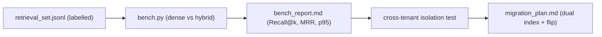

# My Work — Chapter 06: Embeddings and Vector Search

Make retrieval *measurable*. Build the labelled set, benchmark configurations,
and prove cross-tenant isolation.

## What this chapter produces



## Deliverables checklist

- [ ] `retrieval_set.jsonl` — ≥50 queries with ground-truth chunk ids + types (paraphrase, exact-term, no-answer).
- [ ] `metric.md` — confirmed normalisation + correct distance metric for your model.
- [ ] `bench.py` — dense vs hybrid on Recall@1/Recall@5/MRR/p95 at the production k.
- [ ] `bench_report.md` — recommended config with measured deltas, broken out by query type.
- [ ] cross-tenant test — proves a tenant-A query never returns a tenant-B chunk (pre-filter).
- [ ] `migration_plan.md` — dual index + eval gate + config flip + rollback.

## Suggested layout

```
my_work/
  retrieval_set.jsonl
  bench.py  bench_results.csv  bench_report.md
  metric.md  migration_plan.md
  tests/test_cross_tenant.py
```

See `../examples.md` for Recall@k/MRR code, filtered search, RRF, the
cross-tenant test, and the ef_search sweep. See `../lesson.md`/`../deep_dive.md`
for the index-paths and ANN-tradeoff diagrams.

## Done when

A teammate can run your benchmark, see the recommended config with numbers, and
confirm the cross-tenant test passes — without asking you.
