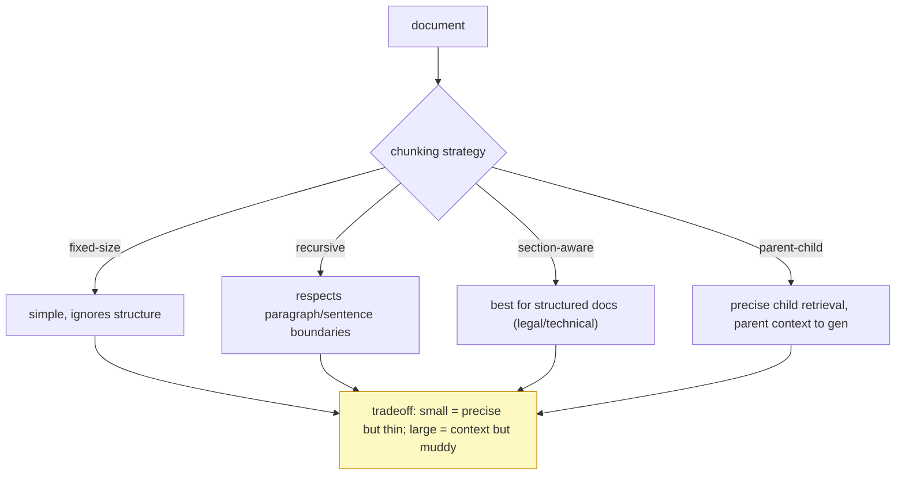

# Deep Dive: RAG Pipeline Basics

## Thesis

A RAG pipeline is an evidence chain from source document to answer and citation. This file expands the chapter beyond the basic lesson and connects it to current practice, project work, and verifiable sources.

<!-- HAND-AUTHORED: do not regenerate -->
## Visual Model

Chunking governs the precision/recall tradeoff. Too small and a fact is split across chunks; too large and the embedding is muddy. This is the comparison to run against your labelled set:

## Core Concepts

### `ingestion`

The process of bringing source data into the AI system. Ingestion determines what can be searched, cited, evaluated, and governed.

Verification: Build an ingestion trace from raw file to indexed chunk.

### `parsing`

Extracting structured text and metadata from source formats. Bad parsing creates broken chunks and unreliable citations.

Verification: Inspect parsed output and add parsing quality checks.

### `cleaning`

Removing or normalizing noise from extracted data. Clean text improves chunking, embedding, search, and generation.

Verification: Define safe cleaning rules and preserve source anchors.

### `chunking`

Splitting documents into retrievable units. It shapes retrieval precision, recall, citations, and context quality.

Verification: Run chunking experiments and inspect retrieval failures.

### `metadata enrichment`

Adding useful structured fields to chunks or documents. It supports filters, citations, routing, and analysis.

Verification: Enrich chunks with source, page, section, tenant, version, and access fields.

### `retrieval`

Finding relevant data for a query before generation or action. Retrieval quality often dominates RAG answer quality.

Verification: Measure retrieval separately from generation.

### `citation`

A reference connecting an answer claim to source evidence. Citations create user trust and auditability.

Verification: Evaluate citation correctness, not just citation presence.

### `no-answer behavior`

A designed refusal when sources are insufficient. It prevents forced unsupported answers in high-risk settings.

Verification: Test unsupported questions and track no-answer correctness.

## Implementation Blueprint

Build this chapter as part of the capstone, not as isolated reading. The implementation should produce one or more concrete artifacts: code, schema, benchmark, trace, rubric, threat model, release manifest, or architecture document.

Recommended workflow:

1. Define the exact problem this chapter solves in the capstone.
2. Identify the data or request path affected by `ingestion`, `parsing`, `cleaning`, `chunking`, `metadata enrichment`, `retrieval`, `citation`, `no-answer behavior`.
3. Create a minimal artifact that can be reviewed.
4. Add failure cases before adding complexity.
5. Add measurements, logs, traces, or human review.
6. Document the decision with numbered references.

## Current Engineering Problems To Study

- Bad parsing and chunking cause failures before the model is called.
- Citations are only useful when they point to actually supporting context.
- No-answer behavior must be designed, tested, and measured.

## Production Failure Modes

Each failure below names the concept, the way it shows up in production, and the check that would have caught it earlier. Treat this section as the source for regression tests and runbook entries.

- `ingestion` — failure: Documents are indexed without source or permission metadata. Mitigation check: Build an ingestion trace from raw file to indexed chunk.
- `parsing` — failure: PDF headers, footers, and tables pollute retrieval. Mitigation check: Inspect parsed output and add parsing quality checks.
- `cleaning` — failure: Cleaning removes legal numbering needed for citations. Mitigation check: Define safe cleaning rules and preserve source anchors.
- `chunking` — failure: Chunks are too small to contain complete obligations. Mitigation check: Run chunking experiments and inspect retrieval failures.
- `metadata enrichment` — failure: Chunks lack page or section, making citations unhelpful. Mitigation check: Enrich chunks with source, page, section, tenant, version, and access fields.
- `retrieval` — failure: The model hallucinates because the required evidence was never retrieved. Mitigation check: Measure retrieval separately from generation.
- `citation` — failure: The cited chunk is related but does not support the specific answer. Mitigation check: Evaluate citation correctness, not just citation presence.
- `no-answer behavior` — failure: The system fabricates an answer when retrieval is empty. Mitigation check: Test unsupported questions and track no-answer correctness.

## Project Directions

- Build an end-to-end RAG pipeline with citations and request traces.
- Create a chunk quality report with broken chunks, metadata gaps, and fixes.
- Build a citation correctness test set with supported and unsupported questions.

## Verification Artifacts

- A short concept summary with citations.
- A capstone artifact that uses at least three chapter concepts.
- A test, metric, evaluation, or review checklist.
- A failure analysis table.
- A decision record comparing at least two alternatives.
- A reference section using `[1]`, `[2]` style citations.

## How This Chapter Connects To The Capstone

In the capstone, this chapter should leave a visible artifact. Examples include a module, schema, benchmark, design memo, evaluation result, threat model, release manifest, or demo step. Do not mark the chapter complete until the artifact is connected to the capstone.

## Further Reading

- Lewis et al., "Retrieval-Augmented Generation" (the original RAG paper): https://arxiv.org/abs/2005.11401
- Gao et al., "Retrieval-Augmented Generation for LLMs: A Survey": https://arxiv.org/abs/2312.10997
- LangChain RAG guide: https://docs.langchain.com/oss/python/langchain/rag
- LlamaIndex RAG overview: https://developers.llamaindex.ai/python/framework/understanding/rag/
- Haystack pipelines: https://docs.haystack.deepset.ai/docs/pipelines
- OpenAI File Search (managed RAG tool): https://platform.openai.com/docs/guides/tools-file-search

## References

[1] LangChain RAG guide: https://docs.langchain.com/oss/python/langchain/rag
[2] LlamaIndex RAG overview: https://developers.llamaindex.ai/python/framework/understanding/rag/
[3] Haystack pipelines: https://docs.haystack.deepset.ai/docs/pipelines
[4] OpenAI File Search: https://platform.openai.com/docs/guides/tools-file-search
[5] RAG Survey paper: https://arxiv.org/abs/2312.10997
