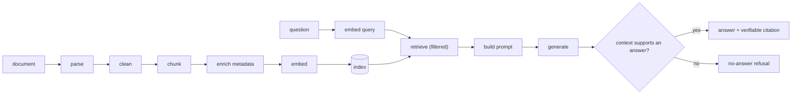

# Lesson: RAG Pipeline Basics

## Learning Objectives

By the end of this chapter you will be able to:

- **Explain** the RAG evidence chain and identify where each link can silently fail.
- **Design** an idempotent ingestion → embed → index → retrieve pipeline with metadata that supports citations.
- **Implement** RAG with verifiable citations and a real no-answer path (refuses on unanswerable questions).
- **Evaluate** citation correctness (not just citation presence) on a small labelled set.
- **Critique** a chunking strategy against retrieval metrics measured on real queries.
- **Build** a minimal RAG without frameworks (raw HTTP + numpy) to verify your understanding (homework stretch).

## 1. RAG Is an Evidence Chain

Retrieval-Augmented Generation is often introduced as "retrieve some context and stick it in the prompt." That framing produces demos, not products. The better mental model: a RAG pipeline is an *evidence chain* that runs from a source document all the way to an answer and a citation, and every link in that chain can break.

```
source document -> parse -> clean -> chunk -> enrich metadata -> embed -> index
                                                                            |
question -> embed query -> retrieve -> (rerank) -> build prompt -> generate -> cite -> log
```

A failure anywhere upstream silently degrades everything downstream. Bad parsing produces broken chunks; broken chunks produce muddy embeddings; muddy embeddings produce poor retrieval; poor retrieval produces an answer with no real evidence; and a confident, fluent, *wrong* answer is the most dangerous output a RAG system can produce.

This chapter builds the first end-to-end pipeline and — more importantly — teaches you to think about it as a chain of measurable, testable links, with two behaviours that separate toy RAG from production RAG: **citations that actually support the claim**, and **a no-answer path that refuses when the evidence isn't there.**

## Visual Overview

The RAG evidence chain. The top row is ingestion (index time); the bottom is query time. Note the explicit branch into either a cited answer or a refusal:



## 2. Why RAG Exists (and What It Doesn't Solve)

RAG addresses real limitations of a bare LLM:

- **Private knowledge**: the model wasn't trained on your documents.
- **Fresh knowledge**: the model's training has a cutoff; your documents change.
- **Citations and auditability**: you can show *where* an answer came from.
- **Reduced fabrication**: grounding answers in retrieved evidence lowers (not eliminates) hallucination.
- **Cost control**: retrieving the relevant slice is cheaper than fine-tuning on everything.

What RAG does *not* automatically give you:

- **Correctness.** A retrieved-and-cited answer can still be wrong if retrieval surfaced the wrong chunk or the model misread it.
- **Freedom from injection.** Retrieved documents are untrusted input (chapter 05, chapter 15).
- **Good answers from a bad corpus.** RAG faithfully reflects your documents, including their errors and gaps.

RAG is a powerful default, but it is a *system you design and measure*, not a feature you switch on.

## 3. Ingestion: Turning Documents into Retrievable Data

Ingestion is the upstream half of the chain. It turns a raw file or URL into indexed, retrievable, cited-able chunks. Steps:

1. **Load**: fetch the file or URL, record `source_uri`, `sha256`, `mime_type`, `byte_size` (chapter 02's `documents` row).
2. **Parse**: extract text and structure from the source format.
3. **Clean**: normalise whitespace, remove boilerplate, fix encoding — without destroying meaningful structure.
4. **Chunk**: split into retrievable units.
5. **Enrich metadata**: attach source, page, section, tenant, access level, version.
6. **Embed**: vectorise each chunk.
7. **Index**: store vectors + metadata in the vector store; catalog in SQL.

Ingestion must be **idempotent** (chapter 02's `sha256` dedup, chapter 03's `Idempotency-Key`). Re-ingesting the same document should not create duplicate chunks or duplicate vectors. Re-ingesting a *new version* should create a new `index_version`/`chunking_version` cohort without orphaning citations to the old one.

## 4. Parsing: The Most Underrated Failure Source

Parsing quality determines chunk quality, and most RAG failures that look like "the model is dumb" are actually "the parser destroyed the document."

Common parsing disasters:

- **PDFs**: headers/footers repeated on every page pollute every chunk; multi-column layouts get read in the wrong order; tables collapse into unreadable token soup; figures and their captions get separated.
- **HTML**: navigation, ads, and cookie banners get ingested as content; the actual article is buried.
- **Scanned documents**: need OCR, which introduces its own errors (a misread digit in a dosage or a deadline is a real-world hazard).

Engineering responses:

- Use format-appropriate parsers (a real PDF library, an HTML main-content extractor) rather than a naive "extract all text."
- **Inspect parsed output.** Before chunking, sample 20–30 parsed documents and read them. This single habit catches most ingestion problems.
- Preserve structure that citations depend on: page numbers, section headings, clause numbers. If you strip the section numbering during cleaning, your citations become "somewhere in document 10" — useless.
- Add a parse-quality check: flag documents where extraction produced suspiciously little text, or where the table-to-text ratio looks wrong.

## 5. Chunking: The Core Tradeoff

Chunking splits documents into retrievable units, and it governs the precision/recall tradeoff of the whole system.

Strategies, from simplest to most structured:

- **Fixed-size** (e.g. 512 tokens with 50-token overlap): simple, predictable, ignores document structure. Fine baseline.
- **Recursive**: split on paragraph, then sentence, then token boundaries, keeping chunks under a size limit. Respects structure better than fixed-size.
- **Section-aware**: split on the document's own headings/clauses. Best for structured documents (legal, technical) where a section is a natural unit of meaning.
- **Semantic**: split where the topic shifts (detected by embedding similarity between sentences). Powerful but more expensive and less predictable.
- **Parent-child**: index small child chunks for precise retrieval, but pass the larger parent chunk to generation for context (chapter 08).

The tradeoffs:

- **Small chunks**: precise retrieval, tight embeddings, but may not contain enough to answer; a fact split across two chunks gets half-retrieved.
- **Large chunks**: more context per retrieval, but muddy embeddings (chapter 06) and more irrelevant text in the prompt (distraction + token cost).
- **Overlap**: preserves continuity across boundaries; increases storage and produces near-duplicate retrievals.

There is no universal best. Chunking is a parameter you *experiment with* against your labelled retrieval set (chapter 06) and golden set (chapter 09). The deliverable is a chunk-quality report: a sample of chunks reviewed for breakage (a clause cut in half, a table mangled, metadata missing) and a recommended strategy with measured retrieval impact.

## 6. Metadata Enrichment

Every chunk should carry the metadata that retrieval, filtering, citations, and audit need (chapter 02's `chunks.metadata`):

- `source`, `document_id`, `page`, `section` — for citations.
- `tenant_id`, `access_level` — for filtered retrieval and security.
- `document_type`, `effective_date`, `version` — for scoping and freshness.
- `chunking_version` — for reproducibility across re-chunking.

Citations depend entirely on this. A retrieval that returns a chunk with no page or section can't produce a useful citation, and a useful citation is half the value of RAG in a high-accuracy domain.

## 7. Retrieval and Prompt Construction

At question time:

1. Embed the query with the *same* model used for the corpus (chapter 06).
2. Retrieve top-k with the metadata filter applied during search (tenant, access).
3. Optionally rerank (chapter 08).
4. Build the prompt.

Prompt construction for RAG (building on chapter 05's structure):

```text
SYSTEM:
  Answer ONLY from the provided context.
  If the context is insufficient, output the exact no-answer JSON.
  Cite doc_id and page for every claim.

CONTEXT:
  <document id="d_10" page="3">...</document>   <- most relevant LAST (near the question)
  <document id="d_44" page="1">...</document>

TASK:
  Question: ...
  Use only the context above.
```

Two ordering decisions matter (from chapter 05's attention discussion):

- **Instructions at the top**, where attention is strong and they aren't lost in the middle.
- **Most relevant chunk near the bottom**, adjacent to the question, where attention is also strong. Putting the key evidence in the middle of eight chunks is the worst place for it.

And the context-budget discipline (chapter 05): count tokens, reserve room for the answer, and decide what to drop when retrieval returns more than fits — drop the lowest-ranked, not the highest.

## 8. Citations: Presence vs Correctness

A citation connects an answer claim to the evidence that supports it. There are two very different quality bars:

- **Citation presence**: the answer includes citations. Easy; the model will happily cite *something*.
- **Citation correctness**: the cited chunk *actually supports* the specific claim. Hard, and the thing that matters.

A model under pressure will cite a chunk that's topically related but doesn't contain the claimed fact. To a casual reader the answer looks well-sourced; to anyone who checks, it's a fabrication with a footnote. This is why **citation correctness must be evaluated, not assumed** (chapter 09). Build a citation-correctness test set: questions where you know the supporting chunk, and check that the answer cites *that* chunk, not a plausible-looking neighbour.

A useful citation carries enough to verify it: `document_id`, `chunk_id`, source name, page or section, and ideally a quoted span. "Source: Policy doc" is not verifiable; "Policy d_10, p.3: 'within 30 days of the incident'" is.

## 9. No-Answer Behaviour: The Mark of Production RAG

The single behaviour that separates a toy from a production system in a high-accuracy domain is the willingness to say "I don't know." When retrieval returns nothing relevant, or the retrieved context genuinely doesn't contain the answer, the system must refuse — not fabricate.

```json
{"answer": null, "reason": "insufficient_context", "citations": []}
```

This must be:

- **Designed**: an explicit branch in the service (chapter 01's no-answer path) and an explicit instruction with an exact output in the prompt (chapter 05).
- **Tested**: a set of questions the corpus *cannot* answer, where the expected behaviour is refusal. Target 100% refusal on these.
- **Measured**: no-answer accuracy is a first-class metric (chapter 09). A system that never refuses is not "confident" — it's fabricating.

In legal, medical, financial, and compliance domains, a wrong answer is worse than no answer. The no-answer path is not a degradation; it's a safety feature.

## 10. Logging and Tracing the Chain

Because RAG is a chain, debugging requires seeing every link. Each request should record (chapter 02's `requests`/`answers`, chapter 12's tracing):

- the question and `request_id`
- the retrieved chunk ids and their scores
- which chunks were actually passed to generation (after reranking/truncation)
- the prompt version, model id, embedding model, index version
- the answer, the cited chunk ids, the no-answer flag
- latency per stage (retrieve / rerank / generate) and token counts

The test of good RAG logging: when a user reports "this answer is wrong", you can pull the `request_id` and see *exactly* what was retrieved, what reached the prompt, and what the model produced — without reproducing anything. If you can't, you're debugging blind.

## 11. Putting It Together: The Minimal Production Pipeline

A first end-to-end pipeline that is small but *complete*:

```python
async def answer(question: str, ctx: RequestContext) -> AskResponse:
    # 1. retrieve (filtered by tenant/access)
    q_vec = await embedder.embed(question)
    chunks = await store.search(q_vec, tenant_id=ctx.tenant_id,
                                access=ctx.allowed_levels, limit=settings.top_k)

    # 2. no-answer guard: nothing retrieved -> refuse
    if not chunks:
        await audit.record_no_answer(ctx, question)
        return AskResponse(answer=None, citations=[], reason="insufficient_context",
                           requires_review=True, request_id=ctx.request_id)

    # 3. build prompt (instructions top, best chunk near question)
    prompt = render_rag_prompt(question, chunks, prompt_version="rag_v4")

    # 4. generate with structured output
    result = await llm.complete_structured(prompt, schema=PolicyAnswer, temperature=0)

    # 5. validate citations point to retrieved chunks
    result = drop_unsupported_citations(result, retrieved=chunks)

    # 6. log the whole chain
    await answers_repo.record(ctx, question, chunks, result)
    return to_response(result, ctx)
```

It's "basic" only in that it has no reranking, query rewriting, or routing (chapter 08). It is *complete* in that it filters for security, refuses when it should, cites verifiably, validates citations against what was actually retrieved, and logs the chain. That completeness is what makes it a foundation rather than a demo.

## 12. Common Mistakes and Anti-Patterns

1. **No chunk inspection.** Shipping a pipeline without ever reading the chunks the parser produced.
2. **Citation presence treated as correctness.** Footnoted fabrication.
3. **No no-answer path.** The system fabricates when retrieval is empty.
4. **Most-relevant chunk buried in the middle** of the context.
5. **No per-request retrieval logging.** "The answer is wrong" becomes unreproducible.
6. **Re-ingestion creates duplicates.** No idempotency on `sha256`.
7. **Stripping section numbers during cleaning**, destroying citations.
8. **Passing more context than fits**, silently truncating the best chunk.
9. **Same answer prompt for all document types** when a contract and an FAQ need different handling.
10. **Citations not validated against retrieved chunks** — the model can cite an id that was never retrieved.

## 13. Production Failure Modes

- **Answers cite the right document but the wrong page.** Cause: page metadata lost or misaligned during parsing. Defensive: parse-quality checks; citation-correctness eval.
- **A confident answer to an unanswerable question.** Cause: missing/weak no-answer path. Defensive: no-answer test set at 100%; explicit refusal output.
- **Re-indexing doubles the vector count.** Cause: non-idempotent ingestion. Defensive: `sha256` dedup; idempotency keys; reconciliation query.
- **Retrieval is great in dev, poor in prod.** Cause: prod corpus has document types (scanned PDFs) the dev set didn't. Defensive: representative dev corpus; parse-quality monitoring on new document types.
- **A table-based answer is wrong.** Cause: the parser mangled the table into token soup. Defensive: table-aware parsing; flag table-heavy chunks for review.
- **An injected instruction in a retrieved doc changes the answer.** Cause: retrieved content treated as trusted. Defensive: delimit context; injection detection; chapter 15 controls.

## 14. Security and Privacy

1. **Retrieved content is untrusted** (chapter 05, 15). Delimit it; never let it override instructions; enforce permissions in code.
2. **Filter during retrieval** (chapter 06) — a RAG pipeline that post-filters can leak across tenants and silently lose recall.
3. **Citations can leak existence.** Citing a restricted document to a user who shouldn't know it exists is itself a leak. The access filter must run before retrieval, so restricted chunks are never candidates.
4. **Logged retrieval includes document content.** Apply the same PII/redaction discipline to retrieval logs as to prompts.

## 15. The Capstone Checklist

By the end of chapter 07, the following should exist in `chapters/07_rag_pipeline_basics/my_work/`:

- `ingest.py`: idempotent parse → clean → chunk → enrich → embed → index, over a small redistributable corpus (10–30 docs).
- `ask.py`: filtered retrieval → prompt build → structured generation → citation validation → no-answer path → logging, returning JSON with `[doc:page]` citations.
- `chunk_quality.md`: a review of ~30 sample chunks with at least 3 concrete ingestion fixes identified.
- A citation-correctness mini-eval: questions with known supporting chunks; measure how often the answer cites the right chunk.
- A no-answer test: 5 unanswerable questions, all of which must refuse.
- `rag_report.md`: per-question answer, retrieved chunk ids, citation verdict.
- A README documenting how to ingest the corpus and run a query end-to-end.

If a teammate can ingest the corpus, ask a supported question and get a verifiable citation, ask an unsupported question and get a refusal — without asking you — the chapter is done.

## 16. Key Takeaway

RAG is an evidence chain, not a prompt trick. Every link — parse, chunk, embed, retrieve, generate, cite — can break and silently degrade the answer. The two behaviours that mark production RAG are verifiable citations and a real no-answer path. Build the complete-but-minimal chain first, log every link, and measure citation correctness and refusal accuracy before you add the advanced techniques in chapter 08.

## Numbered References

[1] LangChain RAG guide: https://docs.langchain.com/oss/python/langchain/rag
[2] LlamaIndex RAG overview: https://developers.llamaindex.ai/python/framework/understanding/rag/
[3] Haystack pipelines: https://docs.haystack.deepset.ai/docs/pipelines
[4] OpenAI File Search: https://platform.openai.com/docs/guides/tools-file-search
[5] RAG Survey paper: https://arxiv.org/abs/2312.10997
