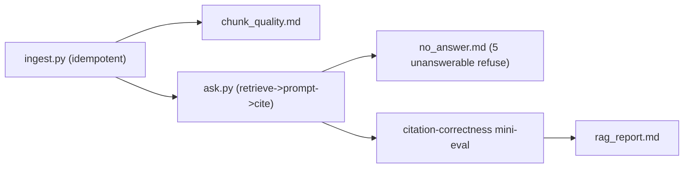

# My Work — Chapter 07: RAG Pipeline Basics

Build the first end-to-end RAG: ingestion, retrieval, grounded answers with
verifiable citations, and a real no-answer path.

## What this chapter produces



## Deliverables checklist

- [ ] `ingest.py` — parse→clean→chunk→enrich→embed→index; idempotent (re-run = same vector count).
- [ ] `chunk_quality.md` — ~30 chunks reviewed; ≥3 concrete pipeline fixes.
- [ ] `ask.py` — filtered retrieval → prompt → structured gen → citation validation → no-answer → logging.
- [ ] `no_answer.md` — 5 unanswerable questions, all refuse.
- [ ] citation-correctness mini-eval — 12 supported questions; cite the *right* chunk.
- [ ] chain logging — reconstruct one request end-to-end from logs alone.

## Suggested layout

```
my_work/
  corpus/ (small redistributable docs)
  ingest.py  ask.py
  chunk_quality.md  no_answer.md  rag_report.md
  README.md
```

See `../examples.md` for idempotent ingestion, section-aware chunking, the
RAG prompt, citation validation, and the no-answer guard. See `../lesson.md`
for the evidence-chain diagram and `../deep_dive.md` for the chunking-strategy
comparison.

## Done when

A teammate ingests the corpus, asks a supported question and gets a verifiable
citation, asks an unsupported one and gets a refusal — without asking you.
