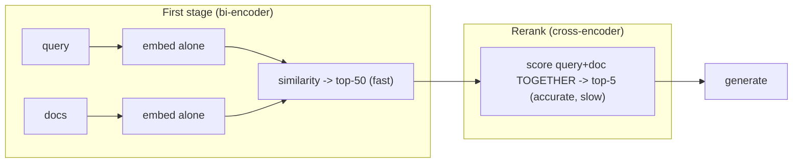

# Deep Dive: Advanced RAG, Retrieval, and Reranking

## Thesis

Advanced RAG is search engineering plus model orchestration under latency, cost, and safety constraints. This file expands the chapter beyond the basic lesson and connects it to current practice, project work, and verifiable sources.

<!-- HAND-AUTHORED: do not regenerate -->
## Visual Model

Why reranking works: a bi-encoder embeds query and document *separately* (fast, scalable, mediocre ranking); a cross-encoder scores them *together* (accurate, slow). The two-stage pattern uses each where it's strong:

## Core Concepts

### `query rewrite`

Transforming a user query before retrieval. It can improve recall for ambiguous, underspecified, or domain-specific questions.

Verification: Evaluate original vs rewritten queries with retrieval metrics.

### `multi-query`

Generating multiple query variants for retrieval. It can improve recall by covering synonyms and perspectives.

Verification: Compare recall and context precision before enabling.

### `hybrid search`

Combining dense vector search with lexical or sparse search. It captures both semantic similarity and exact terms.

Verification: Tune fusion and evaluate by query type.

### `reranking`

Re-scoring retrieved candidates with a stronger ranking model or method. It improves final context quality when first-stage retrieval is broad.

Verification: Measure quality gain, latency cost, and failure reduction.

### `cross-encoder`

A model that scores query-document pairs jointly. It is often more accurate than bi-encoder retrieval but slower.

Verification: Use top-N candidate reranking and compare against baseline.

### `parent-child retrieval`

Retrieving small child chunks while passing larger parent context to generation. It balances precise search with enough context for reasoning.

Verification: Evaluate answer support and context precision.

### `context compression`

Reducing retrieved content before generation. It saves tokens and can remove noise.

Verification: Test compressed vs uncompressed outputs on high-risk cases.

### `query routing`

Sending a request to the appropriate retriever, tool, model, or workflow. It improves accuracy, cost, and safety by matching task to pipeline.

Verification: Create route labels and evaluate routing confusion.

## Implementation Blueprint

Build this chapter as part of the capstone, not as isolated reading. The implementation should produce one or more concrete artifacts: code, schema, benchmark, trace, rubric, threat model, release manifest, or architecture document.

Recommended workflow:

1. Define the exact problem this chapter solves in the capstone.
2. Identify the data or request path affected by `query rewrite`, `multi-query`, `hybrid search`, `reranking`, `cross-encoder`, `parent-child retrieval`, `context compression`, `query routing`.
3. Create a minimal artifact that can be reviewed.
4. Add failure cases before adding complexity.
5. Add measurements, logs, traces, or human review.
6. Document the decision with numbered references.

## Current Engineering Problems To Study

- Basic vector search often misses exact domain references and rare terms.
- Reranking improves precision but consumes latency budget.
- Advanced techniques can degrade quality if they are not evaluated against a baseline.

## Production Failure Modes

Each failure below names the concept, the way it shows up in production, and the check that would have caught it earlier. Treat this section as the source for regression tests and runbook entries.

- `query rewrite` — failure: The rewrite changes meaning and retrieves the wrong policy. Mitigation check: Evaluate original vs rewritten queries with retrieval metrics.
- `multi-query` — failure: Multiple queries add noise and cost without measurable gain. Mitigation check: Compare recall and context precision before enabling.
- `hybrid search` — failure: BM25 dominates and returns exact but irrelevant matches. Mitigation check: Tune fusion and evaluate by query type.
- `reranking` — failure: Reranking adds latency but does not improve answer quality. Mitigation check: Measure quality gain, latency cost, and failure reduction.
- `cross-encoder` — failure: Using it on every candidate exceeds latency budget. Mitigation check: Use top-N candidate reranking and compare against baseline.
- `parent-child retrieval` — failure: The parent context includes irrelevant neighboring sections. Mitigation check: Evaluate answer support and context precision.
- `context compression` — failure: Compression removes a critical exception or qualifier. Mitigation check: Test compressed vs uncompressed outputs on high-risk cases.
- `query routing` — failure: The router sends a legal citation question to general chat. Mitigation check: Create route labels and evaluate routing confusion.

## Project Directions

- Run a retrieval experiment suite comparing chunking, hybrid search, reranking, and query rewriting.
- Implement a confidence-aware reranking policy that reranks only selected requests.
- Design a query router that chooses RAG, SQL analytics, tool workflow, or safe refusal.

## Verification Artifacts

- A short concept summary with citations.
- A capstone artifact that uses at least three chapter concepts.
- A test, metric, evaluation, or review checklist.
- A failure analysis table.
- A decision record comparing at least two alternatives.
- A reference section using `[1]`, `[2]` style citations.

## How This Chapter Connects To The Capstone

In the capstone, this chapter should leave a visible artifact. Examples include a module, schema, benchmark, design memo, evaluation result, threat model, release manifest, or demo step. Do not mark the chapter complete until the artifact is connected to the capstone.

## Further Reading

- Khattab & Zaharia, ColBERT (late-interaction retrieval): https://arxiv.org/abs/2004.12832
- Gao et al., HyDE (Hypothetical Document Embeddings): https://arxiv.org/abs/2212.10496
- Sentence-Transformers, Cross-Encoders (reranking): https://www.sbert.net/examples/applications/cross-encoder/README.html
- Cormack et al., Reciprocal Rank Fusion (RRF): https://plg.uwaterloo.ca/~gvcormac/cormacksigir09-rrf.pdf
- RAG Techniques (curated implementations): https://github.com/NirDiamant/RAG_Techniques
- Weaviate hybrid search: https://weaviate.io/developers/weaviate/search/hybrid

## References

[1] RAG Techniques GitHub: https://github.com/NirDiamant/RAG_Techniques
[2] Awesome RAG GitHub: https://github.com/coree/awesome-rag
[3] Qdrant vector concepts: https://qdrant.tech/documentation/concepts/vectors/
[4] Weaviate hybrid search: https://weaviate.io/developers/weaviate/search/hybrid
[5] FlashRAG paper: https://arxiv.org/abs/2405.13576
[6] RAGLAB paper: https://arxiv.org/abs/2408.11381
