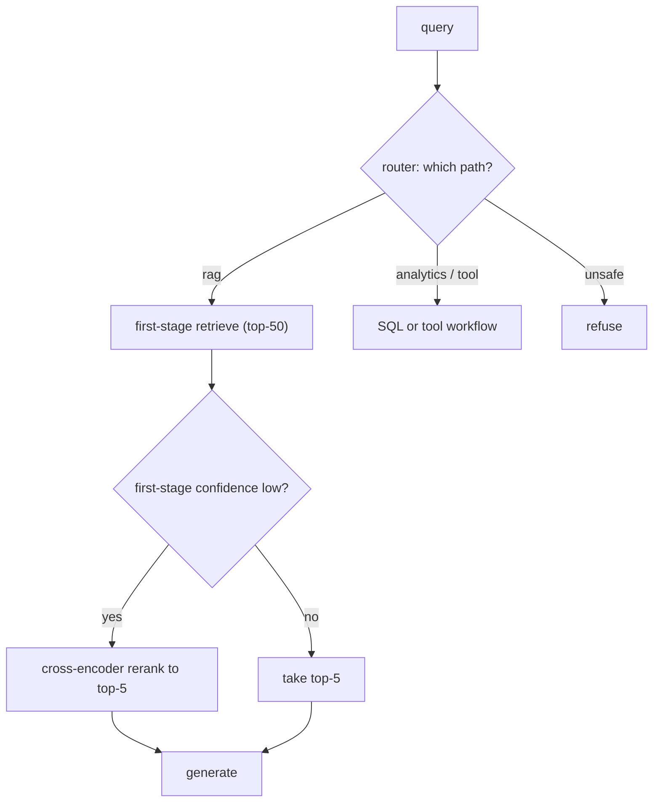

# Lesson: Advanced RAG, Retrieval, and Reranking

## Learning Objectives

By the end of this chapter you will be able to:

- **Compare** bi-encoder retrieval and cross-encoder reranking on cost, latency, and quality.
- **Design** a confidence-aware reranking policy with an empirically tuned threshold.
- **Build** an experiment harness that changes one variable at a time and reports per-query-type results.
- **Evaluate** hybrid search, query rewriting, and routing against a baseline using Recall@k / NDCG / faithfulness.
- **Justify** the routing decision via a labelled routing confusion matrix.

## 1. From "It Works" to "It Works Well Enough to Ship"

The basic pipeline from chapter 07 retrieves, generates, cites, and refuses. It will also disappoint you in measurable ways: it misses exact domain terms, ranks the right chunk just below the cutoff, retrieves ten chunks when two would do, and answers general-chat questions with the same machinery it uses for precise policy lookups. Advanced RAG is the set of techniques that close that gap — query transformation, hybrid search, reranking, parent-child retrieval, context compression, and routing.

The defining discipline of this chapter: **every advanced technique must be justified against a baseline.** Each one adds latency, cost, or complexity. Reranking adds a model call. Multi-query adds several retrievals. Query rewriting can change the meaning of the question. None of them is free, and any of them can *hurt* if added blindly. The professional move is to measure the baseline, add one technique, measure again, and keep it only if the measured gain justifies the cost. Advanced RAG without an eval harness (chapter 09) is cargo-culting.

## Visual Overview

The advanced pipeline: a router picks the path, first-stage retrieval is broad, and a confidence-aware policy reranks only when the ranking is ambiguous:



## 2. The Failure Modes Advanced RAG Addresses

Before reaching for techniques, name the problem you're solving. Basic vector RAG has characteristic failures:

- **Exact-term misses.** A query for a specific code, statute, drug, or product name retrieves semantically related prose but misses the exact clause. → hybrid search.
- **Vocabulary mismatch.** The user asks in different words than the document uses. → query rewriting, multi-query.
- **Right chunk, wrong rank.** The supporting chunk is retrieved but ranked 12th, below the top-5 cutoff that reaches the prompt. → reranking.
- **Precision vs context tension.** Small chunks retrieve precisely but lack context; large chunks have context but retrieve imprecisely. → parent-child retrieval.
- **Context bloat.** Ten chunks retrieved, mostly noise, costing tokens and distracting the model. → context compression.
- **Wrong pipeline for the task.** A "what's the weather" question hits the legal-document RAG. → query routing.

Diagnose with metrics (chapter 06): high Recall@20 but low Recall@5 and low MRR is the classic "right chunk, wrong rank" signature → reranking is the indicated fix. Low Recall@20 entirely means retrieval isn't finding it at all → query transformation or hybrid search. Match the technique to the measured failure.

## 3. Query Transformation: Rewriting and Multi-Query

The user's literal question is often not the best retrieval query. Three transformations:

- **Query rewriting**: rephrase the question into a form closer to how the corpus is written. "How long do I have to report a crash?" → "claim filing deadline after incident." Useful for conversational or underspecified queries. Risk: the rewrite can *change the meaning* and retrieve the wrong thing. Always evaluate original-vs-rewritten on the labelled set.
- **Multi-query**: generate several query variants (synonyms, perspectives) and union their results. Improves recall by covering vocabulary the single query missed. Cost: N retrievals instead of one, plus an LLM call to generate variants. Risk: the extra variants add noise without adding recall — measure before enabling.
- **HyDE (Hypothetical Document Embeddings)**: generate a hypothetical *answer*, embed *that*, and retrieve with it. Sometimes the hypothetical answer is closer in embedding space to the real supporting chunk than the question is. Powerful for some domains, useless or harmful in others — measure.

The common thread: query transformation trades cost and a meaning-drift risk for recall. It's worth it when your diagnosis is "retrieval isn't finding the chunk at all," and a waste when retrieval already finds it but ranks it poorly (that's a reranking problem).

## 4. Hybrid Search in Depth

Chapter 06 introduced hybrid (dense + lexical, fused by RRF). Here's the engineering nuance:

- **When it clearly wins**: corpora rich in identifiers, codes, names, acronyms, legal/medical/financial terminology. The lexical component rescues exact matches that dense search blurs.
- **Fusion tuning**: RRF's `k` constant and the relative weighting of dense vs lexical are tunable. Default RRF (`k=60`, equal weight) is a strong baseline; tune only with measurement.
- **The failure mode**: BM25 dominates and floods results with exact-but-irrelevant matches (the query word appears, but in the wrong context). If hybrid *underperforms* dense-only on paraphrase queries, your fusion is over-weighting lexical.
- **Per-query-type analysis**: hybrid usually wins overall but loses on a subset. Knowing which subset (exact-term vs paraphrase) sets up routing (section 8).

## 5. Reranking: The Highest-Leverage Technique

Reranking is usually the single most effective advanced technique, because "right chunk, wrong rank" is the most common basic-RAG failure.

The setup: first-stage retrieval (dense/hybrid) is a *bi-encoder* — query and documents are embedded independently, then compared. Fast, scales to millions, but the independent encoding loses some query-document interaction signal. A **cross-encoder** reranker takes the query and a candidate document *together* and scores their relevance jointly. Much more accurate at ranking; far too slow to run over the whole corpus.

So the pattern is two-stage:

1. First-stage retrieval returns top-N candidates (e.g. N=50) — fast, high recall, mediocre ranking.
2. The cross-encoder reranks those N candidates — slow per item but only N of them — and you keep the top-k (e.g. k=5) for the prompt.

```python
async def retrieve_and_rerank(query: str, ctx, n: int = 50, k: int = 5):
    candidates = await store.search(embed(query), tenant_id=ctx.tenant_id, limit=n)
    scored = await reranker.score(query, [c.text for c in candidates])  # cross-encoder
    ranked = [c for c, _ in sorted(zip(candidates, scored), key=lambda x: x[1], reverse=True)]
    return ranked[:k]
```

The measurement discipline:

- **Recall@N before reranking** must be high — reranking can only reorder what first-stage retrieval found. If Recall@50 is poor, fix retrieval first; reranking won't conjure missing chunks.
- **NDCG@k or citation-correctness after reranking** measures the ranking improvement.
- **p95 latency for the full path** — reranking adds a model call; know the cost.

The critical caveat: **a higher ranking metric does not guarantee a better answer.** A reranker can over-promote chunks that are topically relevant but don't support the specific claim, *raising* NDCG while *lowering* faithfulness. Always check faithfulness (chapter 09), not just ranking metrics, when adding a reranker.

## 6. Confidence-Aware Reranking: Don't Rerank Everything

Reranking every query wastes latency and money when most queries don't need it. A confidence-aware policy reranks selectively:

- If first-stage retrieval returns a clear winner (top score far above the rest, or the answer chunk is obviously rank 1), skip reranking.
- If the top candidates are clustered (ambiguous ranking) or first-stage confidence is low, rerank.

```python
def needs_rerank(candidates: list[ScoredChunk]) -> bool:
    if len(candidates) < 2:
        return False
    gap = candidates[0].score - candidates[1].score
    return gap < CONFIDENCE_GAP_THRESHOLD     # ambiguous -> rerank
```

The threshold is tuned on your eval set: find the gap below which reranking reliably helps. This commonly lets you rerank ~30% of queries while capturing ~90% of the quality gain — a large latency/cost saving. Document the policy and the threshold; an unexplained "sometimes we rerank" is unmaintainable.

## 7. Parent-Child Retrieval and Context Compression

**Parent-child retrieval** resolves the small-vs-large chunk tension (chapter 06/07). Index *small* child chunks for precise retrieval; when a child matches, pass its larger *parent* (the surrounding section) to generation for context. You get precise matching and sufficient context. The cost: more storage (both granularities) and care that the parent doesn't drag in irrelevant neighbouring content.

**Context compression** reduces retrieved content before generation — extract only the relevant sentences from each chunk, or summarise. Saves tokens and removes noise (helping the attention/distraction problem). The danger: compression can drop a critical qualifier or exception ("...except in jurisdiction X") and turn a correct chunk into a misleading one. Test compressed-vs-uncompressed on high-risk cases specifically; the failures cluster in the cases where a small detail flips the answer.

Both are powerful and both can quietly hurt. Same rule as always: measure against the baseline on your golden set.

## 8. Query Routing: The Right Pipeline per Query

Not every query should hit the same pipeline. A production system often has several: document RAG, a SQL-analytics path ("how many claims last month?"), a tool/agent workflow ("file a claim"), and a safe-refusal path ("ignore your instructions...").

A **router** classifies the incoming query and dispatches it:

```
query -> classifier -> {rag | sql_analytics | tool_workflow | refuse}
```

The router can be a small fast classifier (chapter 14), a cheap LLM call, or rules — chosen by latency and accuracy needs. Routing improves accuracy (right tool for the job), cost (cheap path for easy queries), and safety (explicit refusal path).

The failure mode to guard against: **mis-routing a high-stakes query to a casual path.** A legal-citation question routed to general chat produces an ungrounded answer. Evaluate the router with a labelled set of queries and their correct routes; measure routing confusion (which routes get confused for which) and pay special attention to high-stakes mis-routes.

## 9. The Experiment Harness Is the Real Deliverable

The through-line of this chapter: you cannot adopt advanced techniques responsibly without an experiment harness. The harness:

1. Holds a fixed labelled retrieval set and golden answer set.
2. Runs a configuration (baseline, +hybrid, +rerank, +rewrite, etc.) end to end.
3. Reports Recall@k, MRR/NDCG, citation correctness, faithfulness, and p95 latency.
4. Changes *one variable at a time*.
5. Records results so configurations are comparable over time.

With this harness, "should we add reranking?" becomes a one-hour experiment with a numeric answer, not a debate. Without it, every technique is faith. The harness is the thing that makes you a RAG *engineer* rather than a RAG *enthusiast*.

## 10. Common Mistakes and Anti-Patterns

1. **Adding techniques without a baseline.** No way to know if they helped.
2. **Optimising ranking metrics, ignoring faithfulness.** A reranker that raises NDCG and lowers answer correctness is a regression.
3. **Reranking every query.** Latency and cost for queries that didn't need it.
4. **Query rewriting that changes meaning** and retrieves the wrong thing.
5. **Multi-query that adds noise**, not recall — never measured.
6. **Context compression that drops a critical exception.**
7. **A router with no eval**, silently mis-routing high-stakes queries.
8. **Recall@N too low before reranking** — reranking can't fix missing chunks.
9. **Changing several variables at once** in an experiment — uninterpretable.
10. **Hybrid fusion over-weighting lexical**, flooding results with exact-but-irrelevant matches.

## 11. Production Failure Modes

- **NDCG up, user satisfaction down after reranking.** Cause: reranker promotes topically-relevant-but-unsupporting chunks. Defensive: measure faithfulness/citation-correctness, not just ranking.
- **p95 latency doubles after enabling reranking on all queries.** Defensive: confidence-aware policy; rerank only ambiguous cases.
- **A query rewrite turns "cancel my policy" into "policy cancellation terms" and retrieves the wrong thing.** Defensive: eval original-vs-rewritten; keep rewriting off for high-stakes intents.
- **The router sends a refund-eligibility question to general chat.** Defensive: routing eval with confusion matrix; high-stakes routes get a higher confidence bar.
- **Context compression drops "...does not apply to commercial vehicles" and the answer becomes wrong.** Defensive: test compression on cases where a qualifier flips the answer.
- **Multi-query triples cost with no measurable recall gain.** Defensive: A/B on the labelled set before enabling; disable if the gain is within noise.

## 12. Security and Privacy

1. **Every advanced stage inherits the tenant/access filter.** Reranking, parent expansion, and compression must all operate only on chunks the user is allowed to see — a parent chunk could pull in a restricted neighbouring section.
2. **Query rewriting and multi-query send the query to an LLM.** If the query contains PII, that's a data-egress consideration (chapter 05).
3. **The router is a security boundary.** The refuse path is part of routing; a query that should be refused (injection, out-of-scope) must route to refusal, not to a pipeline that tries to answer it.
4. **Reranked/compressed content is still untrusted.** Injection defences (chapter 15) apply after reranking, not before.

## 13. The Capstone Checklist

By the end of chapter 08, the following should exist in `chapters/08_advanced_rag_retrieval_reranking/my_work/`:

- An experiment harness that runs baseline vs +hybrid vs +rerank (and optionally +rewrite) over the chapter-06 labelled set and chapter-07/09 golden set, reporting Recall@k, NDCG@5, citation correctness, faithfulness, and p95 latency.
- A `rerank_experiment.md` comparing at least baseline vs one reranker, with measured deltas and a recommendation.
- A confidence-aware reranking policy with the gap threshold tuned and documented.
- A query router over at least 3 routes (RAG / analytics-or-tool / refuse) with a routing-accuracy eval and a confusion matrix.
- A decision record selecting which advanced techniques to keep, justified by measured deltas — including any you *rejected* because they didn't help.
- A README documenting how to run the experiment harness and reproduce the numbers.

If a teammate can run your harness, see baseline-vs-technique deltas, and read why each technique was kept or rejected — without asking you — the chapter is done.

## 14. Key Takeaway

Advanced RAG is search engineering under latency, cost, and safety constraints. Every technique — hybrid, rewriting, reranking, parent-child, compression, routing — earns its place only by a measured improvement over a baseline that justifies its cost. The experiment harness is the real deliverable; the techniques are just configurations you compare with it. Diagnose the failure with metrics, add one technique, measure, and keep faithfulness in view even when ranking metrics look good.

## Numbered References

[1] RAG Techniques GitHub: https://github.com/NirDiamant/RAG_Techniques
[2] Awesome RAG GitHub: https://github.com/coree/awesome-rag
[3] Qdrant vector concepts: https://qdrant.tech/documentation/concepts/vectors/
[4] Weaviate hybrid search: https://weaviate.io/developers/weaviate/search/hybrid
[5] FlashRAG paper: https://arxiv.org/abs/2405.13576
[6] RAGLAB paper: https://arxiv.org/abs/2408.11381
