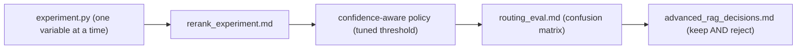

# My Work — Chapter 08: Advanced RAG, Retrieval, Reranking

Build the experiment harness and justify every advanced technique against a
baseline — keeping faithfulness in view, not just ranking metrics.

## What this chapter produces



## Deliverables checklist

- [ ] `experiment.py` — baseline vs +hybrid vs +rerank on Recall@5, NDCG@5, citation correctness, faithfulness, p95.
- [ ] `rerank_experiment.md` — deltas; faithfulness reported alongside NDCG.
- [ ] confidence-aware policy — rerank only ambiguous queries; tuned threshold documented.
- [ ] `routing_eval.md` — ≥3 routes, accuracy + confusion matrix, high-stakes mis-routes flagged.
- [ ] `advanced_rag_decisions.md` — techniques kept AND rejected, each with a measured reason.

## Suggested layout

```
my_work/
  experiment.py
  rerank_experiment.md  routing_eval.md  advanced_rag_decisions.md
  README.md
```

See `../examples.md` for two-stage rerank, confidence policy, RRF, the router,
the experiment harness, and the faithfulness guardrail. See `../deep_dive.md`
for the bi-encoder-vs-cross-encoder diagram.

## Done when

A teammate runs your harness, sees baseline-vs-technique deltas, and reads why
each technique was kept or rejected — without asking you.
