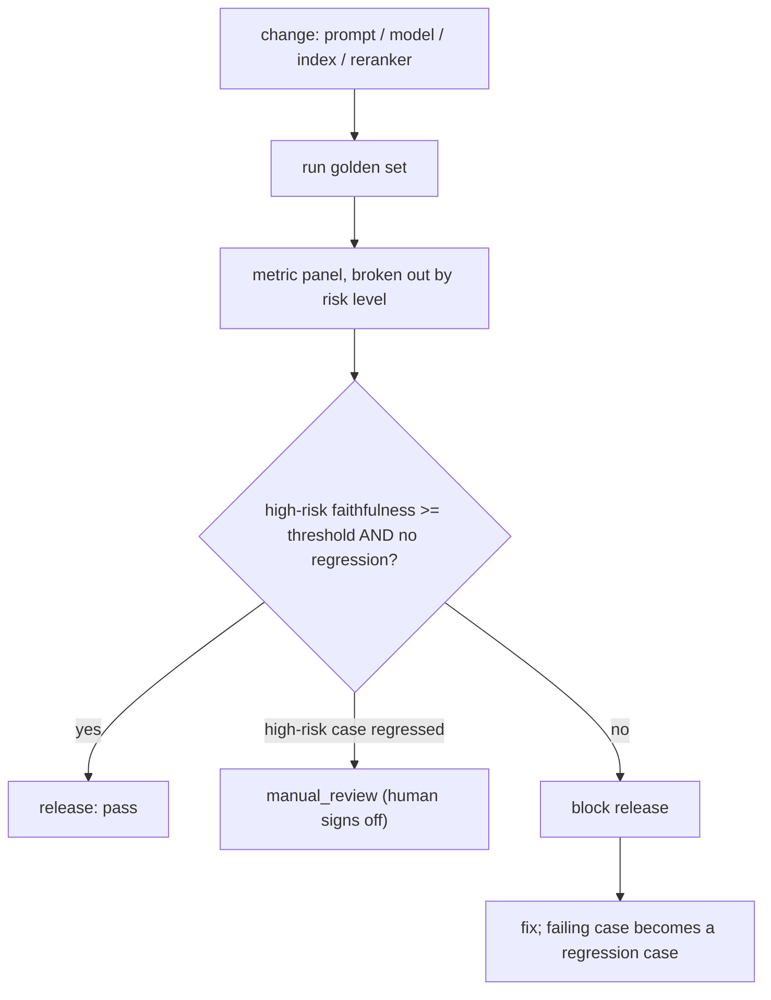

# Lesson: LLM and RAG Evaluation

## 1. Evaluation Is the Control System

Everything before this chapter produced behaviour. Evaluation is how you *know* whether that behaviour is good, whether a change improved it, and whether you can safely ship. Without evaluation, every prompt tweak, model upgrade, reranker, and index rebuild is a guess, and "it feels better" is your only release criterion. That is not engineering.

The mental model: evaluation is the control system for an AI product. It closes the loop between a change and its effect on quality, the way a thermostat closes the loop between temperature and the heater. A team with a good eval harness can move fast *because* they can detect regressions automatically; a team without one moves slowly and ships regressions they discover only when users complain.

This chapter builds that control system: a versioned golden dataset, the right metrics for retrieval and generation, automated graders calibrated against humans, and a release gate that blocks regressions.

## Visual Overview

Evaluation as the release control system. Any behaviour change runs the golden set; the gate decides on **per-risk-level** metrics, not the aggregate:



## 2. What Makes LLM Evaluation Hard

Traditional software has deterministic tests: given input X, assert output equals Y. LLM output breaks that model:

- **The output is open-ended.** There are many correct phrasings of a right answer; exact-match is too strict.
- **It's non-deterministic.** Even at temperature 0, output can vary across runs and model versions.
- **Quality is multi-dimensional.** An answer can be faithful but irrelevant, relevant but unfaithful, correct but uncited, or correct-and-cited but unsafe.
- **The failures that matter are rare and clustered.** Aggregate accuracy of 94% hides the 6% — and if that 6% is all your high-risk legal questions, your "94%" is a disaster.

So LLM evaluation borrows from ML evaluation (datasets, metrics, held-out sets) and from software testing (regression gates, CI) and adds techniques specific to generative output (LLM-as-judge, faithfulness scoring). The goal is not a single accuracy number; it's a *panel* of metrics, broken out by risk level and failure category, that tells you what specifically is good and what specifically is broken.

## 3. The Golden Dataset Is the Foundation

A golden dataset is a curated set of test cases with known-good expectations. It is the single most valuable evaluation artifact — everything else measures against it. A good case (chapter 02's `eval_cases` schema):

```json
{
  "case_id": "CLAIM-007",
  "question": "What is the deadline to file a claim after an incident?",
  "expected_answer": "30 days from the incident date.",
  "reference_chunk_ids": ["c_1042"],
  "risk_level": "high",
  "failure_category": null
}
```

Principles for building it:

- **Source from reality.** Draw questions from real user logs (PII-scrubbed), support tickets, and domain experts — not from your imagination. Imagined questions test the system you *think* you built; real questions test the one you did.
- **Cover risk levels.** Tag each case `low`/`medium`/`high`. High-risk cases (where a wrong answer causes real harm) get the strictest gate.
- **Include the hard cases.** Unanswerable questions (must refuse), questions needing two sources, ambiguous questions, and adversarial/injection questions. A golden set of only easy questions certifies nothing.
- **Version it.** `golden-v1`, `golden-v2` (chapter 02's `eval_datasets`). When you add or change cases, it's a new version, and you can compare runs across dataset versions.
- **Make reference chunk ids resolvable.** When you re-index, those ids may change — have a re-anchoring plan (chapter 02's migration discipline).

Size: 100 cases is a reasonable starting target for a capstone — enough to be statistically meaningful per risk level, small enough to curate carefully. Quality of cases beats quantity.

## 4. Retrieval Metrics (Recap and Integration)

From chapter 06: Recall@k (at the production k), MRR, NDCG, Precision@k. In evaluation, these measure the *retrieval* link of the chain independently from generation. This separation is essential: when an answer is wrong, you must know whether retrieval failed to find the evidence (a retrieval problem) or the model failed to use evidence it had (a generation problem). They have completely different fixes.

The eval harness computes retrieval metrics using the golden set's `reference_chunk_ids`: did retrieval surface the reference chunk in the top-k? This is your retrieval-quality signal, isolated from generation.

## 5. Generation Metrics: The RAGAS Quartet

For the generation link, four metrics (popularised by RAGAS) cover the core quality dimensions:

- **Faithfulness**: are the claims in the answer supported by the retrieved context? Low faithfulness = hallucination. This is usually the most important metric in high-accuracy domains.
- **Answer Relevance**: does the answer actually address the question? A faithful answer can still be off-topic or incomplete.
- **Context Precision**: of the retrieved context, how much was relevant? Low precision = noise in the prompt (cost + distraction).
- **Context Recall**: was the necessary evidence retrieved? (Overlaps with chapter 06's recall, computed against reference context.)

These four form a diagnostic grid:

| Faithfulness | Answer Relevance | Diagnosis |
| --- | --- | --- |
| low | high | model hallucinates fluently — dangerous |
| high | low | model is grounded but answers the wrong question |
| low | low | retrieval probably failed; model has nothing to work with |
| high | high | the goal |

Plus the RAG-specific metrics you built in chapter 07: **citation correctness** (cited chunk actually supports the claim) and **no-answer accuracy** (refuses when it should).

## 6. LLM-as-Judge and Its Calibration Problem

Computing faithfulness or answer relevance at scale requires automated grading, and the practical tool is **LLM-as-judge**: use a model to score whether an answer is faithful to its context, relevant to the question, etc. RAGAS and DeepEval both work this way.

This is powerful and *dangerous if uncalibrated*. The judge model has its own biases: it may favour verbose answers, agree with confident phrasing, or systematically mis-score a domain it doesn't understand. An uncalibrated LLM judge gives you precise numbers that are precisely wrong.

The discipline:

- **Calibrate against human review.** Have domain experts score a sample (say 50 cases). Compare the LLM judge's scores to the human scores. Measure agreement (correlation, or simple agreement rate). If the judge disagrees with humans 30% of the time, its scores are noise.
- **Refresh calibration.** When you change the judge model or the judge prompt, re-calibrate. The judge is itself a model with a version.
- **Use the judge for *triage*, not final truth, on high-risk cases.** Let the LLM judge screen everything; route the high-risk and the judge-uncertain cases to human review.

Treat the judge as an instrument that needs calibration, exactly like you'd calibrate a sensor before trusting its readings.

## 7. Human Review: The Ground Truth

Human (ideally domain-expert) review is the ground truth that calibrates everything else and catches what automated metrics miss. But unstructured human review ("the expert said it looks fine") is nearly useless. Structure it:

- **A rubric.** Reviewers score against explicit criteria (faithful? relevant? correctly cited? safe?), not gut feeling. The rubric makes scores comparable across reviewers and over time.
- **A failure taxonomy.** When a case fails, the reviewer assigns a category (retrieval miss, hallucination, wrong citation, unsafe, formatting). Categories turn "it's bad" into "here's what to fix."
- **Inter-reviewer agreement.** When two reviewers disagree often, your rubric is ambiguous — fix the rubric.
- **Feed failures back into the golden set.** Every real failure a reviewer finds becomes a new eval case (chapter 12's feedback loop). This is how the golden set grows to cover your actual failure surface.

## 8. The Failure Taxonomy

A single "accuracy" number is a poor debugging tool. A failure taxonomy turns failures into a prioritised work list. A starting taxonomy for RAG:

- **retrieval_miss**: the supporting chunk was never retrieved.
- **ranking_miss**: retrieved but ranked below the cutoff.
- **hallucination**: claim not supported by context.
- **wrong_citation**: cited chunk doesn't support the claim.
- **incomplete**: missed part of a multi-source answer.
- **should_have_refused**: answered an unanswerable question.
- **over_refused**: refused an answerable question.
- **unsafe**: violated a safety/policy constraint.
- **formatting**: output didn't match the required schema.

The anti-pattern this fights: labelling everything "hallucination." If retrieval failed, the model *correctly* couldn't answer from missing context — that's a retrieval bug, not a model bug, and the fix is in chapter 06/08, not the prompt. Accurate failure categorisation routes each problem to the right fix.

## 9. The Release Gate

The payoff of all this machinery: an automated gate that decides whether a change can ship. A change here means anything that affects behaviour — prompt, model, reranker, index, chunking.

The gate (chapter 02's `eval_runs.release_gate`):

```
run the candidate config against golden-vN
compute the metric panel, broken out by risk level
PASS if:
  - high-risk faithfulness >= threshold (e.g. 0.95)
  - high-risk no-answer accuracy == 1.0
  - overall answer relevance >= threshold
  - no regression > X% vs the current production run on any metric
FAIL otherwise
MANUAL_REVIEW if: any high-risk case regressed (a human must sign off)
```

Wire this into CI (chapter 04's tiered pipeline): the full eval runs on demand or on a schedule (it's slow and costs money), and a release is blocked unless the gate passes or a named reviewer overrides with justification. This is what lets a team ship prompt changes daily without fear — the gate catches the regression before users do.

The crucial design choice: **gate on per-risk-level metrics, not just the aggregate.** A change that improves the average while regressing high-risk cases must fail the gate. Averages hide exactly the failures that matter most.

## 10. Tooling: RAGAS, DeepEval, LangSmith

You don't build the metric implementations from scratch:

- **RAGAS**: a library focused on RAG metrics (faithfulness, answer relevance, context precision/recall). Good default for the RAGAS quartet.
- **DeepEval**: a broader eval framework with a pytest-like interface, many metrics, and CI integration. Good when you want evals to feel like tests.
- **LangSmith** (and MLflow's GenAI eval): hosted/tooling layers for storing traces, running evals, and tracking results over time.

The engineering caution: these tools mostly use LLM-as-judge under the hood, so the calibration problem (section 6) applies to all of them. Use the library for the metric *computation*; own the *calibration* and the *golden set* yourself. Don't outsource your judgement to a metric you haven't checked against humans on your domain.

## 11. Common Mistakes and Anti-Patterns

1. **No golden set.** Every change is a guess; "feels better" ships regressions.
2. **Gating on the aggregate, not per-risk-level.** Hides the failures that matter.
3. **Uncalibrated LLM-as-judge.** Precise numbers, precisely wrong.
4. **Golden set of only easy questions.** Certifies nothing.
5. **Everything labelled "hallucination."** Mis-routes retrieval bugs to the prompt.
6. **Iterating on the eval set itself.** Tuning a prompt while looking at the eval set leaks the answers — you overfit. Keep a held-out set.
7. **No retrieval/generation separation.** Can't tell whether to fix retrieval or the prompt.
8. **Human review with no rubric.** Unrepeatable, incomparable scores.
9. **Reference chunk ids that break on re-index.** Eval silently measures nothing.
10. **Evals that never become regression tests.** The same bug recurs.

## 12. Production Failure Modes

- **Aggregate score is healthy; users are angry.** Cause: failures concentrated in high-risk cases the average hides. Defensive: per-risk-level gating.
- **The eval judge drifts after a judge-model update and scores inflate.** Defensive: version the judge; re-calibrate against humans on judge change.
- **A prompt change passes eval but fails in production.** Cause: the eval set doesn't cover the production query distribution. Defensive: source cases from real logs; refresh the set.
- **Reference chunk ids became invalid after re-indexing; recall metrics read 0 or garbage.** Defensive: re-anchor references as part of index migration.
- **The team overfits to the eval set.** Cause: iterating prompts while watching the same set. Defensive: a held-out set never used during development.
- **Eval costs spike.** Cause: full LLM-judge eval on every PR. Defensive: tiering — smoke eval on PR, full eval on schedule/demand.

## 13. Security and Privacy

1. **Golden datasets contain real questions, which can contain PII.** Scrub before storing; the eval dataset is a data surface subject to the chapter-15 PII policy.
2. **Adversarial/injection cases belong in the golden set.** Evaluate safety, not just quality — a high-faithfulness system that obeys injected instructions still fails.
3. **Eval traces store prompts, context, and answers.** Apply retention and redaction (chapter 02/12).
4. **The judge model sees your data.** If it's a hosted model, your eval content leaves your trust boundary — a compliance consideration.

## 14. The Capstone Checklist

By the end of chapter 09, the following should exist in `chapters/09_llm_evaluation_ragas_deepeval/my_work/`:

- A versioned golden dataset (`golden/v1.jsonl`) of at least 100 cases across all risk levels, including unanswerable, multi-source, ambiguous, and adversarial cases, each with `expected_answer`, `reference_chunk_ids`, `risk_level`.
- An eval runner that computes retrieval metrics + the RAGAS quartet + citation correctness + no-answer accuracy, broken out by risk level, and stores per-case results and traces.
- A calibration study: LLM-judge scores vs human scores on ~50 cases, with the measured agreement.
- A failure taxonomy applied to the failing cases, with counts per category.
- A release gate definition with explicit thresholds, per-risk-level, plus the manual-review rule.
- A human review workflow doc (rubric + how failures become new eval cases).
- A README documenting how to run the eval and read the report.

If a teammate can run your eval, read the per-risk-level report, and tell whether a change is safe to ship — without asking you — the chapter is done.

## 15. Key Takeaway

Evaluation is the control system that lets you change an AI product without fear. Build a versioned golden set sourced from reality, measure retrieval and generation separately, calibrate your automated judge against humans, categorise failures so they route to the right fix, and gate releases on per-risk-level metrics. The teams that ship reliable AI are not the ones with the best prompts — they're the ones with the best evals.

## Numbered References

[1] RAGAS metrics: https://docs.ragas.io/en/stable/concepts/metrics/available_metrics/
[2] RAGAS GitHub: https://github.com/explodinggradients/ragas
[3] DeepEval documentation: https://deepeval.com/docs/introduction
[4] DeepEval GitHub: https://github.com/confident-ai/deepeval
[5] LangSmith evaluation concepts: https://docs.langchain.com/langsmith/evaluation-concepts
[6] RAGAS paper: https://arxiv.org/abs/2309.15217
[7] ARES paper: https://arxiv.org/abs/2311.09476
