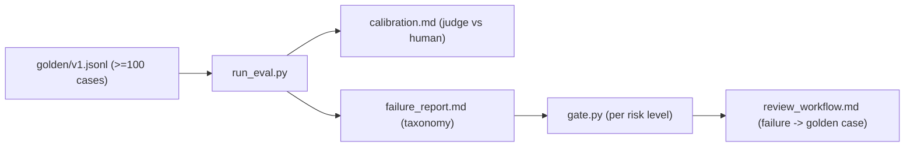

# My Work — Chapter 09: LLM and RAG Evaluation

Build the release control system: a versioned golden set, an eval runner, a
calibrated judge, and a per-risk-level release gate.

## What this chapter produces



## Deliverables checklist

- [ ] `golden/v1.jsonl` — ≥100 cases across risk levels: unanswerable, multi-source, ambiguous, adversarial.
- [ ] `run_eval.py` — retrieval metrics + RAGAS quartet + citation correctness + no-answer accuracy, per risk level.
- [ ] `calibration.md` — LLM-judge vs human agreement on ~50 cases.
- [ ] `failure_report.md` — failures categorised by taxonomy (not all "hallucination").
- [ ] `gate.py` — per-risk-level thresholds + manual-review rule; blocks a worse config.
- [ ] `review_workflow.md` — rubric + how a reviewed failure becomes a new golden case.

## Suggested layout

```
my_work/
  golden/v1.jsonl
  run_eval.py  gate.py
  calibration.md  failure_report.md  review_workflow.md
  README.md
```

See `../examples.md` for the case schema, metric code, the release gate,
judge calibration, taxonomy assignment, and feedback→golden conversion. See
`../deep_dive.md` for the calibration-loop diagram.

## Done when

A teammate runs your eval, reads the per-risk-level report, and can tell whether
a change is safe to ship — without asking you.
