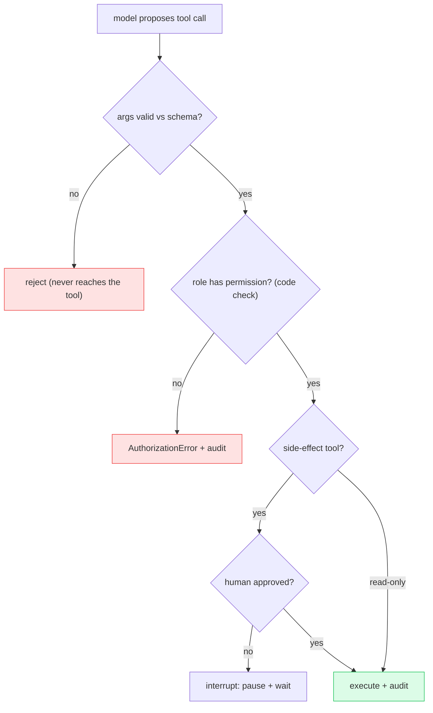

# Deep Dive: Agentic AI, LangGraph, and Tool Use

## Thesis

Agentic AI is workflow engineering with language models, tools, state, permissions, and traces. This file expands the chapter beyond the basic lesson and connects it to current practice, project work, and verifiable sources.

<!-- HAND-AUTHORED: do not regenerate -->
## Visual Model

The tool-execution decision: the model only *proposes*; code validates arguments, enforces permission, and requires approval for side effects. This is what keeps the blast radius small even if the model is fooled:

## Core Concepts

### `agent`

An LLM-based system that uses state, tools, and workflow to pursue a task. Agents can perform multi-step work but expand operational and safety risk.

Verification: Trace state transitions and evaluate route/tool decisions.

### `tool schema`

The typed definition of a callable tool's inputs and outputs. Schemas constrain tool calls and make validation possible.

Verification: Validate tool arguments before execution.

### `state`

The structured data carried through an agent workflow. State makes agent behavior inspectable, resumable, and testable.

Verification: Define a state schema and trace state changes.

### `routing`

Choosing the next step or component based on input or state. Routing controls which model, retriever, tool, or safety path handles a request.

Verification: Test route decisions with labeled scenarios.

### `memory`

Selected persisted or short-term context used across turns or sessions. Memory can improve continuity but creates privacy and staleness risk.

Verification: Define memory scope, retention, deletion, and retrieval rules.

### `human-in-the-loop`

A workflow pattern where humans review, approve, edit, or decide during execution. It controls risky actions and improves quality in uncertain cases.

Verification: Insert approval before side effects and preserve resumable state.

### `interrupt`

A mechanism that pauses workflow execution for external input. It enables review and approval in stateful agent graphs.

Verification: Test pause/resume behavior and state persistence.

### `tool permission`

A policy determining which user or workflow may invoke a tool. Tool permissions prevent excessive agency and unauthorized actions.

Verification: Enforce permissions in application code before tool execution.

### `trace`

A recorded execution path with spans, inputs, outputs, and timings. Traces reveal latency, state transitions, tool calls, and failures.

Verification: Trace API, retrieval, reranking, LLM, guardrail, and tool spans.

## Implementation Blueprint

Build this chapter as part of the capstone, not as isolated reading. The implementation should produce one or more concrete artifacts: code, schema, benchmark, trace, rubric, threat model, release manifest, or architecture document.

Recommended workflow:

1. Define the exact problem this chapter solves in the capstone.
2. Identify the data or request path affected by `agent`, `tool schema`, `state`, `routing`, `memory`, `human-in-the-loop`, `interrupt`, `tool permission`, `trace`.
3. Create a minimal artifact that can be reviewed.
4. Add failure cases before adding complexity.
5. Add measurements, logs, traces, or human review.
6. Document the decision with numbered references.

## Current Engineering Problems To Study

- Agents can call the wrong tool or take unauthorized actions if boundaries are weak.
- Memory improves continuity but creates privacy and stale-context risks.
- Final-answer evaluation is not enough for agent workflows.

## Production Failure Modes

Each failure below names the concept, the way it shows up in production, and the check that would have caught it earlier. Treat this section as the source for regression tests and runbook entries.

- `agent` — failure: The agent loops or calls tools without sufficient evidence. Mitigation check: Trace state transitions and evaluate route/tool decisions.
- `tool schema` — failure: The model sends malformed arguments to a business API. Mitigation check: Validate tool arguments before execution.
- `state` — failure: A node overwrites previous retrieval evidence unexpectedly. Mitigation check: Define a state schema and trace state changes.
- `routing` — failure: A risky action bypasses approval because routing is ambiguous. Mitigation check: Test route decisions with labeled scenarios.
- `memory` — failure: Old user preference influences a different user's answer. Mitigation check: Define memory scope, retention, deletion, and retrieval rules.
- `human-in-the-loop` — failure: Human approval happens after the irreversible action already executed. Mitigation check: Insert approval before side effects and preserve resumable state.
- `interrupt` — failure: The graph cannot resume because state was not checkpointed. Mitigation check: Test pause/resume behavior and state persistence.
- `tool permission` — failure: The model decides permission based on prompt text. Mitigation check: Enforce permissions in application code before tool execution.
- `trace` — failure: A bad answer cannot be debugged because intermediate retrieval is missing. Mitigation check: Trace API, retrieval, reranking, LLM, guardrail, and tool spans.

## Project Directions

- Build a stateful agent graph with classify, retrieve, tool-call, approval, and final-answer nodes.
- Create a tool safety lab with permissions, audit events, retries, and timeout behavior.
- Build an agent evaluation dataset for route choice, tool arguments, approval triggers, and unsafe requests.

## Verification Artifacts

- A short concept summary with citations.
- A capstone artifact that uses at least three chapter concepts.
- A test, metric, evaluation, or review checklist.
- A failure analysis table.
- A decision record comparing at least two alternatives.
- A reference section using `[1]`, `[2]` style citations.

## How This Chapter Connects To The Capstone

In the capstone, this chapter should leave a visible artifact. Examples include a module, schema, benchmark, design memo, evaluation result, threat model, release manifest, or demo step. Do not mark the chapter complete until the artifact is connected to the capstone.

## Further Reading

- Yao et al., ReAct (reasoning + acting agents): https://arxiv.org/abs/2210.03629
- Schick et al., Toolformer (tool use): https://arxiv.org/abs/2302.04761
- LangGraph overview (stateful graphs, checkpointing, interrupts): https://docs.langchain.com/oss/python/langgraph/overview
- LangGraph human-in-the-loop: https://langchain-ai.github.io/langgraph/how-tos/human_in_the_loop/wait-user-input/
- OpenAI Agents SDK: https://github.com/openai/openai-agents-python
- OWASP LLM06 Excessive Agency: https://owasp.org/www-project-top-10-for-large-language-model-applications/

## References

[1] LangGraph overview: https://docs.langchain.com/oss/python/langgraph/overview
[2] LangGraph StateGraph reference: https://reference.langchain.com/python/langgraph/graph/state/StateGraph
[3] LangGraph human-in-the-loop: https://langchain-ai.github.io/langgraph/how-tos/human_in_the_loop/wait-user-input/
[4] LangChain tools: https://docs.langchain.com/oss/python/langchain/tools
[5] OpenAI Agents SDK GitHub: https://github.com/openai/openai-agents-python
[6] AutoGen GitHub: https://github.com/microsoft/autogen
