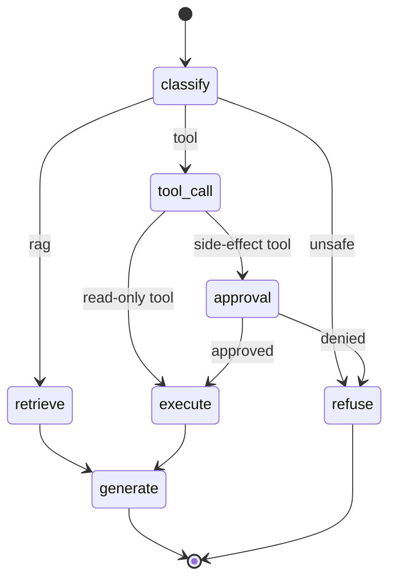

# Lesson: Agentic AI, LangGraph, and Tool Use

## Learning Objectives

By the end of this chapter you will be able to:

- **Design** a typed agent state schema with append-only history and explicit identity fields.
- **Implement** a stateful agent graph with code-enforced tool permissions and approval interrupts.
- **Evaluate** route accuracy, tool-argument validity, approval-trigger correctness, and injection refusal rate.
- **Justify** stopping conditions (max iterations, max tool calls, repeat detection) and the human-in-the-loop boundary.
- **Critique** an agent design for excessive agency and missing audit entries.

## 1. Agents Are Workflow Engineering, Not Magic

An "AI agent" is easy to mystify and easy to get wrong. Strip away the hype and an agent is this: an LLM that, in a loop, decides what to do next — answer, retrieve, call a tool, ask a human — based on explicit *state*, until a stopping condition is met. That's it. The intelligence is in the model; the *reliability* is in the engineering around it: the state schema, the routing logic, the tool permission boundaries, the human-approval steps, the traces, the retries, and the stopping conditions.

The defining shift from RAG (chapters 7–8) to agents is that agents can *take actions*, not just produce text. A RAG system that hallucinates gives a wrong answer; an agent that misbehaves can send an email, issue a refund, or delete a record. The blast radius is larger, so the engineering bar is higher. This chapter is mostly about *containing* that blast radius while keeping the useful autonomy.

The mental model to adopt: an agent is a state machine where one of the transition functions happens to be a language model. You design the states, the legal transitions, the permission checks, and the human gates. The LLM proposes; your engineering disposes.

## Visual Overview

The agent as a state machine. The model proposes (classify, tool args); code disposes (routing, permissions). Every side-effect action passes through a human-approval gate before it executes:



## 2. State: The Thing That Makes Agents Inspectable

The single most important design decision in an agent is its *state schema*. State is the structured data that flows through the workflow — the question, the retrieved evidence, the tool calls made, the approvals obtained, the partial conclusions, the final answer. Good state makes an agent inspectable, resumable, and testable; absent or sloppy state makes it an unauditable black box.

```python
from typing import TypedDict, Annotated
from operator import add


class AgentState(TypedDict):
    request_id: str
    tenant_id: str
    user_id: str
    role: str
    question: str
    route: str | None
    retrieved: list[Chunk]
    tool_calls: Annotated[list[ToolCall], add]   # appended, never overwritten
    approvals: list[Approval]
    final_answer: str | None
    requires_review: bool
```

Design principles:

- **State is explicit and typed.** Every field has a known shape. A reviewer can read the schema and know everything the agent tracks.
- **Append, don't overwrite, the history.** `tool_calls` accumulates; you never lose the record of what the agent did. (LangGraph's `Annotated[list, add]` reducer expresses exactly this.)
- **State carries identity.** `tenant_id`, `user_id`, `role` flow through every node, so permission checks have what they need at every step.
- **State is serialisable.** It can be checkpointed to a store, so the workflow can pause (for human approval) and resume — even across process restarts.

If you can dump an agent's state at any node and understand what it's doing and why, you've designed it well. If debugging requires re-running with print statements, you haven't.

## 3. The Graph: Nodes, Edges, and Routing

A stateful agent is naturally a graph: nodes are steps (classify, retrieve, call a tool, ask a human, answer), edges are transitions, and the routing logic decides which edge to take based on state. LangGraph is a popular framework for exactly this; the concepts transfer to any framework (or to hand-rolled code).

A canonical RAG-plus-tools agent graph:

```
                 +-> retrieve -> generate -> END
classify -> route +
                 +-> tool_call -> approval? -> execute -> generate -> END
                 +-> refuse -> END
```

```python
from langgraph.graph import StateGraph, END

graph = StateGraph(AgentState)
graph.add_node("classify", classify_node)
graph.add_node("retrieve", retrieve_node)
graph.add_node("tool_call", tool_call_node)
graph.add_node("approval", approval_node)
graph.add_node("execute", execute_node)
graph.add_node("generate", generate_node)
graph.add_node("refuse", refuse_node)

graph.set_entry_point("classify")
graph.add_conditional_edges("classify", route_by_intent, {
    "rag": "retrieve",
    "tool": "tool_call",
    "unsafe": "refuse",
})
graph.add_edge("retrieve", "generate")
graph.add_conditional_edges("tool_call", needs_approval, {
    True: "approval",
    False: "execute",
})
graph.add_edge("approval", "execute")     # resumes here after human approves
graph.add_edge("execute", "generate")
graph.add_edge("generate", END)
graph.add_edge("refuse", END)

app = graph.compile(checkpointer=checkpointer)   # checkpointer enables pause/resume
```

The routing functions (`route_by_intent`, `needs_approval`) are where your engineering judgement lives. They are pure functions of state — testable in isolation, no LLM required. The LLM's role is to *populate* state (classify the intent, propose a tool call); your routing logic *decides what to do* with that proposal, with hard rules you control.

## 4. Tools: Typed Contracts with Permission Boundaries

A tool is a function the agent can call. The two things that make a tool safe:

1. **A typed schema** for its arguments (chapter 01's discriminated unions, chapter 05's structured output). The model proposes arguments; you validate them against the schema before execution. A hallucinated or malformed argument fails validation and never reaches the tool.
2. **A permission policy** enforced in code. Each tool declares whether it's read-only or has side effects, and what role/permission is required to invoke it.

```python
@dataclass
class ToolSpec:
    name: str
    args_schema: type[BaseModel]
    side_effects: bool          # read-only vs mutating/external
    required_role: str          # RBAC gate
    requires_approval: bool     # human-in-the-loop gate


TOOLS = {
    "search_docs":  ToolSpec("search_docs", SearchArgs, side_effects=False,
                             required_role="user", requires_approval=False),
    "send_email":   ToolSpec("send_email", EmailArgs, side_effects=True,
                             required_role="agent", requires_approval=True),
    "issue_refund": ToolSpec("issue_refund", RefundArgs, side_effects=True,
                             required_role="agent", requires_approval=True),
}


async def execute_tool(call: ToolCall, state: AgentState) -> ToolResult:
    spec = TOOLS[call.name]
    # 1. validate arguments against the schema
    args = spec.args_schema.model_validate(call.args)
    # 2. enforce permission IN CODE, not via the prompt
    if not has_role(state["role"], spec.required_role):
        raise AuthorizationError(f"role {state['role']} cannot call {call.name}")
    # 3. side-effect tools require a recorded approval
    if spec.requires_approval and not has_approval(state, call):
        raise ApprovalRequiredError(call.name)
    # 4. execute and audit
    result = await TOOL_IMPLS[call.name](args)
    await audit.record_tool_call(state, call, result)
    return result
```

The non-negotiable rule, repeated from chapter 05: **permission is enforced in code, never in the prompt.** "You are only allowed to email internal users" in a system prompt is a suggestion the model can be talked out of (prompt injection). `if not has_role(...)` is a control the model cannot bypass. The model decides *what to propose*; code decides *what is allowed*.

## 5. Human-in-the-Loop: Approval Before Side Effects

For irreversible or high-stakes actions (sending money, emailing customers, deleting data), the agent should *pause* and get human approval before acting. This is the human-in-the-loop pattern, and it depends on the checkpointing from section 2.

The flow:

1. Agent reaches a side-effect tool requiring approval.
2. The graph hits an *interrupt*: it checkpoints state and pauses.
3. A human reviews the proposed action (with full context from state) and approves or denies.
4. On approval, the graph *resumes* from the checkpoint and executes.
5. On denial, the agent produces a graceful refusal explaining why.

```python
# The approval node interrupts; execution resumes only after external input.
async def approval_node(state: AgentState) -> AgentState:
    interrupt({                              # LangGraph interrupt: pause + checkpoint
        "type": "approval_request",
        "action": state["tool_calls"][-1],
        "context": summarise(state),
    })
    # resumes here with the human's decision injected into state
    return state
```

The critical correctness rule: **approval happens before the side effect, not after.** A naive design that runs the tool and then asks "was that okay?" has already sent the email. The interrupt must sit on the edge *into* execution. Test this explicitly — it's the single most important agent safety test.

## 6. Stopping Conditions and Loop Control

An agent loops: think, act, observe, repeat. Without explicit stopping conditions, it can loop forever, burn through your token budget, or oscillate between two tools. Every agent needs hard limits:

- **Max iterations.** A counter in state; the graph refuses to continue past N steps and returns a "could not complete" result. N is small (5–10 for most workflows).
- **Max tool calls.** Independent of iterations; bounds cost and blast radius.
- **Progress detection.** If the agent makes the same tool call twice with the same arguments, it's stuck — break the loop.
- **A wall-clock budget.** The whole workflow has a timeout (chapter 03's request budget applies).

```python
def should_continue(state: AgentState) -> bool:
    if state["iterations"] >= MAX_ITERATIONS:
        return False
    if len(state["tool_calls"]) >= MAX_TOOL_CALLS:
        return False
    if is_repeating(state["tool_calls"]):    # same call twice -> stuck
        return False
    return state["final_answer"] is None
```

The failure mode without these: an agent that retries a failing tool forever, or ping-pongs between "search" and "rerank" without converging, quietly spending money. Bounds are not optional.

## 7. Retries, Timeouts, and Error Handling in the Loop

Tools fail — networks time out, APIs rate-limit, downstream services error. The agent must handle this gracefully:

- **Retry transient failures with backoff** (chapter 01's adapter pattern), with a max attempt count. A tool that times out once is retried; a tool that times out three times is a failure the agent must handle, not retry forever.
- **Surface permanent failures into state.** A failed tool call is recorded in `tool_calls` with its error, so the agent (and a human reviewer) can see it. Don't silently swallow it.
- **Have a degraded path.** If a tool is down, the agent should be able to say "I couldn't complete this because the billing system is unavailable" rather than hanging or hallucinating success.

The anti-pattern: a bare `try/except: pass` around a tool call that turns a failure into a silent "success" the agent then reasons from. A swallowed tool error produces an agent confidently acting on a result it never got.

## 8. Tracing: You Cannot Debug What You Cannot See

Agent workflows are multi-step and non-deterministic, which makes them the hardest part of an AI system to debug. Tracing is non-negotiable. Every run should produce a trace (chapter 12) with a span per node:

```
run_id=run_8a2
  span classify     (12ms)  -> route=tool
  span tool_call    (40ms)  -> propose issue_refund(amount=50)
  span approval     (paused 4m) -> approved by user_admin
  span execute      (320ms) -> refund_id=rf_991
  span generate     (1.2s)  -> final_answer
```

A trace lets you answer, after the fact: what route did it take, what did it propose, was approval obtained, what did the tool return, where did the time go. Without traces, an agent incident is unsolvable — you have an output and no idea how the agent got there. Final-answer evaluation alone (chapter 9) is insufficient for agents; you must evaluate the *path*, and the trace is how you see it.

## 9. Evaluating Agents

Agent evaluation extends chapter 9 to the *process*, not just the output:

- **Route accuracy**: did the agent take the right path for the query? (labelled scenarios → expected routes)
- **Tool-argument validity**: were proposed tool arguments well-formed and correct?
- **Approval-trigger correctness**: did every side-effect action get an approval, and did read-only actions *not* demand one?
- **Injection refusal rate**: against adversarial inputs (in user text, retrieved docs, tool outputs), did the agent refuse to execute embedded instructions?
- **Task success**: did the workflow achieve the goal?

The labelled agent eval set (chapter 10's project lab) has normal cases, approval-required cases, and injection-attempt cases. The injection cases are security regression tests: an agent that scores well on task success but executes injected instructions is a critical failure, not a passing system.

## 10. Frameworks: LangGraph and Alternatives

LangGraph (stateful graphs with checkpointing and interrupts) is a strong default for the patterns in this chapter. Alternatives exist — OpenAI's Agents SDK, Microsoft's AutoGen and Semantic Kernel (chapter 11), CrewAI — each with different abstractions for state, tools, and multi-agent coordination.

The engineering caution (foreshadowing chapter 11): keep your *domain logic portable*. The tool implementations, the permission policy, the state schema, the audit logging — these are yours and should not be welded to one framework's abstractions. The framework provides the graph execution, checkpointing, and interrupt machinery; your business logic should be callable from any of them. When a framework changes its API (they all do), portable domain logic means you adapt the glue, not rewrite the agent.

## 11. Common Mistakes and Anti-Patterns

1. **Permission checks in the prompt, not in code.** The model can be talked out of a prompt rule.
2. **Approval after the side effect.** The email is already sent.
3. **No stopping condition.** Infinite loops, runaway cost.
4. **State overwritten, not appended.** History lost; trace incomplete.
5. **Swallowed tool errors.** Agent acts on results it never got.
6. **No max-tool-calls bound.** Blast radius and cost unbounded.
7. **Evaluating only the final answer.** Misses route and tool-call errors.
8. **Untyped tool arguments.** Hallucinated args reach the tool.
9. **No trace.** Agent incidents become unsolvable.
10. **Domain logic welded to one framework.** A framework change forces a rewrite.

## 12. Production Failure Modes

- **An injected instruction in a retrieved doc makes the agent email the customer list.** Cause: permission in prompt, not code; retrieved content trusted. Defensive: code-level RBAC; treat retrieval as hostile; injection eval cases.
- **The agent loops forever on a flaky tool.** Cause: no max iterations / retry cap. Defensive: hard bounds + progress detection.
- **A refund is issued without approval.** Cause: approval edge placed after execution, or the approval check is bypassable. Defensive: interrupt before side-effect; test the approval gate explicitly.
- **The agent can't resume after a restart during approval.** Cause: state not checkpointed/serialisable. Defensive: serialisable state + a real checkpointer.
- **A tool returned an error but the agent reported success.** Cause: swallowed exception. Defensive: surface tool errors into state; degraded path.
- **An agent incident can't be reconstructed.** Cause: no trace. Defensive: span-per-node tracing with state snapshots.

## 13. Security and Privacy

Agents are the highest-risk component in the course because they act. The controls:

1. **Least privilege per tool.** Each tool gets the minimum role and scope. The agent's overall authority is the union of its tools — keep it small.
2. **Code-enforced permission and approval.** Repeated because it's the whole game: the model proposes, code disposes.
3. **Treat every external input as hostile** — user text, retrieved documents, and especially *tool outputs* (a tool can return attacker-influenced data containing instructions).
4. **Audit every side-effect action** (chapter 02's `audit_log`): actor, tool, arguments, approval, result. This is both a security control and a compliance requirement.
5. **Bound the blast radius.** Even a fully-compromised agent (model entirely fooled) should be unable to cause large harm because its tools are scoped, its side effects gated, and its actions audited. Design assuming the model *will* be fooled.

## 14. The Capstone Checklist

By the end of chapter 10, the following should exist in `chapters/10_agentic_ai_langgraph_tool_use/my_work/`:

- An agent graph (`agent_graph.py`) with classify → route → retrieve/tool → approval → execute → generate nodes, compiled with a checkpointer.
- A typed state schema with appended (not overwritten) history and identity fields.
- A tool registry (`tool_policy.md` + code) where each tool declares side-effects, required role, and approval requirement, all enforced in code.
- A human-in-the-loop interrupt before every side-effect tool, with pause/resume working across a restart.
- Stopping conditions: max iterations, max tool calls, progress detection.
- An agent eval set (≥50 cases: normal, approval-required, injection-attempt) with metrics for route accuracy, tool-arg validity, approval-trigger correctness, and injection refusal rate.
- Span-per-node tracing and an audit entry per side-effect action.
- A README documenting the graph, the tool policy, and how to run the eval.

If a teammate can run the agent, see it refuse an injection, watch it pause for approval before a refund, and reconstruct a run from the trace — without asking you — the chapter is done.

## 15. Key Takeaway

An agent is a state machine with an LLM in one of its transition functions. The model provides autonomy; your engineering provides reliability and safety. Design explicit, typed, append-only state; route with code you control; gate every side effect behind code-enforced permissions and human approval; bound the loop; trace everything; and design as if the model *will* be fooled so the blast radius stays small. Agentic AI is workflow engineering under adversarial conditions — the autonomy is the easy part; the containment is the job.

## Numbered References

[1] LangGraph overview: https://docs.langchain.com/oss/python/langgraph/overview
[2] LangGraph StateGraph reference: https://reference.langchain.com/python/langgraph/graph/state/StateGraph
[3] LangGraph human-in-the-loop: https://langchain-ai.github.io/langgraph/how-tos/human_in_the_loop/wait-user-input/
[4] LangChain tools: https://docs.langchain.com/oss/python/langchain/tools
[5] OpenAI Agents SDK GitHub: https://github.com/openai/openai-agents-python
[6] AutoGen GitHub: https://github.com/microsoft/autogen
