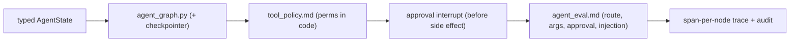

# My Work — Chapter 10: Agentic AI, LangGraph, Tool Use

Build a stateful agent where the model proposes and code disposes: typed state,
code-enforced permissions, human approval before side effects, and traces.

## What this chapter produces



## Deliverables checklist

- [ ] Typed `AgentState` — identity fields, append-only `tool_calls`, approvals.
- [ ] `agent_graph.py` — classify→route→retrieve/tool→approval→execute→generate, compiled with a checkpointer.
- [ ] `tool_policy.md` + code — each tool declares side-effects/role/approval, all enforced in code.
- [ ] human-in-the-loop — approval before every side-effect; pause/resume across a restart.
- [ ] stopping conditions — max iterations, max tool calls, repeat detection.
- [ ] `agent_eval.md` — ≥50 cases (normal, approval-required, injection); route accuracy, arg validity, approval correctness, injection refusal rate.
- [ ] tracing + audit — reconstruct one run end-to-end.

## Suggested layout

```
my_work/
  agent_graph.py  tools/  state.py
  tool_policy.md  agent_eval.md
  tests/  README.md
```

See `../examples.md` for state, graph wiring, the execute-with-gates core,
the approval interrupt, stopping conditions, and injection cases. See
`../deep_dive.md` for the tool-execution decision diagram.

## Done when

A teammate runs the agent, sees it refuse an injection, watches it pause for
approval before a side effect, and reconstructs a run from the trace — without
asking you.
