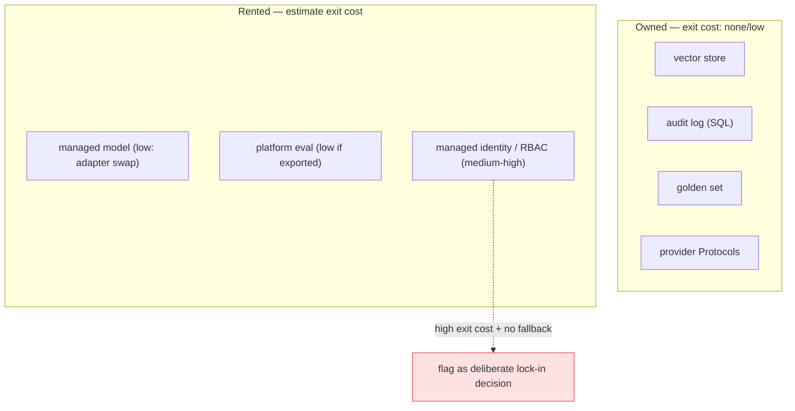

# Deep Dive: Azure/OpenAI Foundry and Enterprise AI

## Thesis

Enterprise AI requires platform literacy without surrendering architecture to one vendor. This file expands the chapter beyond the basic lesson and connects it to current practice, project work, and verifiable sources.

<!-- HAND-AUTHORED: do not regenerate -->
## Visual Model

Every capability is either *owned* (low/no exit cost) or *rented* (an exit cost you should estimate). Lock-in is fine when deliberate; the danger is rented capabilities with high exit cost and no fallback:

## Core Concepts

### `model deployment`

A configured model endpoint available for inference. Deployment settings affect availability, cost, quotas, and governance.

Verification: Document endpoint, model, region, quota, and fallback behavior.

### `managed identity`

Cloud identity used by services to access resources without embedded secrets. It reduces secret sprawl and supports enterprise access control.

Verification: Use identity-based access where supported and document permissions.

### `RBAC`

Role-based access control. It maps users or services to permitted actions and resources.

Verification: Define roles, permissions, and tests for protected operations.

### `Foundry project`

A managed workspace for building, evaluating, and operating AI applications in the Microsoft ecosystem. It groups models, agents, evals, deployments, and governance assets.

Verification: Export or mirror critical artifacts in your repository.

### `agent service`

A managed or application-level runtime for tool-using agents. It can simplify deployment but must be assessed for observability and control.

Verification: Verify tool logs, permissions, state, and evaluation export.

### `Semantic Kernel`

Microsoft's SDK for AI orchestration with plugins/functions and connectors. It is useful to compare with LangGraph, LlamaIndex, and OpenAI Agents SDK.

Verification: Build a framework comparison and keep domain logic portable.

### `governance`

Policies and controls for responsible, auditable, and compliant AI use. Governance connects technical behavior to organizational risk.

Verification: Define ownership, review gates, data policy, and monitoring.

### `vendor lock-in`

Dependence on a provider-specific API, feature, or data store that is hard to replace. AI platforms change quickly, so portability matters.

Verification: Keep provider-neutral contracts and exportable artifacts.

## Implementation Blueprint

Build this chapter as part of the capstone, not as isolated reading. The implementation should produce one or more concrete artifacts: code, schema, benchmark, trace, rubric, threat model, release manifest, or architecture document.

Recommended workflow:

1. Define the exact problem this chapter solves in the capstone.
2. Identify the data or request path affected by `model deployment`, `managed identity`, `RBAC`, `Foundry project`, `agent service`, `Semantic Kernel`, `governance`, `vendor lock-in`.
3. Create a minimal artifact that can be reviewed.
4. Add failure cases before adding complexity.
5. Add measurements, logs, traces, or human review.
6. Document the decision with numbered references.

## Current Engineering Problems To Study

- Managed platforms simplify deployment but can hide architecture and portability risks.
- Evaluation and traces should be exportable and owned by the engineering team.
- Enterprise systems need identity, content safety, network, audit, and cost governance.

## Production Failure Modes

Each failure below names the concept, the way it shows up in production, and the check that would have caught it earlier. Treat this section as the source for regression tests and runbook entries.

- `model deployment` — failure: The app uses a model name but the platform requires a deployment name. Mitigation check: Document endpoint, model, region, quota, and fallback behavior.
- `managed identity` — failure: API keys are stored in config files across environments. Mitigation check: Use identity-based access where supported and document permissions.
- `RBAC` — failure: A support user can access admin-only documents. Mitigation check: Define roles, permissions, and tests for protected operations.
- `Foundry project` — failure: Evaluation data exists only in a platform UI and cannot be reproduced. Mitigation check: Export or mirror critical artifacts in your repository.
- `agent service` — failure: The service hides tool traces needed for incident analysis. Mitigation check: Verify tool logs, permissions, state, and evaluation export.
- `Semantic Kernel` — failure: The architecture becomes tightly coupled to one SDK abstraction. Mitigation check: Build a framework comparison and keep domain logic portable.
- `governance` — failure: Teams deploy model changes without review or documented risk. Mitigation check: Define ownership, review gates, data policy, and monitoring.
- `vendor lock-in` — failure: Prompts, evals, and tool schemas live only in a vendor console. Mitigation check: Keep provider-neutral contracts and exportable artifacts.

## Project Directions

- Design a vendor-neutral enterprise AI architecture and map it to Azure/OpenAI-style services.
- Compare LangGraph, LlamaIndex, Semantic Kernel, OpenAI Agents SDK, and Foundry Agent Service.
- Write a migration plan that moves from one model provider to another without changing product APIs.

## Verification Artifacts

- A short concept summary with citations.
- A capstone artifact that uses at least three chapter concepts.
- A test, metric, evaluation, or review checklist.
- A failure analysis table.
- A decision record comparing at least two alternatives.
- A reference section using `[1]`, `[2]` style citations.

## How This Chapter Connects To The Capstone

In the capstone, this chapter should leave a visible artifact. Examples include a module, schema, benchmark, design memo, evaluation result, threat model, release manifest, or demo step. Do not mark the chapter complete until the artifact is connected to the capstone.

## Further Reading

- Microsoft Foundry documentation: https://learn.microsoft.com/en-us/azure/foundry/
- Azure AI Foundry Agent Service: https://learn.microsoft.com/en-gb/azure/ai-foundry/agents/overview
- Semantic Kernel: https://github.com/microsoft/semantic-kernel
- Azure Well-Architected Framework (design tradeoffs): https://learn.microsoft.com/en-us/azure/well-architected/
- OpenAI Agents SDK: https://github.com/openai/openai-agents-python
- Microsoft Responsible AI: https://www.microsoft.com/en-us/ai/principles-and-approach/

## References

[1] Microsoft Foundry documentation: https://learn.microsoft.com/en-us/azure/foundry/
[2] Azure AI Foundry Agent Service: https://learn.microsoft.com/en-gb/azure/ai-foundry/agents/overview
[3] Microsoft Foundry evaluation: https://learn.microsoft.com/en-us/azure/foundry/how-to/evaluate-generative-ai-app
[4] Azure OpenAI responsible AI: https://learn.microsoft.com/en-us/legal/cognitive-services/openai/overview
[5] Semantic Kernel GitHub: https://github.com/microsoft/semantic-kernel
