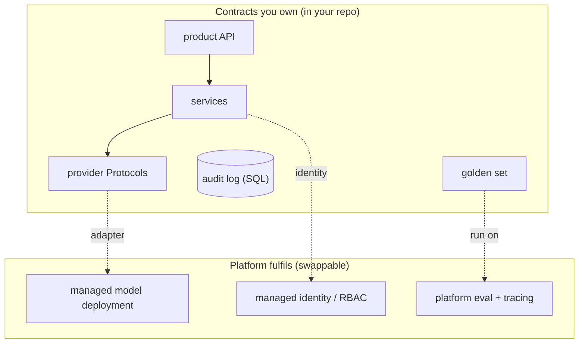

# Lesson: Azure/OpenAI Foundry and Enterprise AI

## 1. Platform Literacy Without Surrender

Enterprises rarely build AI on raw model APIs alone. They build on managed platforms — Azure AI Foundry, the OpenAI platform with its Agents SDK, Microsoft's Semantic Kernel and AutoGen — that bundle model hosting, identity, content safety, evaluation, tracing, agent orchestration, and governance. These platforms are genuinely useful: they solve real problems (identity, compliance, scaling) that you would otherwise build yourself.

They also create a trap. The same convenience that gets you to production fast can quietly weld your architecture to one vendor's abstractions, until "switch providers" or "run this eval outside the console" becomes a multi-month project. The skill this chapter teaches is *platform literacy without surrender*: use the managed platform's strengths while keeping your architecture portable enough that the platform is a choice you can revisit, not a cage.

The mental model: treat the managed platform as a set of *implementations* behind interfaces you own. Your product's API contract, your tool definitions, your state schema, your evaluation data, your audit logs — these belong to you and live in your repository. The platform fulfils them; it does not define them. When you frame it this way, vendor choice becomes a measured tradeoff (cost, capability, compliance, ops burden) rather than an irreversible commitment.

## Visual Overview

The platform sits *behind* contracts you own. Your services talk to Protocols and your own stores; adapters map those to the rented platform services, so a provider swap is an adapter change:



## 2. What These Platforms Actually Provide

Stripped of branding, enterprise AI platforms offer a fairly consistent menu:

- **Model hosting and deployment**: managed endpoints for hosted models, often with a "deployment name" indirection over the raw model id.
- **Identity and access**: managed identity (services authenticate without embedded secrets), RBAC, network isolation (private endpoints, VNets).
- **Content safety**: input/output filtering for harmful content, often configurable.
- **Evaluation**: built-in eval runners and metrics dashboards.
- **Tracing and monitoring**: request traces, token/cost dashboards.
- **Agent orchestration**: managed agent runtimes (Foundry Agent Service, OpenAI Agents SDK) with tool calling, state, and sometimes human-in-the-loop.
- **Governance**: audit, policy, cost controls, data-residency guarantees.

Each item maps to something you've built or will build in this course by hand. The platform is, in effect, a managed version of chapters 1–15. Understanding the mapping (section 4) is what lets you decide, per capability, whether to use the platform's version or your own.

## 3. The Deployment-Name Gotcha and Other Platform Realities

A few concrete realities that trip up engineers moving from raw APIs to managed platforms:

- **Deployment names vs model ids.** On Azure OpenAI, you don't call `gpt-4o-mini` directly; you create a *deployment* with a name you choose and call that. Your code references the deployment name; the actual model behind it can change. This is both a feature (swap the model without code change) and a hazard (your "model id" in logs is now a deployment alias — record the real model behind it for reproducibility, chapter 02).
- **Managed identity over API keys.** Mature platforms let services authenticate via managed identity (no key in config). Use it where available — it eliminates a whole class of secret-leak risks (chapter 04). Your provider adapter (chapter 01) hides whether auth is a key or an identity token.
- **Quotas and rate limits are platform-level.** Your per-tenant rate limiting (chapter 03) sits *on top of* the platform's quotas. Hitting a platform quota looks like a `provider_error` (chapter 01) — handle it as retryable with backoff.
- **Content safety can change behaviour.** A platform's safety filter may refuse or modify outputs your own guardrails would have passed (or vice versa). Know which layer is making which decision, or you'll debug a refusal that came from the platform, not your code.

These aren't reasons to avoid platforms — they're reasons to put a provider adapter between your code and the platform so these specifics stay in one place.

## 4. Vendor-Neutral Architecture: The Mapping Exercise

The core deliverable of this chapter is a *vendor-neutral architecture* and an explicit *mapping* from it to a chosen platform. The architecture describes your system in terms of *capabilities and contracts*; the mapping says which platform service fulfils each, and — critically — what would have to move with you if you left.

```
Capability             Your contract                Platform fulfilment        Exit cost
---------------------  ---------------------------  -------------------------  -----------------
LLM completion         LlmProvider Protocol         Azure OpenAI deployment    low (adapter swap)
Embeddings             EmbeddingProvider Protocol   Azure OpenAI embeddings    low
Vector search          VectorStore Protocol         (your Qdrant, not theirs)  none (self-owned)
Agent orchestration    your graph + state schema    Foundry Agent Service      medium (re-host graph)
Evaluation             your golden set + runner     Foundry eval (export)      low if exported
Tracing                OTel spans                   Foundry tracing            low (OTel is portable)
Identity/RBAC          your RequestContext          managed identity + RBAC    medium
Content safety         your guardrails              platform content filter    re-implement filter
Audit                  your audit_log (SQL)         (your SQL, not theirs)     none (self-owned)
```

The exercise forces clarity: which capabilities are *yours* (vector store, audit log, golden set) and which are *rented* (model hosting, content safety). The rented ones need an exit cost estimate. A capability with a "high" exit cost and no fallback is a lock-in risk to flag, not necessarily to avoid — but to decide on deliberately.

## 5. Keeping Domain Logic Portable

The practical discipline that makes the mapping real:

- **Your provider adapters (chapter 01) wrap the platform's SDK**, not the other way around. `AzureOpenAiLlmProvider` implements your `LlmProvider` Protocol. Swapping to a different platform means writing a new adapter, not touching your services.
- **Your agent's state schema, tool definitions, and routing logic live in your repo** (chapter 10), even if a managed agent runtime executes them. A managed runtime that *only* accepts tools defined in its console is a lock-in smell — prefer one that accepts your definitions.
- **Your evaluation golden set lives in your repo** (chapter 09), not only in the platform's eval UI. Use the platform's eval *runner* if convenient, but the dataset and the results must be exportable and version-controlled. "Our evals exist only in a vendor dashboard" means you cannot reproduce or migrate them.
- **Your traces use OpenTelemetry** (chapter 12), a vendor-neutral standard. Platforms that emit OTel spans are portable; ones that only show traces in a proprietary console are not.
- **Your audit log is your SQL** (chapter 02), never only the platform's logs.

The test: could you stand up your system on a different provider in a sprint, changing only adapters and config? If yes, you have platform literacy. If it's a quarter-long project, you've surrendered.

## 6. Framework Comparison: LangGraph vs Semantic Kernel vs Agents SDK vs Foundry

You will be asked (in interviews, in architecture reviews) to compare orchestration options. A structured comparison, on the axes that matter:

| Axis | LangGraph | Semantic Kernel | OpenAI Agents SDK | Foundry Agent Service |
| --- | --- | --- | --- | --- |
| State model | explicit typed graph state | plugins/functions + context | sessions + handoffs | managed sessions |
| Tools | your Python functions | plugins (functions/connectors) | function tools | tools + hosted tools |
| Human-in-the-loop | interrupts + checkpoints | manual | manual | managed |
| Tracing | OTel/LangSmith | OTel | OTel | Foundry tracing |
| Eval | bring your own | bring your own | bring your own | built-in |
| Lock-in | low (OSS, portable) | low (OSS) | medium (OpenAI-centric) | higher (Azure-centric) |
| Best when | complex stateful graphs | .NET/enterprise integration | OpenAI-first stacks | Azure-governed enterprise |

The honest takeaway: there is no universal winner. The right choice depends on your existing stack (.NET shop → Semantic Kernel is natural), your governance requirements (heavily-regulated Azure tenant → Foundry's built-in governance earns its lock-in), and your need for complex state (LangGraph's explicit graphs). The senior move in a comparison is to state the *decision criteria first* (what does this org need?) and then map options to criteria — not to declare a favourite.

## 7. Governance and Compliance in Enterprise AI

Enterprise platforms exist largely because of governance requirements that startups can ignore and enterprises cannot:

- **Data residency**: where is data processed and stored? Some platforms guarantee a region; this can be a hard regulatory requirement.
- **Data usage**: is your data used to train the provider's models? Enterprise tiers typically guarantee not; verify it in writing, it's a compliance fact not a technical one.
- **Network isolation**: private endpoints, no public internet egress. Often mandatory in finance/health.
- **Identity and audit**: who did what, tied to corporate identity, retained per policy (chapter 02's audit log, chapter 15's compliance).
- **Cost governance**: quotas and budgets per team/project so one experiment can't burn the quarter's budget.

The engineering point: these are mostly *configuration and contract* concerns, not code. But they shape architecture — a data-residency requirement may dictate which region your vector store lives in, which forces your whole stack into that region. Surface these requirements early; they're expensive to retrofit.

## 8. Migration Planning

The proof that your architecture is portable is a *migration plan* you could actually execute. A good plan:

1. **Inventory** the rented capabilities (from the section-4 mapping) and their exit costs.
2. **For the model provider**, the migration is: write the new adapter, run the chapter-09 eval gate on the new provider, compare quality/latency/cost, flip config. The product API does not change. (This is the same dual-path + eval + flip pattern as chapter 06's index migration.)
3. **For evaluation**, ensure the golden set and historical results are exported and re-importable.
4. **For agent orchestration**, confirm your state schema and tools are framework-portable; the migration re-hosts the graph, it doesn't redesign it.
5. **For identity/governance**, this is usually the highest-cost piece and may genuinely tie you to a platform — flag it explicitly.

The deliverable is not "we will migrate" — most teams won't. It's *proof that you could*, which is what keeps a vendor honest and what an architecture reviewer wants to see. A migration plan you've partially rehearsed (e.g. you've actually swapped the LLM provider in dev) is far more credible than one you've only written.

## 9. Common Mistakes and Anti-Patterns

1. **Prompts, tools, and evals living only in a vendor console.** Unversioned, unexportable, lock-in by neglect.
2. **Calling the platform SDK directly from services.** No adapter; a provider change is a rewrite.
3. **Treating a framework comparison as a beauty contest.** No decision criteria; just preference.
4. **Ignoring the deployment-name indirection** and logging an alias as the model id (breaks reproducibility).
5. **Assuming the new provider has every capability of the old one** in a migration plan.
6. **Re-implementing identity/RBAC against a platform abstraction** with no portable equivalent.
7. **Not verifying data-usage and residency in writing.** A compliance assumption that turns out false.
8. **Letting platform content-safety silently make decisions** your guardrails should own — confusing debugging.
9. **No cost governance**, so one team's experiment exhausts a shared quota.
10. **Building multi-quarter lock-in without a deliberate decision.** Lock-in is sometimes the right call — but it should be a *call*.

## 10. Production Failure Modes

- **A model upgrade behind a deployment name silently shifts behaviour.** Defensive: pin and record the real model id; eval on change.
- **An eval can't be reproduced because it only exists in the console.** Defensive: export golden set + results to the repo.
- **A platform quota is hit at peak and looks like random failures.** Defensive: handle quota as retryable `provider_error`; monitor quota headroom.
- **A region outage takes the whole stack down because everything is in one region for residency.** Defensive: documented DR plan within residency constraints.
- **The content-safety filter starts refusing valid outputs after a platform update.** Defensive: know which layer decides; monitor refusal rate by source.
- **Migration estimated at "a week" takes a quarter** because identity/RBAC was platform-specific. Defensive: honest exit-cost estimates in the mapping; rehearse the cheap migrations.

## 11. Security and Privacy

1. **Managed identity over keys** wherever the platform supports it (chapter 04) — fewer secrets to leak.
2. **Data boundary awareness**: anything sent to a hosted platform has left your premises. Know the data-usage and residency terms; they're compliance facts (chapter 15).
3. **Network isolation** (private endpoints) for regulated workloads — often a hard requirement, not an option.
4. **Audit stays in your control.** Use the platform's audit *in addition to* your own (chapter 02), never instead of it — you need an audit trail you own and can retain on your terms.
5. **Content safety is defense in depth, not your only layer.** Your guardrails (chapter 15) run regardless of the platform's filter; relying solely on the platform's is surrendering a security control.

## 12. The Capstone Checklist

By the end of chapter 11, the following should exist in `chapters/11_azure_openai_foundry_semantic_kernel/my_work/`:

- `architecture_neutral.md`: your system described in capabilities and contracts, naming no vendor.
- `platform_mapping.md`: each capability mapped to a platform service, with an exit-cost estimate and what's self-owned vs rented.
- `framework_compare.md`: LangGraph vs Semantic Kernel vs OpenAI Agents SDK vs Foundry on state, tools, HITL, tracing, eval, lock-in — with stated decision criteria and a recommendation.
- `migration_plan.md`: how to swap the model provider behind your adapter without changing the product API, including the eval-gate step; ideally with one provider actually swapped in dev as proof.
- A demonstration that your evals and traces are exportable (not console-only).
- A README summarising the portability posture.

If a teammate can read your mapping and tell which capabilities are rented, what each would cost to leave, and how a provider swap would work — without asking you — the chapter is done.

## 13. Key Takeaway

Enterprise AI platforms are powerful and worth using — but use them as implementations behind contracts you own, not as the definition of your architecture. Keep your provider adapters, state schema, tool definitions, golden set, traces, and audit log in your repository. Map every rented capability to an exit cost, and prove portability with a migration plan you've partly rehearsed. Lock-in is sometimes the right tradeoff; the goal is to make it a deliberate decision, not an accident of convenience.

## Numbered References

[1] Microsoft Foundry documentation: https://learn.microsoft.com/en-us/azure/foundry/
[2] Azure AI Foundry Agent Service: https://learn.microsoft.com/en-gb/azure/ai-foundry/agents/overview
[3] Microsoft Foundry evaluation: https://learn.microsoft.com/en-us/azure/foundry/how-to/evaluate-generative-ai-app
[4] Azure OpenAI responsible AI: https://learn.microsoft.com/en-us/legal/cognitive-services/openai/overview
[5] Semantic Kernel GitHub: https://github.com/microsoft/semantic-kernel
