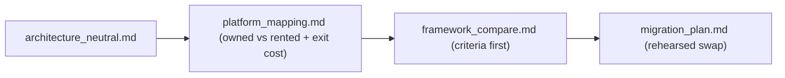

# My Work — Chapter 11: Azure/OpenAI Foundry and Enterprise AI

Use a managed platform without surrendering your architecture. Keep contracts
you own; map every rented capability to an exit cost.

## What this chapter produces



## Deliverables checklist

- [ ] `architecture_neutral.md` — capabilities + contracts, no vendor named.
- [ ] `platform_mapping.md` — each capability owned/rented + exit-cost estimate.
- [ ] two adapters for one `LlmProvider` Protocol — service tests pass on both via config only.
- [ ] `framework_compare.md` — LangGraph vs SK vs Agents SDK vs Foundry; criteria stated first.
- [ ] `migration_plan.md` — provider swap behind the adapter + eval gate; one rehearsed dev swap.
- [ ] (stretch) export proof (evals not console-only) + governance checklist.

## Suggested layout

```
my_work/
  architecture_neutral.md  platform_mapping.md
  framework_compare.md  migration_plan.md  governance.md
  adapters/  README.md
```

See `../examples.md` for two-adapter wiring, the capability→platform table,
managed identity, and the migration step. See `../deep_dive.md` for the
owned-vs-rented diagram.

## Done when

A teammate can read your mapping and tell which capabilities are rented, what
each costs to leave, and how a provider swap works — without asking you.
