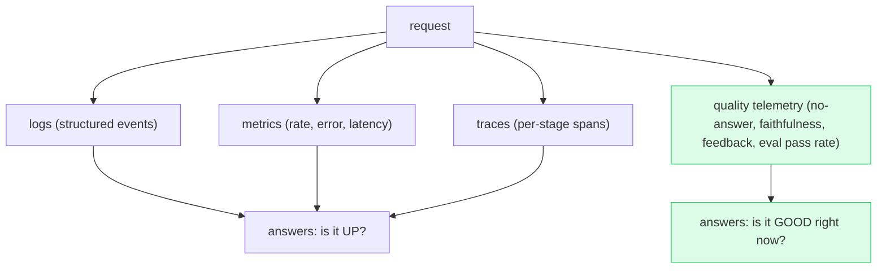

# Deep Dive: Production Serving, Monitoring, and MLOps

## Thesis

Production AI is a lifecycle of observability, versioning, feedback, incident response, and continuous evaluation. This file expands the chapter beyond the basic lesson and connects it to current practice, project work, and verifiable sources.

<!-- HAND-AUTHORED: do not regenerate -->
## Visual Model

The three pillars of observability, plus the AI-specific fourth thing most stacks lack — *quality telemetry*. "Is it up?" is answered by the first three; "is it good right now?" needs the fourth:

## Core Concepts

### `observability`

The ability to understand system behavior through logs, metrics, and traces. AI failures require visibility into retrieval, generation, tools, and safety checks.

Verification: Capture spans and metrics for every major pipeline stage.

### `metric`

A numeric measurement of system behavior or quality. Metrics turn performance and quality into trackable signals.

Verification: Define latency, error, retrieval, generation, safety, and cost metrics.

### `trace`

A recorded execution path with spans, inputs, outputs, and timings. Traces reveal latency, state transitions, tool calls, and failures.

Verification: Trace API, retrieval, reranking, LLM, guardrail, and tool spans.

### `log`

A recorded event emitted by a system. Logs support debugging, audit, analytics, and incident response.

Verification: Use structured logs and apply data minimization.

### `SLO`

Service Level Objective, a target for reliability or performance. SLOs align engineering work with user expectations.

Verification: Set p95 latency, uptime, and quality objectives where appropriate.

### `incident`

An event where system behavior harms reliability, safety, cost, or users. AI incidents can involve quality and policy failures, not only outages.

Verification: Define severity, containment, rollback, and postmortem process.

### `rollback`

Returning a system or artifact to a previous known-good version. AI rollback may involve code, prompt, model, index, or data.

Verification: Track release manifests for all AI artifacts.

### `feedback loop`

A process that turns user or expert feedback into improvements and regression tests. It keeps production learning connected to development.

Verification: Categorize feedback and promote cases into eval datasets.

### `drift`

A change in data, user behavior, or model behavior over time. Drift can reduce quality without any code change.

Verification: Monitor distributions, failure rates, and eval performance over time.

## Implementation Blueprint

Build this chapter as part of the capstone, not as isolated reading. The implementation should produce one or more concrete artifacts: code, schema, benchmark, trace, rubric, threat model, release manifest, or architecture document.

Recommended workflow:

1. Define the exact problem this chapter solves in the capstone.
2. Identify the data or request path affected by `observability`, `metric`, `trace`, `log`, `SLO`, `incident`, `rollback`, `feedback loop`, `drift`.
3. Create a minimal artifact that can be reviewed.
4. Add failure cases before adding complexity.
5. Add measurements, logs, traces, or human review.
6. Document the decision with numbered references.

## Current Engineering Problems To Study

- AI quality can regress even when API uptime looks healthy.
- A bad release may come from prompt, model, index, data, or tool schema changes.
- Feedback is wasted unless it becomes labeled data and regression coverage.

## Production Failure Modes

Each failure below names the concept, the way it shows up in production, and the check that would have caught it earlier. Treat this section as the source for regression tests and runbook entries.

- `observability` — failure: Only final answers are logged, so failures cannot be traced. Mitigation check: Capture spans and metrics for every major pipeline stage.
- `metric` — failure: The team debates quality without data. Mitigation check: Define latency, error, retrieval, generation, safety, and cost metrics.
- `trace` — failure: A bad answer cannot be debugged because intermediate retrieval is missing. Mitigation check: Trace API, retrieval, reranking, LLM, guardrail, and tool spans.
- `log` — failure: Logs include sensitive raw prompts without policy approval. Mitigation check: Use structured logs and apply data minimization.
- `SLO` — failure: Latency is optimized without a clear target. Mitigation check: Set p95 latency, uptime, and quality objectives where appropriate.
- `incident` — failure: A hallucinated legal answer is treated as a normal bug. Mitigation check: Define severity, containment, rollback, and postmortem process.
- `rollback` — failure: Code is rolled back but the bad prompt remains active. Mitigation check: Track release manifests for all AI artifacts.
- `feedback loop` — failure: Feedback is stored but never labeled or reviewed. Mitigation check: Categorize feedback and promote cases into eval datasets.
- `drift` — failure: New document types lower retrieval quality silently. Mitigation check: Monitor distributions, failure rates, and eval performance over time.

## Project Directions

- Design observability for API, retrieval, generation, agent tools, evaluation, cost, and security.
- Write incident runbooks for hallucination, provider outage, latency spike, data leakage, and cost spike.
- Build a version registry that connects releases to eval results and rollback artifacts.

## Verification Artifacts

- A short concept summary with citations.
- A capstone artifact that uses at least three chapter concepts.
- A test, metric, evaluation, or review checklist.
- A failure analysis table.
- A decision record comparing at least two alternatives.
- A reference section using `[1]`, `[2]` style citations.

## How This Chapter Connects To The Capstone

In the capstone, this chapter should leave a visible artifact. Examples include a module, schema, benchmark, design memo, evaluation result, threat model, release manifest, or demo step. Do not mark the chapter complete until the artifact is connected to the capstone.

## Further Reading

- Google SRE Book — Service Level Objectives: https://sre.google/sre-book/service-level-objectives/
- OpenTelemetry documentation (traces, metrics, logs): https://opentelemetry.io/docs/
- Prometheus documentation: https://prometheus.io/docs/
- Grafana documentation: https://grafana.com/docs/
- MLflow — GenAI evaluation and monitoring: https://www.mlflow.org/docs/latest/genai/eval-monitor
- Sculley et al., "Hidden Technical Debt in Machine Learning Systems": https://papers.nips.cc/paper/2015/hash/86df7dcfd896fcaf2674f757a2463eba-Abstract.html

## References

[1] MLflow tracking: https://www.mlflow.org/docs/latest/ml/tracking
[2] MLflow GenAI eval and monitoring: https://www.mlflow.org/docs/latest/genai/eval-monitor
[3] MLflow tracing: https://mlflow.org/docs/latest/genai/tracing/
[4] OpenTelemetry documentation: https://opentelemetry.io/docs/
[5] Prometheus documentation: https://prometheus.io/docs/
[6] Grafana documentation: https://grafana.com/docs/
