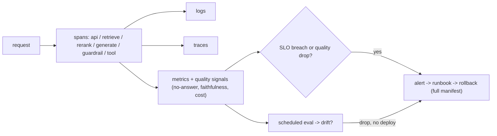

# Lesson: Production Serving, Monitoring, and MLOps

## Learning Objectives

By the end of this chapter you will be able to:

- **Explain** the four-pillar observability model (logs, metrics, traces, *and* quality signals).
- **Design** SLOs for latency, availability, quality, and cost — each with an alert threshold.
- **Implement** span-per-stage tracing and an alert → runbook → manifest-level rollback path.
- **Evaluate** drift through scheduled evaluation and online quality signals.
- **Justify** the release manifest as the rollback unit (code + prompt + model + index, not code alone).

## 1. Production AI Is a Lifecycle, Not a Launch

Shipping an AI system to production is not the finish line; it's the start of the part that determines whether it succeeds. A model that worked in eval can degrade in production for reasons that have nothing to do with code: the input distribution shifts, a provider silently changes a model, a new document type confuses retrieval, a prompt edit regresses a high-risk case. The discipline that keeps a production AI system healthy — observability, versioning, feedback loops, incident response, continuous evaluation — is what this chapter teaches. Call it LLMOps; it's MLOps with the extra problems that generative output and external model providers create.

The defining insight: **API uptime is not quality.** A traditional service is "up" if it returns 200s. An AI service can return 200s all day while quietly giving wrong answers. Your monitoring must answer a harder question than "is it up?" — it must answer "is it *good* right now?" That requires instrumenting quality, not just availability, and it's the thing most teams discover they're missing only after an incident.

## Visual Overview

Observability for AI watches *quality*, not just uptime. Spans feed logs, traces, and metrics; quality signals and scheduled evals drive alerts that lead to a runbook and a manifest-level rollback:



## 2. Observability: Logs, Metrics, Traces — for Quality

Observability rests on three pillars, and for AI you apply each to *quality*, not just to the request path:

- **Logs** (chapter 01's structured logs): per-request events with `request_id`, `tenant_id`, model/prompt/index versions, latency, tokens, no-answer flag. The queryable record of what happened.
- **Metrics**: aggregated numbers over time — request rate, error rate by code, latency percentiles, *and* quality signals (no-answer rate, refusal rate, citation rate, feedback score, eval pass rate).
- **Traces** (chapters 7, 10): per-request spans across the pipeline stages — API, retrieve, rerank, generate, guardrail, tool. The way you see *where* a request spent time and *which link* failed.

The AI-specific addition is the fourth thing most observability stacks lack: **quality telemetry**. A traditional dashboard shows CPU, memory, latency, errors. An AI dashboard must also show: faithfulness trend (sampled), no-answer rate, thumbs-down rate, eval pass rate per release, cost per request. When the no-answer rate jumps from 5% to 30% overnight, that's a retrieval or corpus problem your CPU graph will never show.

## 3. What to Instrument at Each Stage

A `/ask` request should emit a span per stage, and each stage contributes metrics:

```
api          -> request count, p50/p95/p99 latency, error rate by code, in-flight
retrieve     -> retrieval latency, candidates returned, recall (sampled vs golden)
rerank       -> rerank latency, fraction of queries reranked
generate     -> generation latency, input/output tokens, cost
guardrail    -> blocks by category, false-positive rate (sampled)
tool         -> tool call count, tool error rate, approval rate
overall      -> end-to-end p95, no-answer rate, feedback score, eval pass rate
```

The principle: **every stage is observable, not just the edges.** A common failure is logging only the final answer — then when an answer is wrong, you can't tell whether retrieval missed, the reranker mis-ordered, the prompt failed, or a guardrail interfered. Span-per-stage tracing (OpenTelemetry, chapter 11's portable standard) makes the chain visible end to end. The test, again: can you pull a `request_id` and see every stage's input, output, and timing? If not, you're flying blind.

## 4. SLOs: Define "Good Enough" Before You Optimise

A Service Level Objective is a target for a measurable property. Without SLOs, "make it faster" and "make it better" are endless. With them, you know when to stop and when to act.

AI SLOs span availability *and* quality:

- **Latency**: p95 `/ask` < 3s, p99 < 6s.
- **Availability**: 99.5% of requests return a non-5xx response.
- **Quality**: golden-set faithfulness ≥ 0.95 on high-risk cases (continuously or per-release); no-answer accuracy = 100% on the unanswerable set.
- **Cost**: < $X per 1000 requests.

SLOs drive alerting: an alert fires when an SLO is at risk (error budget burning, latency creeping, quality regressing). The key discipline is setting quality SLOs at all — most teams set latency and availability SLOs and forget that an AI system's whole point is the quality of its output. A latency SLO with no quality SLO optimises for fast wrong answers.

## 5. Continuous Evaluation in Production

Chapter 9 built the eval harness for pre-release gating. In production, evaluation continues:

- **Per-release eval** (the gate from chapter 9): every prompt/model/index change runs the golden set before shipping.
- **Scheduled production eval**: run the golden set against the *live* system on a schedule (nightly), so drift that isn't tied to a deploy still gets caught.
- **Sampled live scoring**: take a sample of real production requests and score them (LLM-as-judge + periodic human review). This catches quality issues on real traffic that the golden set doesn't cover.
- **Online signals**: no-answer rate, refusal rate, thumbs-down rate, and "user rephrased the same question" (a frustration signal) are cheap proxies for quality you can watch continuously.

The combination matters: the golden set catches *known* failure modes; sampled live scoring catches *unknown* ones; online signals are the early-warning system between scored evals. A regression that the golden set misses will usually show up as a spike in thumbs-down or no-answer rate first.

## 6. Drift: When Nothing Changed But Quality Dropped

Drift is the AI-specific gremlin: quality degrades with *no code change*. Causes:

- **Input drift**: users start asking different kinds of questions, or in different language, than the corpus covers.
- **Corpus drift**: new document types are ingested that the chunking/parsing handles poorly.
- **Model drift**: the provider updated the model behind your alias (chapter 11's deployment-name hazard).
- **World drift**: the facts changed; your documents are stale.

Drift is invisible to traditional monitoring and only detectable through quality telemetry. Defences: monitor the distribution of queries and retrieval scores over time; watch online quality signals; pin model ids so provider updates are deliberate; schedule re-evaluation. When the nightly eval drops with no deploy in the window, drift is the prime suspect.

## 7. The Release Manifest and Versioned Everything

Chapter 4 introduced the release manifest; production is where it earns its keep. Every release ties together code, prompt, model, embedding model, index, and eval run (chapter 02's versions, chapter 04's manifest). In production this enables:

- **Attribution**: a quality regression is traced to a specific release and its specific artifact changes.
- **Cohort analysis**: "answers from `prompt_v5` have 8% lower faithfulness than `prompt_v4`" — because every answer logged its `prompt_version` (chapter 02).
- **Rollback**: restore the *full* known-good set, not just code (section 8).

The discipline that makes this work: never deploy an artifact change without a manifest entry, and never overwrite a versioned artifact (chapter 4). A production system where "which prompt is live?" requires asking a person is a system that cannot do incident analysis.

## 8. Incident Response and Rollback

AI incidents include categories traditional services don't have. Write runbooks for each:

- **Hallucination incident**: a high-risk wrong answer reached a user. Contain (disable the feature or fall back to refusal), find the cohort by version, roll back the offending artifact, add the case to the golden set.
- **Provider outage**: the model API is down. Fail over to a fallback provider (chapter 11's adapter) or degrade gracefully to "service temporarily unavailable" — never hang.
- **Latency spike**: trace shows which stage; common causes are provider slowness, a heavy reranker on all queries, or a slow DB query.
- **Data leakage**: a cross-tenant leak or PII exposure. This is a security incident (chapter 15) — contain, audit, notify per policy.
- **Cost spike**: a prompt change added tokens, a retry loop ran away, or traffic surged. Find the cause via per-request token metrics.

The rollback principle from chapter 4, restated because it's where teams fail: **rolling back code is not enough.** If the incident was a bad prompt shipped with the code, reverting the code while the prompt stays active (or vice versa) leaves the bug live. Roll back the *manifest* — the full set of artifact versions. A rehearsed rollback (a drill, timed, in a runbook) is the difference between a 5-minute incident and a 2-hour one.

## 9. Feedback Loops: Turning Production Into Training Data

Production generates the most valuable data you have: real usage with real reactions. Wasting it is the most common LLMOps failure. The loop (chapter 02's `feedback` table, chapter 9's golden set):

1. Capture feedback: explicit (thumbs, ratings, corrections) and implicit (rephrase, abandonment, escalation to human).
2. Categorise it (chapter 9's failure taxonomy) — by hand or with assistance.
3. Promote failures into the golden set as new regression cases.
4. Use the categorised data to prioritise fixes (the top failure category is your next sprint).
5. Optionally, accumulate corrected examples toward fine-tuning data (chapter 14) — but only after RAG/prompt fixes are exhausted.

The test of a working feedback loop: a user's thumbs-down today becomes a golden-set case this week and a regression-gated behaviour next release. A system where feedback is collected but never categorised or reused is collecting feedback for show.

## 10. Cost Management

LLM serving cost is variable and can surprise you. Instrument and control it:

- **Per-request token + cost metric** (input and output priced separately), tagged by tenant, prompt version, and endpoint.
- **Cost dashboards** by tenant and by feature, so you can see where money goes.
- **Budgets and alerts**: a per-tenant or per-day budget that alerts (or throttles) before it blows.
- **Cost-aware optimisation** (chapter 13): caching, smaller models for easy cases, prompt-token reduction — measured against quality, not blindly.

The non-obvious failure: a prompt change that adds 2000 tokens of examples to every call can 3x your bill overnight with no other symptom. The per-prompt-version token metric catches it; without it, you find out on the invoice.

## 11. Common Mistakes and Anti-Patterns

1. **Monitoring uptime, not quality.** Green dashboards, wrong answers.
2. **Logging only the final answer.** Can't localise which stage failed.
3. **No quality SLO.** Optimising latency while quality drifts.
4. **Rolling back code but not the prompt/index.** Bug stays live.
5. **Feedback collected but never categorised or reused.** Wasted signal.
6. **No scheduled production eval.** Drift goes undetected until users complain.
7. **No per-request cost metric.** Cost spikes discovered on the invoice.
8. **Unpinned model ids.** Provider updates cause silent drift.
9. **Alerts with no runbook.** "Quality is down" with no first step.
10. **No release manifest.** Regressions can't be attributed to a change.

## 12. Production Failure Modes

- **No-answer rate jumps to 30% with no deploy.** Cause: corpus or input drift. Defensive: query/score distribution monitoring; scheduled eval.
- **A bad prompt ships and faithfulness drops for one cohort.** Defensive: per-version metrics; cohort analysis; manifest rollback.
- **Provider outage hangs every request.** Defensive: timeouts (chapter 3); fallback provider; graceful degradation.
- **Cost triples overnight.** Cause: token-heavy prompt change or runaway retries. Defensive: per-version token metric; budget alerts.
- **An incident can't be reconstructed.** Cause: missing traces. Defensive: span-per-stage tracing retained long enough.
- **Rollback restores code but the bad index is still live.** Defensive: manifest-level rollback; rehearsed drill.

## 13. Security and Privacy

1. **Traces and logs contain prompts, context, and answers** — i.e. potentially PII. Apply redaction (chapter 1) and retention (chapter 2); observability is a data surface subject to the chapter-15 policy.
2. **Dashboards and alerts can leak data** (a sample answer in an alert). Mind what flows into third-party monitoring tools.
3. **Audit vs observability are different** (chapter 2): observability is for engineers and rotates; audit is for compliance and is append-only and retained. Keep both.
4. **Incident response includes security incidents** (data leakage, PII exposure) — these have notification obligations (chapter 15), not just a rollback.

## 14. The Capstone Checklist

By the end of chapter 12, the following should exist in `chapters/12_production_serving_monitoring_mlops/my_work/`:

- A span-per-stage tracing setup (OpenTelemetry) where every `/ask` produces a trace covering api → retrieve → rerank → generate → guardrail → tool.
- A metrics surface (`telemetry/metrics.md` + instrumentation) including quality signals: no-answer rate, refusal rate, citation rate, feedback score, and a per-release eval pass rate.
- SLOs (latency, availability, *quality*, cost) with alert thresholds.
- Runbooks for hallucination, provider outage, latency spike, data leakage, cost spike — each with containment, attribution, and rollback steps.
- A release manifest enforced in CI plus a *rehearsed, timed* rollback drill (target MTTR < 5 min).
- A scheduled production eval and a documented feedback loop (feedback → categorise → golden case).
- A README describing the observability and on-call story.

If a teammate can answer "is quality healthy right now?" from your dashboards, follow a runbook to localise an injected failure, and roll back via the manifest in under five minutes — without asking you — the chapter is done.

## 15. Key Takeaway

Production AI is a lifecycle of keeping quality healthy after launch. Instrument quality, not just uptime; trace every stage; set quality SLOs; evaluate continuously to catch drift; tie every release to a manifest so regressions are attributable and rollback is complete; and close the feedback loop so production failures become regression tests. The teams that run reliable AI in production are the ones who can answer "is it good right now?" with data, and roll back a bad release in minutes.

## Numbered References

[1] MLflow tracking: https://www.mlflow.org/docs/latest/ml/tracking
[2] MLflow GenAI eval and monitoring: https://www.mlflow.org/docs/latest/genai/eval-monitor
[3] MLflow tracing: https://mlflow.org/docs/latest/genai/tracing/
[4] OpenTelemetry documentation: https://opentelemetry.io/docs/
[5] Prometheus documentation: https://prometheus.io/docs/
[6] Grafana documentation: https://grafana.com/docs/
