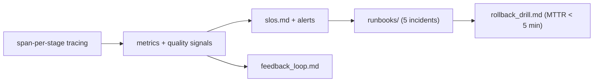

# My Work — Chapter 12: Production Serving, Monitoring, MLOps

Make the capstone operable: observability that answers "is it good right now?",
runbooks, and a manifest-level rollback.

## What this chapter produces



## Deliverables checklist

- [ ] span-per-stage tracing (OTel) over api→retrieve→rerank→generate→guardrail→tool.
- [ ] `telemetry/metrics.md` — incl. quality signals (no-answer, refusal, citation, feedback, eval pass rate).
- [ ] `slos.md` — latency, availability, *quality*, cost + alert thresholds.
- [ ] `runbooks/` — hallucination, provider outage, latency spike, data leakage, cost spike.
- [ ] release manifest enforced in CI + `rollback_drill.md` (timed, < 5 min).
- [ ] `feedback_loop.md` — one thumbs-down becomes a golden case.

## Suggested layout

```
my_work/
  telemetry/{spans.md,metrics.md}
  slos.md  runbooks/*.md
  release_manifest.yaml  rollback_drill.md  feedback_loop.md
  dashboards/overview.json
```

See `../examples.md` for OTel spans, metrics, the runbook skeleton, cohort
analysis, manifest rollback, and the feedback→golden loop. See `../deep_dive.md`
for the four-pillar observability diagram.

## Done when

A teammate can answer "is quality healthy right now?" from your dashboards,
follow a runbook to localise an injected failure, and roll back via the manifest
in under five minutes — without asking you.
