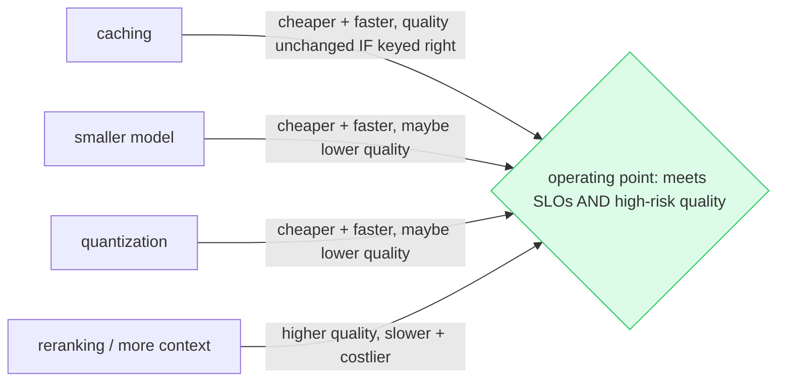

# Deep Dive: Optimization, Caching, Quantization, and Serving

## Thesis

Optimization is the disciplined reduction of cost and latency while preserving quality and safety. This file expands the chapter beyond the basic lesson and connects it to current practice, project work, and verifiable sources.

<!-- HAND-AUTHORED: do not regenerate -->
## Visual Model

Every optimization moves you within the cost/quality/latency triangle — there is no free lunch, only a measured tradeoff. Find the operating point that meets your SLOs *and* high-risk quality:

## Core Concepts

### `latency budget`

A target allocation of request time across components. It guides optimization choices and prevents blind tuning.

Verification: Measure component latency and set per-stage targets.

### `streaming`

Sending partial model output to the client as it is generated. It improves perceived latency but complicates safety, citations, and validation.

Verification: Design streaming boundaries and specify how citations and errors are emitted.

### `batching`

Processing multiple items together for efficiency. It improves throughput for embeddings, evals, and serving.

Verification: Separate offline batching from interactive request paths.

### `prompt caching`

Reusing repeated prompt prefixes when supported by provider or serving stack. It can reduce latency and cost for stable instructions or schemas.

Verification: Cache only safe repeated prefixes and monitor cache hit rates.

### `KV-cache`

Cached transformer key/value attention states used during generation. It affects serving throughput, memory, and long-context performance.

Verification: Understand serving memory constraints and context length tradeoffs.

### `quantization`

Reducing numeric precision of model weights or activations. It lowers memory and can improve deployment economics.

Verification: Run before/after evals on task-specific datasets.

### `ONNX`

An open model format and runtime ecosystem for optimized inference. It is useful for smaller classifiers, rerankers, or embedding components.

Verification: Export or evaluate a small model runtime where latency matters.

### `vLLM`

An open-source LLM serving engine focused on high-throughput inference. It is a common option for serving open models.

Verification: Compare serving metrics and operational burden against hosted APIs.

### `TGI`

Hugging Face Text Generation Inference server. It provides an open-model serving path in the Hugging Face ecosystem.

Verification: Verify model support, batching, streaming, and metrics.

### `Triton`

NVIDIA Triton Inference Server for production model serving. It supports optimized serving across model formats and GPU environments.

Verification: Use it when serving requirements and team expertise justify complexity.

## Implementation Blueprint

Build this chapter as part of the capstone, not as isolated reading. The implementation should produce one or more concrete artifacts: code, schema, benchmark, trace, rubric, threat model, release manifest, or architecture document.

Recommended workflow:

1. Define the exact problem this chapter solves in the capstone.
2. Identify the data or request path affected by `latency budget`, `streaming`, `batching`, `prompt caching`, `KV-cache`, `quantization`, `ONNX`, `vLLM`, `TGI`, `Triton`.
3. Create a minimal artifact that can be reviewed.
4. Add failure cases before adding complexity.
5. Add measurements, logs, traces, or human review.
6. Document the decision with numbered references.

## Current Engineering Problems To Study

- Streaming improves perceived latency but complicates validation and citations.
- Caching can leak data if keys ignore tenant or permission context.
- Quantization and serving changes require before/after quality evaluation.

## Production Failure Modes

Each failure below names the concept, the way it shows up in production, and the check that would have caught it earlier. Treat this section as the source for regression tests and runbook entries.

- `latency budget` — failure: Reranking is added without knowing where p95 latency is spent. Mitigation check: Measure component latency and set per-stage targets.
- `streaming` — failure: Unsafe text is streamed before guardrails run. Mitigation check: Design streaming boundaries and specify how citations and errors are emitted.
- `batching` — failure: Batching increases user-facing latency unexpectedly. Mitigation check: Separate offline batching from interactive request paths.
- `prompt caching` — failure: Private context is cached without tenant-aware boundaries. Mitigation check: Cache only safe repeated prefixes and monitor cache hit rates.
- `KV-cache` — failure: High concurrency exhausts memory due to long prompts. Mitigation check: Understand serving memory constraints and context length tradeoffs.
- `quantization` — failure: Quantization degrades faithfulness on edge cases. Mitigation check: Run before/after evals on task-specific datasets.
- `ONNX` — failure: A routing classifier is too slow as an LLM call. Mitigation check: Export or evaluate a small model runtime where latency matters.
- `vLLM` — failure: The team self-hosts without monitoring GPU memory or throughput. Mitigation check: Compare serving metrics and operational burden against hosted APIs.
- `TGI` — failure: Unsupported model/runtime settings cause deployment surprises. Mitigation check: Verify model support, batching, streaming, and metrics.
- `Triton` — failure: A team uses Triton without the operational skills to maintain it. Mitigation check: Use it when serving requirements and team expertise justify complexity.

## Project Directions

- Instrument a RAG request and create a latency budget with p50/p95 measurements.
- Design a cache strategy with keys, TTLs, invalidation, and security risks.
- Compare hosted API, vLLM, TGI, and Triton using a decision matrix.

## Verification Artifacts

- A short concept summary with citations.
- A capstone artifact that uses at least three chapter concepts.
- A test, metric, evaluation, or review checklist.
- A failure analysis table.
- A decision record comparing at least two alternatives.
- A reference section using `[1]`, `[2]` style citations.

## How This Chapter Connects To The Capstone

In the capstone, this chapter should leave a visible artifact. Examples include a module, schema, benchmark, design memo, evaluation result, threat model, release manifest, or demo step. Do not mark the chapter complete until the artifact is connected to the capstone.

## Further Reading

- Kwon et al., vLLM / PagedAttention (high-throughput serving): https://arxiv.org/abs/2309.06180
- Dao et al., FlashAttention (faster attention): https://arxiv.org/abs/2205.14135
- OpenAI, Prompt caching: https://platform.openai.com/docs/guides/prompt-caching
- Hugging Face Text Generation Inference (TGI): https://huggingface.co/docs/text-generation-inference
- NVIDIA Triton Inference Server: https://docs.nvidia.com/deeplearning/triton-inference-server/
- ONNX Runtime — quantization: https://onnxruntime.ai/docs/performance/model-optimizations/quantization.html

## References

[1] OpenAI prompt caching: https://platform.openai.com/docs/guides/prompt-caching
[2] vLLM online serving: https://docs.vllm.ai/en/latest/serving/online_serving/
[3] vLLM OpenAI-compatible server: https://docs.vllm.ai/en/latest/serving/openai_compatible_server/
[4] Hugging Face TGI: https://huggingface.co/docs/text-generation-inference/main/en/index
[5] NVIDIA Triton: https://docs.nvidia.com/deeplearning/triton-inference-server/index.html
[6] Transformers quantization: https://huggingface.co/docs/transformers/quantization
[7] ONNX Runtime quantization: https://onnxruntime.ai/docs/performance/model-optimizations/quantization.html
