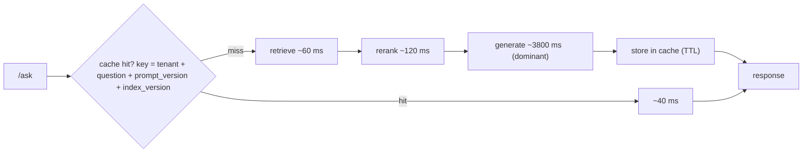

# Lesson: Optimization, Caching, Quantization, and Serving

## Learning Objectives

By the end of this chapter you will be able to:

- **Decompose** `/ask` latency by stage and identify the dominant bottleneck before optimising.
- **Design** a tenant-safe response cache (key format, TTLs, invalidation, cross-tenant test).
- **Compare** hosted API vs vLLM vs TGI vs Triton using *your* measured numbers, not vendor claims.
- **Implement** before/after benchmarking that gates every optimisation on the chapter-09 golden set.
- **Critique** a quantization choice on per-risk-level evaluation, not aggregate accuracy.

## 1. Optimization Is Reduction Without Regression

Optimization is the disciplined reduction of latency and cost *while preserving quality and safety*. The "while preserving" clause is the whole discipline. It is trivial to make an AI system faster and cheaper if you're allowed to make it worse — use a tiny model, cache aggressively without checking correctness, quantize without measuring. The skill is reducing cost and latency *and proving the quality didn't drop*.

This is why optimization comes after evaluation (chapter 9) in the course. You cannot optimize responsibly without a quality gate, because every optimization is a change that could regress, and "it's faster now" is worthless if it's also wrong. The pattern for every technique in this chapter is identical: measure the baseline (quality + latency + cost), apply the optimization, measure again, and keep it only if the latency/cost win comes with no meaningful quality loss on the golden set.

The second discipline: **measure before you optimize.** Most teams optimize the wrong thing. They add a reranker cache when 80% of latency is in generation, or they quantize the model when the bottleneck is a slow SQL query. A latency budget (section 2) tells you where the time actually goes, so you optimize what matters.

## Visual Overview

Where a request's time goes, and where caching helps. The cache key must include tenant and versions; generation dominates the budget, which is why it's the thing to optimize:



## 2. The Latency Budget

Before optimizing, decompose where time goes. A `/ask` request's latency is the sum of its stages (chapter 12's tracing gives you this data):

```
stage          p50     p95     notes
-----------    -----   -----   ---------------------------
api overhead    3ms     8ms    routing, validation, auth
retrieve       25ms    60ms    vector search + filter
rerank         40ms   120ms    cross-encoder (if enabled)
generate     1200ms  3800ms    <- the dominant cost, almost always
guardrail      15ms    40ms    output checks
overall      1300ms  4000ms
```

Two truths this reveals almost every time:

- **Generation dominates.** Output tokens are generated serially; a long answer is slow by construction. This is why streaming (chapter 3) matters — it doesn't reduce total latency, it improves *perceived* latency by showing tokens as they arrive.
- **Optimizing a non-dominant stage is wasted effort.** Shaving 20ms off retrieval when generation is 1200ms is rounding error. Set a target per stage and attack the biggest gap between target and measured.

The latency budget turns "make it faster" into "reduce p95 generation from 3800ms to 2500ms" — a specific, measurable goal.

## 3. Streaming: Perceived Latency

Streaming (chapter 3's SSE endpoint) sends tokens as they're generated. It doesn't make the total faster — the last token arrives at the same time — but the *first* token arrives in ~200ms instead of the user staring at a spinner for 4 seconds. For interactive use, perceived latency is what users judge.

The cost of streaming, revisited from chapter 3: it complicates safety (you may emit tokens before a guardrail runs — chapter 15) and citations (they usually arrive at the end). The optimization tradeoff: streaming is almost always worth it for interactive UX, rarely worth it for batch or tool-internal calls where nobody's watching the tokens.

## 3b. Speculative Decoding: Quality-Preserving Speedup

If you control the serving stack, **speculative decoding** [1] is the quality-preserving speedup you should know about. A small "draft" model proposes several tokens; the large model verifies them *in parallel* (one forward pass for the batch of proposed tokens) and accepts a prefix of them. When the draft is good, you generate multiple tokens per large-model step — often a 2-3× wall-clock speedup with **no change in output distribution** (the verification mechanism guarantees the result is the same distribution the large model would have produced alone).

Why it works in production: generation is autoregressive (token by token), so the large model is normally one-token-per-step bottlenecked. Speculative decoding turns that into one-multi-token-per-step. vLLM, TGI, and the OpenAI/Anthropic backends use variants of this internally — you mostly benefit without knowing.

When you'd implement it yourself: you're self-hosting an open model and want to squeeze more throughput out of the same hardware. The draft model is typically the same family, much smaller (e.g. 1B drafting for a 70B target).

For depth: read the original Leviathan paper [1] and the "Medusa" / "Eagle" follow-ups for the production-grade variants.

[1] Leviathan et al., *Fast Inference from Transformers via Speculative Decoding*: https://arxiv.org/abs/2211.17192

## 4. Batching: Throughput vs Latency

Batching processes multiple items together. It's a throughput optimization, and the key distinction is *offline vs interactive*:

- **Offline batching** (embeddings for ingestion, eval runs, bulk re-indexing): batch aggressively. Throughput is everything; per-item latency is irrelevant. Embedding 100k chunks should batch into large groups.
- **Interactive batching** (the serving path): dangerous. Holding a user's request to batch it with others *adds* latency to that request. Server-side continuous batching (what vLLM does internally) is fine because the server manages it without adding user-visible delay; application-level "wait 50ms to collect a batch" usually hurts the experience.

The rule: batch the offline paths hard, leave the interactive path to the serving engine, and never add application-level batching delay to a user-facing request without measuring the latency cost.

## 5. Prompt Caching: Cost and Latency, With a Security Trap

Prompt caching reuses the computation for a repeated prompt *prefix*. If your system prompt + tool schemas + few-shot examples are stable (they should be — chapter 5's versioned prompts), the provider (or your serving stack) can cache that prefix and only process the variable suffix. This reduces both latency and cost, sometimes dramatically, for prompts with large stable prefixes.

To benefit: put the *stable* content first (system prompt, schema, examples) and the *variable* content last (retrieved context, the question). This is the same ordering chapter 5 recommended for attention reasons — it also happens to maximise cache hits.

The security trap, which is the most important thing in this section: **a cache key that ignores tenant or permission context leaks data across users.** If you cache a *response* (not just a prompt prefix) keyed only on the question text, tenant A can receive tenant B's cached answer. Any cache in a multi-tenant AI system must include `tenant_id` (and relevant access scope) in the key. This is a recurring AI security incident; chapter 6's filtering discipline applies to caches too.

```python
# WRONG: cache key ignores tenant -> cross-tenant leak
key = hash(question)

# RIGHT: tenant + access scope in the key
key = hash((tenant_id, tuple(sorted(allowed_levels)), question, prompt_version, index_version))
```

Also include `prompt_version` and `index_version` in the key, or a prompt/index change silently serves stale cached answers.

## 6. KV-Cache and Why Long Prompts Cost Serving Memory

The KV-cache (chapter 5) is the model's per-request memory of already-processed tokens during generation. For hosted APIs you don't manage it, but it explains real behaviour: long prompts consume serving memory proportional to their length, and at high concurrency, many long prompts can exhaust GPU memory on a self-hosted setup. This is why "just stuff more context in" has a hidden serving cost beyond the per-token price — it's also why context compression (chapter 8) and tight token budgets (chapter 5) are optimizations, not just quality measures.

## 7. Quantization: Smaller, Faster, Maybe Worse

Quantization reduces the numeric precision of model weights (e.g. from 16-bit to 8-bit or 4-bit). Smaller weights mean less memory and often faster inference — relevant when self-hosting open models. The cost: some accuracy loss, which may or may not matter for your task.

The discipline, identical to every other optimization: **before/after evaluation on your golden set.** A quantized model that's 2x faster and loses 1% on low-risk cases might be a great trade; the same model losing 8% faithfulness on high-risk cases is a non-starter. Quantization's quality loss is often *uneven* — it can be fine on common cases and degrade on edge cases, exactly the high-risk ones your average metric hides. So evaluate per-risk-level (chapter 9), not just on average.

Quantization is mostly a concern when self-hosting; with hosted APIs the provider handles it and you select a model tier instead.

## 8. Serving Engines: Hosted API vs vLLM vs TGI vs Triton

When self-hosting open models, the serving engine matters:

- **Hosted API** (OpenAI, Anthropic, Azure): no ops burden, pay per token, you don't manage hardware. The right default unless you have a specific reason not to.
- **vLLM**: high-throughput open-model serving with continuous batching and efficient KV-cache management. Strong default for self-hosting at scale.
- **TGI (Text Generation Inference)**: Hugging Face's open-model server; good ecosystem fit if you're in the HF stack.
- **Triton**: NVIDIA's general inference server; powerful and format-flexible, but high operational complexity — use it when you have the GPU-ops expertise and requirements that justify it.

The decision is a tradeoff matrix, not a favourite:

| Factor | Hosted API | vLLM | TGI | Triton |
| --- | --- | --- | --- | --- |
| Ops burden | none | medium | medium | high |
| Cost at scale | high ($/token) | lower (your GPUs) | lower | lower |
| Control / privacy | low | high | high | high |
| Throughput | provider-managed | high | high | high |
| Best when | starting, low volume, no GPU ops | high volume, have GPU ops | HF ecosystem | complex, multi-model, GPU experts |

The honest default for most teams and most of this course: **hosted API.** Self-hosting makes sense when volume makes per-token pricing painful, when data can't leave your infrastructure (chapter 11's residency), or when you need a model no API offers. Self-hosting trades a token bill for an ops team — fill the matrix with *your* numbers (measured $/1k requests, measured p95, honest ops-hours estimate) before deciding.

## 9. The Cost/Quality/Latency Triangle

Every optimization moves you within a triangle of cost, quality, and latency, and you usually trade one for another:

- Smaller model: cheaper + faster, maybe lower quality.
- Caching: cheaper + faster, no quality change *if keyed correctly*.
- Quantization: cheaper + faster, maybe lower quality.
- More retrieved context: maybe higher quality, more expensive + slower.
- Reranking: higher quality, slower + more expensive.

There is no free lunch; there is only a measured tradeoff. The job is to find the operating point that meets your SLOs (chapter 12) — fast enough, cheap enough, and *good enough on high-risk cases* — and to prove with the golden set that you're there. An optimization decision record states the three numbers before and after, and the SLO each one has to satisfy.

## 10. Common Mistakes and Anti-Patterns

1. **Optimizing without a latency budget.** Shaving a non-dominant stage.
2. **Optimizing without a quality gate.** Faster wrong answers.
3. **Cache key without `tenant_id`.** Cross-tenant data leak.
4. **Cache key without prompt/index version.** Stale answers after a change.
5. **Application-level interactive batching** that adds user-visible delay.
6. **Quantization without per-risk-level eval.** Average looks fine; high-risk cases regressed.
7. **Self-hosting without an ops estimate.** Token bill replaced by a bigger ops bill.
8. **Streaming for non-interactive paths** where nobody watches the tokens.
9. **Serving-engine choice by hype**, not by a matrix of your numbers.
10. **No before/after numbers** in the optimization decision record.

## 11. Production Failure Modes

- **Tenant A gets tenant B's cached answer.** Cause: cache key omits tenant. Defensive: tenant + access scope in every cache key; a cross-tenant cache test.
- **A prompt change ships but users see old answers.** Cause: cache key omits prompt version. Defensive: version in the key; cache-bust on release.
- **Quantized model passes average eval, fails legal questions.** Defensive: per-risk-level before/after eval.
- **Self-hosted serving OOMs at peak.** Cause: long prompts × high concurrency exhaust KV-cache memory. Defensive: bound context length; load test memory; cap concurrency.
- **Latency "optimization" had no effect.** Cause: optimized a 25ms stage while generation is 1200ms. Defensive: latency budget first.
- **Cost rises after enabling caching.** Cause: cache hit rate is near zero because keys are too specific (include a timestamp). Defensive: monitor hit rate; key only on stable, semantically-relevant fields.

## 12. Security and Privacy

1. **Caches are a data surface.** A response cache holds answers (and the context that produced them) — subject to tenant isolation (key includes tenant), retention, and the PII policy (chapter 15).
2. **Cross-tenant cache leakage is the headline risk** of this chapter — test it like the cross-tenant retrieval test (chapter 6).
3. **Streaming bypasses output guardrails** if the guardrail runs on the full text. Either delay the visible stream behind the guardrail or run guardrails per chunk (chapter 15).
4. **Self-hosting changes the data boundary** (data stays on your infra — a privacy *benefit*) but adds the burden of securing the serving infrastructure yourself.

## 13. The Capstone Checklist

By the end of chapter 13, the following should exist in `chapters/13_optimization_caching_quantization_serving/my_work/`:

- A latency budget (`latency_budget.md`) decomposing `/ask` p50/p95 by stage, with a target per stage and the measured gap.
- A cache design (`cache_design.md`) specifying what's cached, the key format *including tenant and version*, TTLs, invalidation, and the cross-tenant risk with its mitigation and test.
- A serving decision matrix (`serving_matrix.md`) comparing hosted API vs vLLM vs TGI vs Triton on quality, p95, throughput, $/1k, and ops burden — filled with numbers from your own measurements where possible.
- If a quantized open model is in scope: a before/after eval (`quantization_eval.md`) on the golden set, per risk level.
- A cross-tenant cache test proving no leakage.
- An optimization decision record with before/after cost, latency, and quality numbers, tied to your SLOs.
- A README documenting which optimizations were adopted and why.

If a teammate can read your latency budget, see which optimization you chose and the before/after numbers, and confirm the cross-tenant cache test passes — without asking you — the chapter is done.

## 14. Key Takeaway

Optimization is reduction without regression. Measure where time and money actually go (the latency budget), then apply caching, streaming, batching, quantization, or a serving change — each justified by before/after numbers that show the cost/latency win came with no quality loss on high-risk cases. Two things are non-negotiable: every cache key includes tenant and version, and every optimization is gated by the golden set. Fast and cheap is easy; fast, cheap, and still correct is the job.

## Numbered References

[1] OpenAI prompt caching: https://platform.openai.com/docs/guides/prompt-caching
[2] vLLM online serving: https://docs.vllm.ai/en/latest/serving/online_serving/
[3] vLLM OpenAI-compatible server: https://docs.vllm.ai/en/latest/serving/openai_compatible_server/
[4] Hugging Face TGI: https://huggingface.co/docs/text-generation-inference/main/en/index
[5] NVIDIA Triton: https://docs.nvidia.com/deeplearning/triton-inference-server/index.html
[6] Transformers quantization: https://huggingface.co/docs/transformers/quantization
[7] ONNX Runtime quantization: https://onnxruntime.ai/docs/performance/model-optimizations/quantization.html
