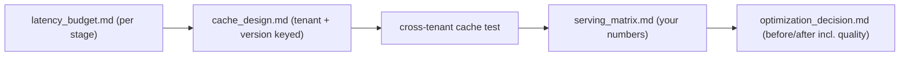

# My Work — Chapter 13: Optimization, Caching, Quantization, Serving

Reduce cost and latency *without regressing quality*. Measure first, optimize
the dominant stage, gate every change on the golden set.

## What this chapter produces



## Deliverables checklist

- [ ] `latency_budget.md` — p50/p95 by stage, target per stage, biggest gap (generation dominates).
- [ ] `cache_design.md` — key format incl. tenant_id + prompt_version + index_version; TTL; invalidation.
- [ ] cross-tenant cache test — proves no leakage.
- [ ] `serving_matrix.md` — hosted vs vLLM vs TGI vs Triton on quality/p95/throughput/$/ops, your numbers.
- [ ] `optimization_decision.md` — one optimization with before/after cost, latency, AND quality (per risk).
- [ ] (stretch) quantization before/after eval; streaming+guardrail.

## Suggested layout

```
my_work/
  latency_budget.md  cache_design.md  serving_matrix.md
  optimization_decision.md  quantization_eval.md
  tests/test_cache_cross_tenant.py  README.md
```

See `../examples.md` for the budget, tenant-safe cache key, cross-tenant test,
serving matrix, and the optimization decision record. See `../deep_dive.md` for
the cost/quality/latency triangle.

## Done when

A teammate reads your latency budget, sees the optimization you chose with
before/after numbers, and confirms the cross-tenant cache test passes — without
asking you.
