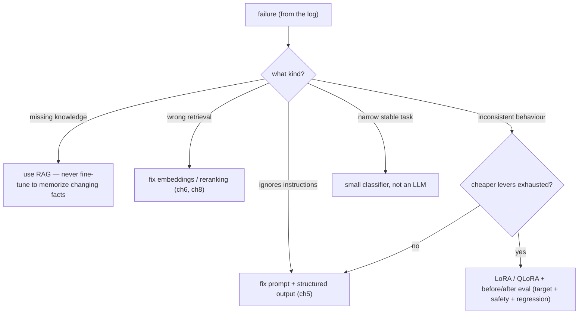

# Lesson: Fine-Tuning and Model Adaptation

## Learning Objectives

By the end of this chapter you will be able to:

- **Classify** a failure as retrieval / prompt / model behavior / data / safety, and pick the cheapest lever that addresses it.
- **Explain** LoRA and QLoRA mechanics, including the loss function and the gradient flow through the adapter.
- **Design** an adaptation decision memo with failure evidence, measurable success criteria, and per-risk safety checks.
- **Evaluate** a fine-tuned model against target + safety + format + generality metrics on a hash-checked held-out set.
- **Justify** when *not* to fine-tune by referencing tried cheaper levers (prompt, RAG, classifier).

## 1. Fine-Tuning Is a Decision, Not a Reflex

When an AI system underperforms, "fine-tune the model" is a tempting reflex — it feels like the serious, ML-engineer move. It is usually the wrong first move. Most quality problems in production AI systems are *retrieval* problems, *prompt* problems, or *evaluation* problems, and fine-tuning fixes none of those. Worse, fine-tuning is expensive, slow to iterate, easy to get wrong, and can regress behaviours (safety, formatting, generality) that were fine before.

The central thesis of this chapter: **fine-tuning is a decision you justify with evidence, not a reflex you reach for.** The evidence comes from your failure log (chapter 9): *what kind* of failure are you trying to fix? Because the type of failure tells you whether fine-tuning is even the right tool.

- **Missing knowledge** ("the model doesn't know our policies") → that's RAG, not fine-tuning. Fine-tuning to memorise documents that change is an anti-pattern.
- **Wrong behaviour** ("the model won't follow our output format / tone / refusal style consistently") → this is where adaptation can genuinely help.
- **Wrong retrieval / prompt** → fix those first; they're cheaper and faster.

This chapter teaches you to make the decision well, and — when adaptation *is* warranted — to do it with the same measurement discipline as every other change.

## Visual Overview

The adaptation decision tree. Classify the failure first; fine-tuning is the *last* lever, reached only when cheaper ones are exhausted and the failure is genuinely about behaviour:



## 2. The Decision Framework: RAG vs Prompt vs Fine-Tune

Before any training, classify the failure and pick the cheapest lever that addresses it:

| Symptom | Likely cause | Right lever |
| --- | --- | --- |
| "doesn't know recent/private facts" | missing knowledge | RAG (chapters 7–8) |
| "retrieves the wrong thing" | retrieval quality | embeddings/reranking (6, 8) |
| "ignores instructions sometimes" | prompt design | prompt + structured output (5) |
| "inconsistent format/tone" | behaviour | fine-tuning (this chapter) |
| "too slow/expensive for a narrow task" | model size | small task-specific model / distillation |
| "needs a specialised classification" | narrow task | small classifier, not an LLM |

The order of preference is almost always: **fix retrieval and prompts first, fine-tune last.** Fine-tuning should be reached for when you've exhausted the cheaper levers and the residual failure is genuinely a *behaviour* the base model won't reliably produce from prompting alone. A decision memo (section 9) documents this reasoning so the team can approve or reject it on evidence, not enthusiasm.

## 3. Parameter-Efficient Fine-Tuning: LoRA and QLoRA

Full fine-tuning (updating all model weights) is expensive and produces a whole new model to store and serve. **Parameter-efficient fine-tuning (PEFT)** updates a small number of added parameters instead, achieving most of the benefit at a fraction of the cost.

- **LoRA (Low-Rank Adaptation)** freezes the base model and trains small "adapter" matrices injected into the attention layers. The adapter is tiny (megabytes vs gigabytes), trains fast, and can be swapped in/out at serving time. Multiple LoRA adapters can share one base model.
- **QLoRA** is LoRA on top of a *quantized* base model (chapter 13), drastically cutting the memory needed to fine-tune — enough to fine-tune a meaningful model on a single consumer GPU.

The engineering benefits beyond cost: adapters are *composable and reversible*. You can ship adapter `v1`, and rolling back is loading the previous adapter — the base model never changed. This fits the versioning and rollback discipline from chapters 4 and 12: an adapter is just another versioned artifact in the release manifest.

The risk, especially with small datasets: **overfitting.** A LoRA adapter trained on 200 noisy examples will happily memorise their quirks and generalise badly. Small, clean, representative data beats large, noisy data.

## 3b. What You Are Actually Optimising

Conceptually, fine-tuning on supervised pairs `(prompt, target_completion)` minimises the negative log-likelihood of the target tokens under the model. For a single example:

```
L = -∑_{t} log P(y_t | y_<t, prompt; θ)
```

where `y_t` is the t-th target token and `θ` are the model's parameters.

For full fine-tuning, the gradient `∂L/∂θ` flows through every weight. For **LoRA**, the base weights `W` are frozen; you add a low-rank perturbation:

```
W_effective = W + ΔW    where    ΔW = B · A      (rank r ≪ d)
```

Here `A ∈ R^(r×d)` and `B ∈ R^(d×r)` are the small trainable matrices. The forward pass uses `W + B·A`; the gradient only updates `A` and `B`:

```
∂L/∂A = Bᵀ · (∂L/∂W_effective)
∂L/∂B = (∂L/∂W_effective) · Aᵀ
```

What this buys you in practice:

- **Trainable params shrink by 100-1000×**, because `r` is typically 8-32 while `d` is thousands. You can train on a single GPU.
- **The base model is unchanged** — adapters are *additive*. You can ship multiple adapters per use case and load the right one per request.
- **QLoRA** [1] adds: keep `W` in 4-bit precision and only de-quantize during the forward pass. Combined with paged optimiser states, this brings 65B-parameter fine-tuning to one consumer GPU.

What it does *not* buy you:

- Adapters can't add knowledge the base model has no way to express. Garbage in, garbage out.
- Fine-tuning can erode safety alignment (chapter 9 / 15). Re-run the safety eval.
- Small noisy datasets overfit fast. The "data is the whole game" point (next section) applies more strongly to LoRA than to full fine-tuning.

**For a primary-source treatment**, read LoRA [2] (it is short and clear), QLoRA [1], and the DPO paper [3] if your task is preference tuning. The Hugging Face PEFT and TRL libraries [4][5] implement the math above as `LoraConfig` + `SFTTrainer` calls — but if you can't write the loss on a whiteboard, the SDK is a black box.

[1] Dettmers et al., *QLoRA*: https://arxiv.org/abs/2305.14314
[2] Hu et al., *LoRA*: https://arxiv.org/abs/2106.09685
[3] Rafailov et al., *DPO*: https://arxiv.org/abs/2305.18290
[4] Hugging Face PEFT: https://huggingface.co/docs/peft
[5] Hugging Face TRL: https://huggingface.co/docs/trl

## 4. Data Is the Whole Game

Fine-tuning quality is dominated by data quality, not by hyperparameters or method. Garbage in, garbage out — and unlike a prompt, you can't easily inspect what a fine-tuned model "learned."

Principles:

- **Clean beats large.** A few hundred carefully-curated, correct, representative examples beat thousands of noisy ones. Review your data by hand.
- **Match the production distribution.** Training on examples that don't look like real traffic adapts the model to the wrong thing.
- **Hold out a test set the model never sees during training** (chapter 9's held-out discipline), confirmed by a hash check so you can *prove* no leakage.
- **Label consistency matters.** If two annotators would label the same example differently, the model learns noise. Measure inter-annotator agreement.

## 5. Synthetic Data: Useful and Dangerous

Generating training data with an LLM (synthetic data) can cheaply expand coverage, but it carries specific hazards:

- **It bakes in the generator's biases and errors.** If you generate training data with the same model family you'll deploy, you risk teaching the model its own mistakes.
- **It can contain confidently-wrong labels.** A synthetic "legal Q&A" example with an incorrect answer trains the model to be incorrectly confident.
- **It can be unrealistically clean**, so the model never learns to handle the messiness of real input.

The discipline if you use synthetic data: **review a sample by hand, deduplicate, validate labels against human-written ground truth, and never train on synthetic data you haven't spot-checked.** A `synthetic_data_review.md` recording sample size, dedup rate, and label-spotcheck pass rate is the artifact that makes synthetic data defensible.

## 6. Distillation and Small Task-Specific Models

Not every problem needs a big general model. Two cheaper alternatives often outperform fine-tuning a large model:

- **Distillation**: train a smaller model to mimic a larger one's behaviour on a specific task. Reduces latency and cost for that narrow task. The trap: the student copies the teacher's *errors* too, so evaluate the student against independent ground truth, not just against teacher agreement.
- **A small classifier instead of an LLM**: for a narrow, stable task (intent routing, spam detection, a yes/no gate), a small fine-tuned classifier (or even a classic ML model) is faster, cheaper, and more predictable than an LLM call. Chapter 8's query router is a prime candidate — a classifier can replace an LLM-classification call entirely once the task is stable.

The lesson: "fine-tune the big model" is one option among several, and often not the best. A small model that does one thing reliably beats a large model coaxed into doing it via adapters.

## 7. Preference Tuning

Beyond supervised fine-tuning (learn from input→output examples), **preference tuning** (DPO and related methods) trains a model from *comparisons* — "output A is better than output B for this input." It's how you shape subtler behaviours: helpfulness, tone, refusal style, formatting preferences that are hard to specify as exact targets.

The catch: preference data is only as good as the consistency of the preferences. If reviewers disagree about which output is better, you're training on noise. Define a rubric (chapter 9) and measure inter-reviewer agreement before trusting preference labels. Preference tuning is powerful but data-hungry and easy to get wrong; treat it as an advanced technique, not a default.

## 8. Before/After Evaluation: The Non-Negotiable Gate

Every adaptation is a change, and like every change in this course, it passes the golden-set gate (chapter 9) before shipping. But adaptation needs a *broader* eval than a prompt change, because training can have side effects:

- **The target metric**: did the adaptation improve the specific failure category the decision memo claimed it would?
- **Regression on other metrics**: did overall faithfulness, answer relevance, or formatting hold?
- **Safety regression**: did the adapted model become more willing to comply with unsafe requests or injections? (Fine-tuning can erode safety training.)
- **Generality regression**: did it get worse at things outside the fine-tuning distribution?

Run the same golden set, per risk level, on the base model and the adapted model with a fixed seed. Adopt the adaptation only if it improves the target *without* regressing safety, formatting, or generality. The most common fine-tuning failure in practice: the team reports a win on the metric they optimised and never checks the metrics they didn't — and ships a model that's better at one thing and worse at three others.

## 9. The Adaptation Decision Memo

The deliverable that ties this chapter together is a one-page memo a reviewer can approve or reject:

```md
# Adaptation Decision: <failure category>

## Failure evidence
From the failure log: <N> cases of category <X>, e.g. "inconsistent JSON
formatting on multi-field extraction" — 14% of high-risk cases.

## Cheaper levers considered
- Prompt: tried structured-output enforcement; reduced but didn't eliminate (still 6%).
- Retrieval: not relevant (this is a formatting, not a knowledge, failure).

## Proposed adaptation
QLoRA on llama-3-8b, ~300 hand-curated extraction examples, held-out 60 cases.

## Success criteria (before/after on golden set, per risk level)
- target: formatting failures on high-risk < 1%
- guardrails: safety pass rate must not drop
- regression: overall faithfulness/relevance within 1% of base

## Decision: <approve / reject> — <reviewer> <date>
```

If the cheaper levers weren't tried, the memo should be rejected. If the success criteria don't include regression and safety checks, the memo is incomplete. This memo is the artifact that keeps fine-tuning a disciplined decision rather than a reflex.

## 10. Common Mistakes and Anti-Patterns

1. **Fine-tuning to add knowledge.** That's RAG; fine-tuning to memorise changing facts is an anti-pattern.
2. **Fine-tuning before fixing retrieval/prompts.** Expensive fix for a cheap problem.
3. **No held-out set / leakage.** Reported gains are memorisation.
4. **Reporting the target metric only.** Hides safety/format/generality regressions.
5. **Synthetic data trained on without review.** Bakes in the generator's errors.
6. **Overfitting on a tiny noisy dataset.** Adapter memorises quirks.
7. **No rollback recipe for an adapter.** "Which adapter is live?" is unanswerable.
8. **Distillation evaluated only against the teacher.** Inherits teacher errors.
9. **Preference tuning on inconsistent labels.** Training on noise.
10. **No decision memo.** Fine-tuning happens because it's exciting, not because evidence supports it.

## 11. Production Failure Modes

- **Fine-tuned model is better at the target task, worse at everything else.** Cause: only the target metric was measured. Defensive: full regression suite + safety eval, per risk level.
- **Reported improvement vanishes in production.** Cause: training data didn't match the production distribution, or leakage inflated the eval. Defensive: distribution match; hash-checked held-out set.
- **The adapted model started complying with injections.** Cause: fine-tuning eroded safety alignment. Defensive: injection/safety cases in the before/after eval.
- **Can't roll back the adaptation.** Cause: no adapter versioning. Defensive: adapter as a versioned artifact in the release manifest (chapter 4).
- **Synthetic-data-trained model is confidently wrong on edge cases.** Cause: synthetic labels were wrong. Defensive: hand-review + label validation against human ground truth.
- **A distilled router mis-routes unsafe requests into normal RAG.** Cause: student copied teacher gaps. Defensive: evaluate the student on independent labels, especially safety routes.

## 12. Security and Privacy

1. **Training data can contain PII.** Fine-tuning data is a sensitive data surface (chapter 15) — scrub, control access, and track retention. A model can memorise and later emit training data.
2. **Fine-tuning can erode safety alignment.** A model fine-tuned on task data may become more compliant with harmful requests; always re-run the safety eval (chapter 15) after adaptation.
3. **Adapters are artifacts to secure.** A LoRA adapter encodes what it learned; treat it with the same access control as the data it was trained on.
4. **Hosted fine-tuning sends your data to the provider** — a data-boundary and compliance consideration (chapter 11). Self-hosted PEFT keeps data in-house at the cost of ops.

## 13. The Capstone Checklist

By the end of chapter 14, the following should exist in `chapters/14_finetuning_model_adaptation/my_work/`:

- An `adaptation_decision.md` memo for a real capstone weakness: failure evidence from the log, cheaper levers tried, the proposed adaptation (or the decision *not* to adapt), and per-risk-level success criteria including safety and regression checks.
- If adaptation is pursued: a training run with logged hyperparameters, a dataset hash, and a hash-checked held-out set.
- A before/after eval on the golden set, per risk level, covering target metric + safety + formatting + generality.
- If synthetic data is used: a `synthetic_data_review.md` (sample size, dedup rate, label-spotcheck pass rate).
- Either a small classifier compared against an LLM router, or a clear justification for not building one.
- A README documenting the decision and (if applicable) how to roll the adapter back.

If a teammate can read your decision memo and agree the lever was justified — or agree that *not* fine-tuning was the right call — without asking you, the chapter is done.

## 14. Key Takeaway

Fine-tuning is a decision justified by failure evidence, not a reflex. Classify the failure: missing knowledge is RAG, wrong retrieval is retrieval, inconsistent behaviour is where adaptation earns its place — and even then, only after the cheaper levers are exhausted. Use parameter-efficient methods (LoRA/QLoRA) so adaptation is cheap and reversible, treat data quality as the whole game, and gate every adaptation on a before/after eval that checks safety and regressions, not just the target metric. Often the best "fine-tuning" decision is a small task-specific classifier or no fine-tuning at all.

## Numbered References

[1] Hugging Face PEFT: https://huggingface.co/docs/transformers/peft
[2] PEFT LoRA guide: https://huggingface.co/docs/peft/developer_guides/lora
[3] Hugging Face TRL: https://huggingface.co/docs/trl/index
[4] Transformers quantization: https://huggingface.co/docs/transformers/quantization
[5] QLoRA paper: https://arxiv.org/abs/2305.14314
