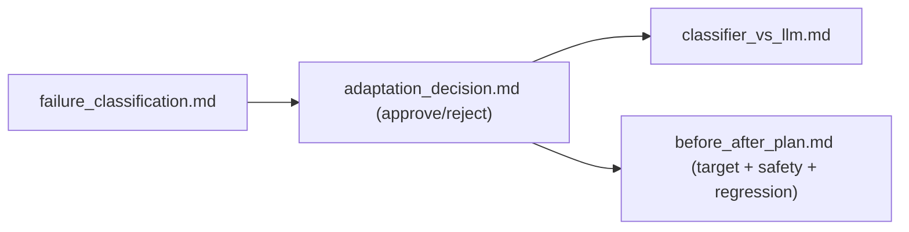

# My Work — Chapter 14: Fine-Tuning and Model Adaptation

Decide *whether* to adapt before *how*. Fine-tuning is the last lever — justify
it with failure evidence, and gate it on a before/after eval that checks safety.

## What this chapter produces



## Deliverables checklist

- [ ] `failure_classification.md` — ≥30 failures categorised; which are *not* fine-tuning problems and why.
- [ ] `adaptation_decision.md` — failure evidence, cheaper levers tried, proposal (or decision not to), per-risk success criteria incl. safety.
- [ ] `classifier_vs_llm.md` — small classifier vs LLM router on accuracy, latency, cost.
- [ ] `before_after_plan.md` — exact eval: same golden set, fixed seed, target + safety + formatting + generality.
- [ ] (stretch) QLoRA run with logged hyperparameters + hash-checked held-out set; synthetic-data review.

## Suggested layout

```
my_work/
  failure_classification.md  adaptation_decision.md
  classifier_vs_llm.md  before_after_plan.md
  synthetic_data_review.md  README.md
```

See `../examples.md` for the failure→lever map, hash-checked split, QLoRA
sketch, before/after eval, and the decision memo. See `../deep_dive.md` for the
LoRA-adapter diagram and `../lesson.md` for the decision tree.

## Done when

A teammate can read your decision memo and agree the lever was justified — or
agree that *not* fine-tuning was the right call — without asking you.
