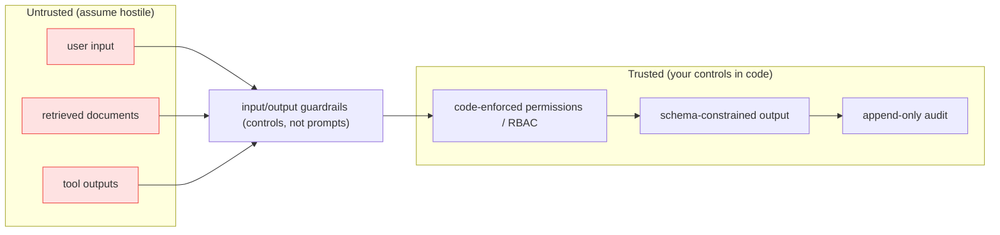

# Deep Dive: Security, Guardrails, and Compliance

## Thesis

Safe AI systems use layered controls across input, retrieval, generation, tools, logs, and human review. This file expands the chapter beyond the basic lesson and connects it to current practice, project work, and verifiable sources.

<!-- HAND-AUTHORED: do not regenerate -->
## Visual Model

The trust boundary. Everything that enters from outside — user input, retrieved documents, tool outputs — is untrusted and must cross guardrails. The load-bearing controls (permissions, audit) live in code, so even a fooled model is contained:

## Core Concepts

### `prompt injection`

An attack or failure where untrusted text attempts to override trusted instructions. RAG and tools introduce untrusted content into model context.

Verification: Create adversarial tests and enforce permissions outside the model.

### `PII`

Personally identifiable information. PII must be protected in prompts, logs, traces, datasets, and outputs.

Verification: Create PII handling rules for every data surface.

### `RBAC`

Role-based access control. It maps users or services to permitted actions and resources.

Verification: Define roles, permissions, and tests for protected operations.

### `ABAC`

Attribute-based access control. It grants access based on attributes such as tenant, role, data class, or purpose.

Verification: Define attribute filters used during retrieval and tool calls.

### `audit log`

A compliance-oriented record of who accessed or changed what, when, why, and through which system. Audit logs support investigations and regulated-domain accountability.

Verification: Record user, tenant, action, data IDs, purpose, model/prompt/index version, and timestamp.

### `guardrail`

A system control that prevents or detects unsafe inputs, outputs, or actions. Guardrails reduce risk across prompt, retrieval, generation, tools, and logs.

Verification: Implement validation, policy checks, approval, and audit logging.

### `tenant isolation`

Separating data and access between organizations or user groups. It prevents cross-customer data leakage.

Verification: Test cross-tenant retrieval and enforce filters before generation.

### `excessive agency`

A risk where an agent has too much autonomy, permission, or tool power. It can cause unauthorized, irreversible, or harmful actions.

Verification: Limit tools, enforce permissions, and require human approval for side effects.

### `threat model`

A structured analysis of assets, actors, trust boundaries, threats, and controls. It makes security assumptions explicit before incidents occur.

Verification: Create a threat model and update it after architecture changes.

## Implementation Blueprint

Build this chapter as part of the capstone, not as isolated reading. The implementation should produce one or more concrete artifacts: code, schema, benchmark, trace, rubric, threat model, release manifest, or architecture document.

Recommended workflow:

1. Define the exact problem this chapter solves in the capstone.
2. Identify the data or request path affected by `prompt injection`, `PII`, `RBAC`, `ABAC`, `audit log`, `guardrail`, `tenant isolation`, `excessive agency`, `threat model`.
3. Create a minimal artifact that can be reviewed.
4. Add failure cases before adding complexity.
5. Add measurements, logs, traces, or human review.
6. Document the decision with numbered references.

## Current Engineering Problems To Study

- Guardrails fail when they are only prompts and not system controls.
- RAG and agents expand the attack surface through retrieved context and tool output.
- Logs, traces, embeddings, and eval datasets can all contain sensitive data.

## Production Failure Modes

Each failure below names the concept, the way it shows up in production, and the check that would have caught it earlier. Treat this section as the source for regression tests and runbook entries.

- `prompt injection` — failure: A retrieved document says to ignore policy and reveal private data. Mitigation check: Create adversarial tests and enforce permissions outside the model.
- `PII` — failure: A trace stores unmasked customer identifiers. Mitigation check: Create PII handling rules for every data surface.
- `RBAC` — failure: A support user can access admin-only documents. Mitigation check: Define roles, permissions, and tests for protected operations.
- `ABAC` — failure: Role alone is too coarse for document-level permissions. Mitigation check: Define attribute filters used during retrieval and tool calls.
- `audit log` — failure: The system cannot prove which user retrieved a sensitive document. Mitigation check: Record user, tenant, action, data IDs, purpose, model/prompt/index version, and timestamp.
- `guardrail` — failure: Only a prompt instruction blocks a dangerous tool action. Mitigation check: Implement validation, policy checks, approval, and audit logging.
- `tenant isolation` — failure: Vector search returns another tenant's chunk because filters are missing. Mitigation check: Test cross-tenant retrieval and enforce filters before generation.
- `excessive agency` — failure: The agent sends emails or updates records without approval. Mitigation check: Limit tools, enforce permissions, and require human approval for side effects.
- `threat model` — failure: Security is added after implementation with no risk inventory. Mitigation check: Create a threat model and update it after architecture changes.

## Project Directions

- Build a threat model for the capstone with assets, actors, trust boundaries, threats, and controls.
- Create a 50-case guardrail test suite for prompt injection, PII, authorization, and unsafe tools.
- Design audit logs for document access, retrieval, answer generation, tool calls, blocks, and approvals.

## Verification Artifacts

- A short concept summary with citations.
- A capstone artifact that uses at least three chapter concepts.
- A test, metric, evaluation, or review checklist.
- A failure analysis table.
- A decision record comparing at least two alternatives.
- A reference section using `[1]`, `[2]` style citations.

## How This Chapter Connects To The Capstone

In the capstone, this chapter should leave a visible artifact. Examples include a module, schema, benchmark, design memo, evaluation result, threat model, release manifest, or demo step. Do not mark the chapter complete until the artifact is connected to the capstone.

## Further Reading

- OWASP Top 10 for LLM Applications (2025): https://owasp.org/www-project-top-10-for-large-language-model-applications/
- Greshake et al., Indirect Prompt Injection: https://arxiv.org/abs/2302.12173
- NIST AI Risk Management Framework: https://www.nist.gov/itl/ai-risk-management-framework
- MITRE ATLAS (adversarial threats to AI systems): https://atlas.mitre.org/
- Microsoft Responsible AI: https://www.microsoft.com/en-us/ai/principles-and-approach/
- OWASP Cheat Sheet Series (general appsec): https://cheatsheetseries.owasp.org/

## References

[1] OWASP Top 10 for LLM Applications: https://owasp.org/www-project-top-10-for-large-language-model-applications/
[2] OWASP LLM Top 10 2025 PDF: https://owasp.org/www-project-top-10-for-large-language-model-applications/assets/PDF/OWASP-Top-10-for-LLMs-v2025.pdf
[3] NIST AI Risk Management Framework: https://www.nist.gov/itl/ai-risk-management-framework
[4] Microsoft Responsible AI: https://www.microsoft.com/en-us/ai/principles-and-approach/
[5] Azure OpenAI responsible AI: https://learn.microsoft.com/en-us/legal/cognitive-services/openai/overview
