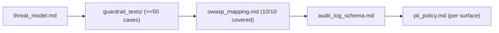

# My Work — Chapter 15: Security, Guardrails, Compliance

Layered controls across every surface, with the load-bearing ones in code.
Build the threat model, guardrail suite, audit design, and PII policy.

## What this chapter produces



## Deliverables checklist

- [ ] `threat_model.md` — assets, actors, trust boundaries, threats (→ OWASP), controls, named residual risks.
- [ ] `guardrail_tests/` — ≥50 cases: direct/indirect/tool-output injection, PII, authorization, unsafe tools; runnable; honest pass rate.
- [ ] `owasp_mapping.md` — each of the 10 categories → at least one control; gaps flagged.
- [ ] `audit_log_schema.md` — fields + sensitive actions that produce an entry; append-only.
- [ ] `pii_policy.md` — a control per data surface (prompt, log, trace, embedding, eval, cache, backup); no "TBD".
- [ ] proof: an unauthorized tool call is blocked by code even with a manipulated prompt.

## Suggested layout

```
my_work/
  threat_model.md  owasp_mapping.md  audit_log_schema.md  pii_policy.md
  guardrail_tests/  redteam.md  README.md
```

See `../examples.md` for code-enforced permissions, the guardrail suite, input/
output guardrails, the OWASP table, and the PII-per-surface table. See
`../deep_dive.md` for the trust-boundary diagram and `../lesson.md` for
defense-in-depth.

## Done when

A teammate (or an auditor) can read your threat model, run your guardrail suite,
and confirm every OWASP category maps to a control and every data surface has a
PII control — without asking you.
