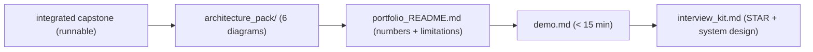

# My Work — Chapter 16: Capstone, Portfolio, Interview

Integrate all prior chapters into one defensible system, then turn it into a
portfolio and interview kit. Every claim must trace to evidence.

## What this chapter produces



## Deliverables checklist

- [ ] Runnable capstone: `docker compose up` → working `/ask` in minutes; API+SQL+RAG+agent+eval+obs+security integrated.
- [ ] `architecture_pack/` — system, data, RAG, agent, deployment, threat diagrams; each matches the code.
- [ ] `portfolio_README.md` — what/run/architecture/results (per risk)/security/limitations (≥3)/sources.
- [ ] `demo.md` — ingest, supported answer, unsupported→refusal, eval run, blocked injection; < 15 min.
- [ ] `interview_kit.md` — 5 STAR stories (measured results), 3 system-design walkthroughs, 10 Q&A drills.
- [ ] `evidence_index.md` — every README number → its committed artifact.

## Suggested layout

```
my_work/
  (the integrated capstone repo or a link to it)
  architecture_pack/
  portfolio_README.md  demo.md  interview_kit.md  evidence_index.md
```

See `../examples.md` for the README skeleton, evidence index, STAR template,
system-design checklist, and demo runbook. See `../deep_dive.md` for the
defensibility diagram.

## Done when

A stranger clones the repo, runs the demo in under 15 minutes, reads the eval
numbers and trusts them, sees the injection get blocked, and finds your honest
limitations — without asking you.
