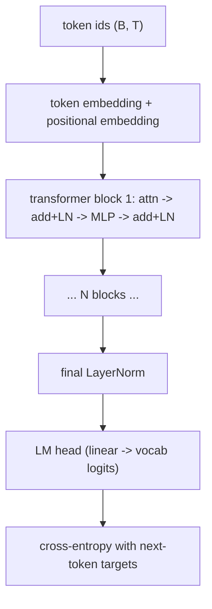

# Supplementary Lab 05b: Build a Tiny Transformer

This is the optional, Karpathy-style "let's build it from scratch" lab the
main chapter 5 deliberately does not require. Doing it once gives you a
visceral understanding of what tokens, embeddings, attention, and the
KV-cache *are* — not just what the API charges for.

The lab is small on purpose. Targets, with line counts you should not exceed
much:

- `bpe_tokenizer.py` (~120 lines) — Byte-Pair Encoding from scratch
- `attention.py` (~60 lines) — scaled dot-product + multi-head attention
- `mini_transformer.py` (~200 lines) — a working decoder-only LLM
- `train.py` (~120 lines) — train it on a tiny text corpus
- `sample.py` (~80 lines) — generate text with temperature, top-k, top-p

You will train a model with on the order of 100k-1M parameters on a CPU in
minutes. The point is the *understanding*, not the resulting model.

## What you should be able to do after this lab

1. **Tokenise** a string by hand using a BPE merge table.
2. **Compute** scaled dot-product attention numerically for a 2×2 example
   (matches `chapters/05_*/deep_dive.md` worked example).
3. **Sketch** the transformer block: attention → residual → LayerNorm →
   FFN → residual → LayerNorm.
4. **Explain** why the KV-cache exists and what it stores.
5. **Sample** from the trained model and explain each decoding parameter's
   effect.
6. **Recognise** in production code which step is doing what.

## Prerequisites

- Comfort with PyTorch tensors. If you've never seen PyTorch, do the official
  60-minute blitz first: https://pytorch.org/tutorials/beginner/deep_learning_60min_blitz.html
- Linear algebra at the level of "I can multiply matrices."
- Basic probability (softmax, cross-entropy).

## Setup

```bash
python -m venv .venv && source .venv/bin/activate
pip install torch numpy tqdm
```

CPU is fine; GPU is faster. The default config trains on the Tiny Shakespeare
dataset (a few hundred KB of text — bundled below, or downloadable from
https://github.com/karpathy/char-rnn).

## Suggested workflow

1. Read `bpe_tokenizer.py`. Trace the `train` and `encode` methods by hand
   on the string "the cat sat on the cat".
2. Read `attention.py`. Compute one forward pass on a 2×2 example by hand,
   then run the file and confirm the numbers match.
3. Read `mini_transformer.py`. Identify each block in the diagram below.
4. Run `python train.py`. Watch the loss go down from ~3.0 to ~1.5 over a
   few thousand steps.
5. Run `python sample.py` with a few different temperature/top_k settings.
   Note how generation degenerates at temperature 0 (repetitive) and
   becomes word-salad at temperature 2.0.

## Architecture (decoder-only, GPT-style)



For a working larger reference, see Karpathy's
[nanoGPT](https://github.com/karpathy/nanoGPT). This lab is a deliberately
smaller, more annotated version.

## What to commit

In `my_work/`:

- `notes.md` — the 2×2 attention worked example *redone by hand*
- `training_log.md` — loss vs steps; one observation
- `samples.md` — three generations at different decoding settings, and
  one paragraph explaining what changed and why
- `architecture_diagram.md` — your own re-drawing of the transformer block,
  labelled with tensor shapes at each step

## What you should NOT use

This lab exists to make abstractions transparent. Do **not** use:

- `transformers` (Hugging Face) — defeats the purpose
- `torch.nn.MultiheadAttention` — implement it yourself in `attention.py`
- An LLM to write the code for you — you're trying to feel the math

You may use:

- `torch.nn.Linear`, `torch.nn.Embedding`, `torch.nn.LayerNorm`
- numpy for the BPE tokenizer
- `tqdm` for progress bars

## References

- Vaswani et al., *Attention Is All You Need*: https://arxiv.org/abs/1706.03762
- Karpathy, nanoGPT: https://github.com/karpathy/nanoGPT
- Karpathy, *Let's build GPT from scratch* (video): https://www.youtube.com/watch?v=kCc8FmEb1nY
- The Annotated Transformer: https://nlp.seas.harvard.edu/annotated-transformer/
- Sennrich, Haddow, Birch, *Neural Machine Translation of Rare Words with Subword Units* (the BPE paper): https://arxiv.org/abs/1508.07909
